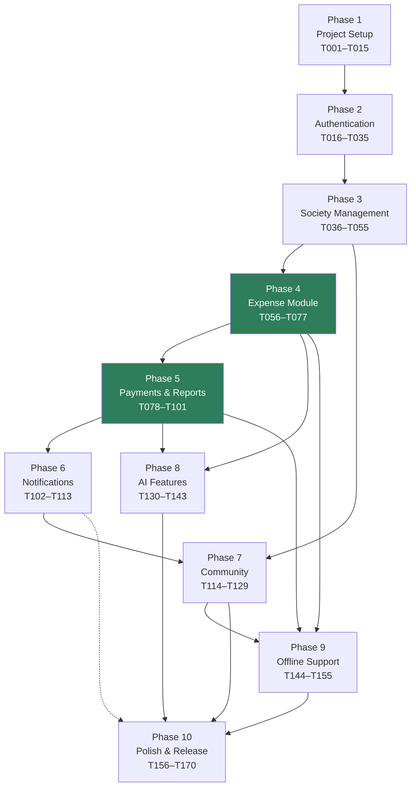
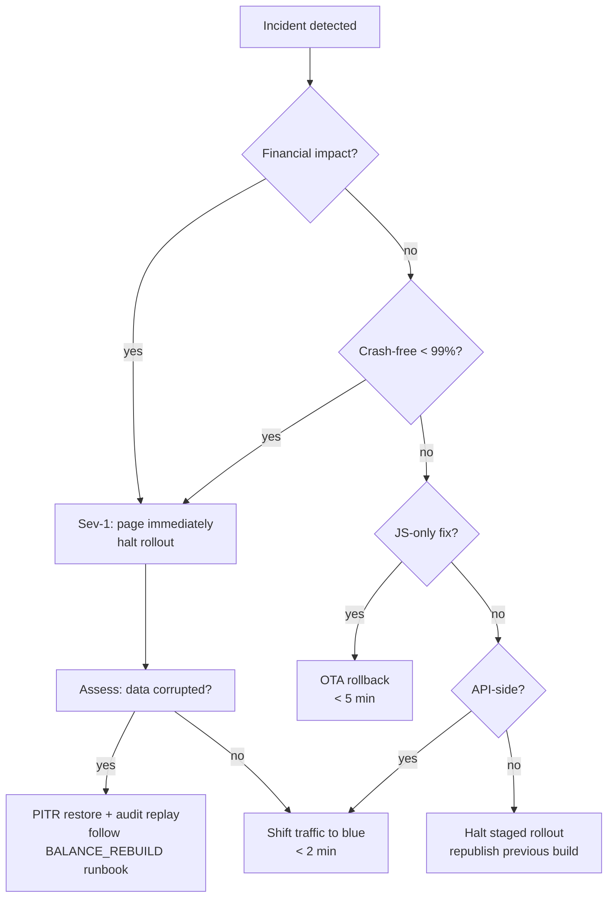

# Society Expense Splitter — Implementation Roadmap

**Version:** 1.0
**Owner:** Technical Program Management
**Inputs:** PRD v1.0 · Software Architecture Document v1.0
**Output:** 170 executable tasks across 10 phases, 34 milestones

> **How to use this document.** Tasks are executed in ID order. Each is sized at 30–90 minutes for a senior engineer or a capable coding agent, leaves the repository green, and is independently reviewable as a single PR. Do not start a task until every task in its **Depends on** list has been merged. If a task turns out to need more than 90 minutes, stop and split it — that is a signal the scope was misjudged, not a reason to push through.

---

## Execution Conventions

| Rule | Detail |
|---|---|
| **One task = one PR** | Branch named in the task; squash-merged to `main` |
| **Green on merge** | Typecheck, lint, unit and integration tests pass before merge, always |
| **Commit message** | Exactly as given in the task (Conventional Commits, enforced by commitlint) |
| **Review** | 1 approval; `CODEOWNERS` review mandatory on `packages/split-engine`, `packages/domain`, migrations and CI |
| **Blocked tasks** | If a dependency is unmet, stop and report — never stub past it |
| **Migrations** | Forward-only, expand→migrate→contract, always backward-compatible with the previous app version |
| **Definition of Ready** | Dependencies merged, acceptance criteria unambiguous, test fixtures available |

**Difficulty scale:** `Easy` — mechanical, well-trodden · `Medium` — requires design judgement within a known pattern · `Hard` — novel logic, concurrency, money, or security implications; expect a longer review.

**Time totals by phase**

| Phase | Tasks | Est. hours |
|---|---|---|
| 1 — Project Setup | T001–T015 | 16 |
| 2 — Authentication | T016–T035 | 24 |
| 3 — Society Management | T036–T055 | 24 |
| 4 — Expense Module | T056–T077 | 29 |
| 5 — Payments, Maintenance, Reports | T078–T101 | 33 |
| 6 — Notifications | T102–T113 | 14 |
| 7 — Community Modules | T114–T129 | 19 |
| 8 — AI Features | T130–T143 | 18 |
| 9 — Offline Support | T144–T155 | 17 |
| 10 — Polish & Release | T156–T170 | 19 |
| **Total** | **170** | **~213 h** |

---

# Phase 1 — Project Setup & Foundations

**Goal:** a monorepo where an engineer can clone, run one command, and have a typechecked, linted, tested API and Expo app running against local infrastructure — with CI enforcing every rule the architecture depends on.

**Tasks:** T001–T015 · **Estimated:** 16 h

### Deliverables
- Turborepo monorepo with `apps/mobile`, `apps/api`, and five shared packages
- Shared TypeScript, ESLint, Prettier and Jest presets
- Husky, lint-staged and commitlint enforcing standards pre-commit
- Docker Compose local stack (Postgres, Redis, MinIO)
- Environment variable schemas that fail the boot on misconfiguration
- `Money` value object and branded ID types with 100% coverage
- CI pipeline: typecheck, lint, unit tests, layer-boundary enforcement, build

### Definition of Done
- [ ] `pnpm install && pnpm dev` starts the API, the Expo app and the local stack
- [ ] `pnpm lint && pnpm typecheck && pnpm test` pass from the repo root
- [ ] A PR with a layering violation fails CI
- [ ] A commit not matching Conventional Commits is rejected locally
- [ ] `packages/domain` money utilities are at 100% line and branch coverage
- [ ] `docs/guides/LOCAL_SETUP.md` gets a new machine running in under 15 minutes

### Risks
| Risk | Mitigation |
|---|---|
| Expo SDK / React Native version churn breaks the scaffold | Pin exact versions; record them in an ADR; upgrade deliberately, never incidentally |
| Turborepo caching masks broken builds | `--force` on CI release jobs; verify cache keys include env |
| Over-engineering the setup phase | Timebox to 16 h; anything not needed by Phase 2 is deferred |
| Monorepo tooling unfamiliarity slows the team | T001 includes a `docs/guides/LOCAL_SETUP.md` walkthrough |

### Manual QA Checklist
- [ ] Clone on a clean machine, follow `LOCAL_SETUP.md`, reach a running app
- [ ] Expo app opens on a physical Android device via the dev client
- [ ] `docker compose up` brings up Postgres, Redis and MinIO with healthy checks
- [ ] Deliberately break a type and confirm CI fails with a readable message
- [ ] Attempt a commit with a bad message and confirm it is rejected

---

#### T001 · Initialise the monorepo
**Objective** — Create the Turborepo + pnpm workspace skeleton with all app and package directories, root scripts and a working local setup guide.
**Depends on** —
**Create** `package.json`, `pnpm-workspace.yaml`, `turbo.json`, `.gitignore`, `.nvmrc`, `README.md`, `docs/guides/LOCAL_SETUP.md`, placeholder `package.json` in `apps/{mobile,api}` and `packages/{contracts,domain,split-engine,db-schema,config}`
**Modify** —
**Acceptance** — `pnpm install` completes from root · `pnpm build` runs across all workspaces without error · Turbo pipeline defines `build`, `lint`, `typecheck`, `test`, `dev` with correct `dependsOn` · Node version pinned in `.nvmrc` and `engines`
**Tests** — Run `pnpm install` on a clean clone · Confirm `turbo run build --dry` resolves the dependency graph · Confirm no package resolves outside the workspace
**Commit** `chore: initialise turborepo monorepo structure`
**Time** 60 min · **Difficulty** Easy

#### T002 · Shared TypeScript configuration
**Objective** — Create `packages/config/tsconfig` presets (base, node, react-native, library) and wire every workspace to extend them with strict settings.
**Depends on** T001
**Create** `packages/config/tsconfig/{base,node,react-native,library}.json`, `packages/config/package.json`
**Modify** `apps/api/tsconfig.json`, `apps/mobile/tsconfig.json`, `packages/*/tsconfig.json`
**Acceptance** — `strict`, `noUncheckedIndexedAccess`, `noImplicitOverride`, `exactOptionalPropertyTypes` enabled everywhere · Path aliases `@/*`, `@shared/*` resolve in both apps · `pnpm typecheck` passes from root
**Tests** — Introduce an implicit `any` and confirm typecheck fails · Confirm an alias import resolves in both apps · Confirm `tsc --noEmit` runs per workspace
**Commit** `chore(config): add shared strict typescript presets`
**Time** 45 min · **Difficulty** Easy

#### T003 · Shared ESLint and Prettier presets
**Objective** — Create shared lint configuration including the project's custom rules: no `any`, no raw hex colours in `.tsx`, no `console.log`, no literal strings in JSX, no barrel re-exports.
**Depends on** T002
**Create** `packages/config/eslint-preset/{base,node,react-native}.js`, `packages/config/prettier/index.js`, `.prettierignore`
**Modify** `apps/*/eslintrc.cjs`, `packages/*/.eslintrc.cjs`, root `package.json` scripts
**Acceptance** — `no-explicit-any` is an error · `no-console` is an error (allows `warn`/`error` in API only) · A raw hex colour in a `.tsx` file fails lint · `import/no-cycle` enabled · Prettier and ESLint do not conflict
**Tests** — Add a file violating each custom rule and confirm each fails · `pnpm lint` passes on the clean tree · `pnpm format:check` passes
**Commit** `chore(config): add shared eslint and prettier presets`
**Time** 60 min · **Difficulty** Medium

#### T004 · Husky, lint-staged and commitlint
**Objective** — Enforce formatting, linting and commit-message standards before code ever reaches CI.
**Depends on** T003
**Create** `.husky/{pre-commit,commit-msg}`, `commitlint.config.js`, `lint-staged.config.js`
**Modify** root `package.json` (`prepare` script)
**Acceptance** — Pre-commit runs `eslint --fix` and `prettier` on staged files only · `commit-msg` rejects non-Conventional-Commit messages · Allowed scopes list matches the SAD (`expenses`, `payments`, `sync`, `auth`, `db`, `ui`, `api`, `mobile`, `split-engine`, `ci`) · Hooks install automatically on `pnpm install`
**Tests** — Commit with message `updated stuff` and confirm rejection · Commit `feat(auth): add otp` and confirm acceptance · Stage a badly formatted file and confirm it is auto-fixed
**Commit** `chore: add husky, lint-staged and commitlint`
**Time** 45 min · **Difficulty** Easy

#### T005 · Scaffold the Expo application
**Objective** — Create the Expo app with Expo Router, TypeScript, NativeWind and the four route groups as empty placeholders.
**Depends on** T002, T003
**Create** `apps/mobile/app/_layout.tsx`, `apps/mobile/app/index.tsx`, `apps/mobile/app/(auth)/_layout.tsx`, `apps/mobile/app/(setup)/_layout.tsx`, `apps/mobile/app/(app)/_layout.tsx`, `apps/mobile/app.config.ts`, `apps/mobile/babel.config.js`, `apps/mobile/metro.config.js`, `apps/mobile/tailwind.config.js`, `apps/mobile/global.css`
**Modify** `apps/mobile/package.json`
**Acceptance** — App boots on iOS simulator and Android emulator · Typed routes enabled · NativeWind classes apply correctly · Four route groups navigable via hardcoded links · Hermes enabled
**Tests** — `pnpm --filter mobile start` launches Metro · Navigate to each route group and confirm render · Apply `className="bg-red-500"` and confirm the style applies · Confirm the TypeScript route type is generated
**Commit** `feat(mobile): scaffold expo app with router and nativewind`
**Time** 90 min · **Difficulty** Medium

> ### 🏁 Milestone M01 — Workspace bootstrapped
> A developer can clone the repo, install, and run a blank Expo app with all quality gates active locally. **Verify:** clean-clone install succeeds; a bad commit message is rejected; the app renders on a physical device.

#### T006 · Scaffold the NestJS API
**Objective** — Create the NestJS application with the Fastify adapter, module skeleton, health endpoints and graceful shutdown.
**Depends on** T002, T003
**Create** `apps/api/src/main.ts`, `apps/api/src/app.module.ts`, `apps/api/src/modules/health/health.{module,controller}.ts`, `apps/api/nest-cli.json`, `apps/api/Dockerfile`
**Modify** `apps/api/package.json`
**Acceptance** — API starts on the configured port with the Fastify adapter · `GET /v1/health/live` returns 200 · `GET /v1/health/ready` returns 200 with dependency placeholders · Global prefix `/v1` applied · Graceful shutdown drains in-flight requests within 30 s
**Tests** — `pnpm --filter api start:dev` boots without error · `curl /v1/health/live` returns 200 · Send SIGTERM mid-request and confirm the response completes
**Commit** `feat(api): scaffold nestjs application with fastify`
**Time** 60 min · **Difficulty** Medium

#### T007 · Local infrastructure with Docker Compose
**Objective** — Provide a one-command local stack: Postgres 15, Redis and MinIO, with health checks and seeded buckets.
**Depends on** T001
**Create** `infra/docker/docker-compose.dev.yml`, `infra/docker/postgres/init.sql`, `scripts/dev/setup.sh`
**Modify** root `package.json` (`dev:infra` script), `docs/guides/LOCAL_SETUP.md`
**Acceptance** — `pnpm dev:infra` brings up all three services · Postgres has `pgcrypto`, `citext`, `pg_trgm` extensions created · MinIO starts with a pre-created bucket · Health checks report healthy · Data persists across restarts via named volumes
**Tests** — `docker compose up -d` then `docker compose ps` shows all healthy · `psql` connects and lists extensions · MinIO console reachable and bucket present
**Commit** `chore: add local docker compose stack`
**Time** 60 min · **Difficulty** Easy

#### T008 · API environment schema and validation
**Objective** — Define every environment variable as a Zod schema that refuses to boot on a missing or invalid value, including the production safety checks from the SAD.
**Depends on** T006
**Create** `apps/api/src/config/{configuration.ts,validation.schema.ts}`, `apps/api/.env.example`
**Modify** `apps/api/src/app.module.ts`, `apps/api/src/main.ts`
**Acceptance** — Process exits with a readable error listing every missing variable · Production refuses to start with an `rzp_test_` key · Production requires `SENTRY_DSN` · Config is injected via a typed `ConfigService`, never `process.env` in feature code
**Tests** — Boot with a missing `DATABASE_URL` and confirm a descriptive exit · Boot with `NODE_ENV=production` and a test Razorpay key; confirm refusal · Boot with a valid `.env` and confirm success
**Commit** `feat(api): add zod-validated environment configuration`
**Time** 60 min · **Difficulty** Medium

#### T009 · Mobile environment and EAS configuration
**Objective** — Configure `app.config.ts` with environment-driven values, EAS build profiles for three channels, and a clear public/secret boundary.
**Depends on** T005
**Create** `apps/mobile/eas.json`, `apps/mobile/src/constants/config.ts`, `apps/mobile/.env.example`
**Modify** `apps/mobile/app.config.ts`
**Acceptance** — Three EAS profiles (`development`, `preview`, `production`) with distinct channels and bundle identifiers · Only the API base URL, Razorpay key id, Sentry DSN and PostHog key are `EXPO_PUBLIC_*` · `config.ts` validates public values at module load · Deep-link scheme `societyexpense` and the universal-link domain registered
**Tests** — `eas build:configure` validates the file · Confirm a secret is absent from a built bundle (`grep` the export) · Confirm the deep-link scheme opens the app
**Commit** `feat(mobile): add eas profiles and environment configuration`
**Time** 45 min · **Difficulty** Easy

#### T010 · Contracts package skeleton
**Objective** — Create `packages/contracts` with the response envelope, error format, pagination and common primitives shared by client and server.
**Depends on** T002
**Create** `packages/contracts/src/common/{envelope.ts,errors.ts,pagination.ts,primitives.ts}`, `packages/contracts/src/index.ts`
**Modify** `packages/contracts/package.json`
**Acceptance** — `SuccessEnvelope<T>` and `ErrorEnvelope` schemas match SAD §7.9–7.10 exactly · `ErrorCode` union contains the full catalogue · `CursorPage<T>` helper defined · Package has `zod` as its only runtime dependency · Importable from both apps
**Tests** — Unit-test that a valid envelope parses and an invalid one fails · Confirm `ErrorCode` is exhaustive against the SAD list · Import in both apps and typecheck
**Commit** `feat(contracts): add response envelope and error schemas`
**Time** 45 min · **Difficulty** Easy

> ### 🏁 Milestone M02 — Local stack and contracts ready
> API and mobile app both boot, local infrastructure runs, and the shared API contract exists. **Verify:** `pnpm dev` starts everything; `/v1/health/ready` is green; contracts import cleanly in both apps.

#### T011 · Domain primitives — Result, branded IDs, Clock
**Objective** — Create the foundational domain types every other module depends on: `Result`, branded identifiers, the `Clock` port and the domain error base class.
**Depends on** T002
**Create** `packages/domain/src/shared/{result.ts,ids.ts,clock.ts,errors.ts}`, `packages/domain/src/index.ts`
**Modify** `packages/domain/package.json`
**Acceptance** — `Result<T,E>` with `ok`/`err`/`isOk`/`isErr`/`map`/`unwrapOr` · Branded `SocietyId`, `MemberId`, `ExpenseId`, `PaymentId`, `DueId`, `ApartmentId`, each with `of()` and `generate()` · Passing one ID type where another is expected fails typecheck · `Clock` interface plus `SystemClock` and `FixedClock` · Package has zero runtime dependencies
**Tests** — 100% coverage on `result.ts` · Type-level test asserting ID cross-assignment fails · `FixedClock` returns a stable instant
**Commit** `feat(domain): add result type, branded ids and clock port`
**Time** 60 min · **Difficulty** Medium

#### T012 · Money value object
**Objective** — Implement the `Money` value object in integer paise with exact arithmetic, weighted allocation with deterministic residual distribution, and Indian formatting. This is load-bearing for the entire product.
**Depends on** T011
**Create** `packages/domain/src/shared/money.vo.ts`, `packages/domain/src/shared/__tests__/money.test.ts`
**Modify** `packages/domain/src/index.ts`
**Acceptance** — Constructed only via `fromPaise` / `fromRupees`; the constructor is private · `add`, `subtract`, `multiplyByWeight`, `allocateByWeights`, `equals`, `compare`, `isZero`, `isNegative` · `allocateByWeights` always sums to exactly the input · `format()` renders `₹4,52,250.75` with lakh grouping · Cross-currency arithmetic throws · **No floating-point operation anywhere in the file**
**Tests** — **100% line and branch coverage (blocking)** · Property test: for 10,000 random amounts and weight sets, allocations sum exactly to the input · Formatting cases: 0, 1 paisa, 99999999, negative · Confirm `parseFloat` and `Number` appear nowhere in the file
**Commit** `feat(domain): add money value object with exact paise arithmetic`
**Time** 90 min · **Difficulty** Hard

#### T013 · CI — install, typecheck, lint, build
**Objective** — Create the core CI workflow with Turbo remote caching, running on every pull request.
**Depends on** T003, T006, T005
**Create** `.github/workflows/ci.yml`, `.github/PULL_REQUEST_TEMPLATE.md`, `.github/CODEOWNERS`
**Modify** root `package.json`
**Acceptance** — Jobs: `setup`, `typecheck`, `lint`, `build`, running in parallel where possible · `pnpm install --frozen-lockfile` · Turbo cache restored between jobs · Total runtime under 8 minutes · `CODEOWNERS` requires review on `packages/split-engine`, `packages/domain`, migrations and `.github/`
**Tests** — Open a PR with a type error and confirm failure · Open a clean PR and confirm all jobs pass · Confirm cache hit on a second run
**Commit** `ci: add core pull request pipeline`
**Time** 60 min · **Difficulty** Medium

#### T014 · CI — unit tests with per-path coverage thresholds
**Objective** — Add the test job with path-specific coverage gates so the financial core is held to 100% while application code is held to 80%.
**Depends on** T013, T012
**Create** `packages/config/jest-preset/{base.js,node.js,react-native.js}`, `.github/workflows/` test job addition
**Modify** `.github/workflows/ci.yml`, `apps/*/jest.config.js`, `packages/*/jest.config.js`
**Acceptance** — Thresholds enforced per path as in SAD §15.2 (`split-engine` and money at 100%, use cases at 90%, global 80%) · Coverage reported as a PR comment · A drop below any threshold fails the build · Tests run in parallel and are order-independent
**Tests** — Remove a `money.vo.ts` test and confirm CI fails on coverage · Confirm the coverage comment renders · Run the suite twice in different orders and confirm identical results
**Commit** `ci: add unit test job with per-path coverage thresholds`
**Time** 60 min · **Difficulty** Medium

#### T015 · Enforce clean-architecture layer boundaries
**Objective** — Configure dependency-cruiser so a layering violation fails the build rather than relying on discipline.
**Depends on** T013
**Create** `.dependency-cruiser.js`, `docs/ARCHITECTURE_DECISIONS/ADR-0001-modular-monolith.md`
**Modify** `.github/workflows/ci.yml`, root `package.json`
**Acceptance** — `packages/domain` may not import `@nestjs/*`, `drizzle-orm`, `react`, or any provider SDK · `application/` may not import `infrastructure/` · No cross-feature imports in `apps/mobile/src/features/*` · No cross-module imports in `apps/api/src/modules/*` except via a module's public `index.ts` · Violations produce a readable error naming both files
**Tests** — Add `import { Injectable } from '@nestjs/common'` to a domain file and confirm CI fails · Add a cross-feature import and confirm failure · Confirm the clean tree passes
**Commit** `ci: enforce clean architecture layer boundaries`
**Time** 60 min · **Difficulty** Medium

> ### 🏁 Milestone M03 — Phase 1 complete
> Foundations are done: monorepo, quality gates, CI, local infrastructure, and a fully tested `Money` type. **Verify:** all Phase 1 DoD boxes ticked; a deliberate layering violation fails CI; `Money` coverage is 100%. **Gate: do not begin Phase 2 until this milestone passes.**

---

# Phase 2 — Authentication & Session Management

**Goal:** a user can register or sign in by phone OTP, email or OAuth; the API enforces identity and tenancy on every request; the mobile app restores sessions silently and routes to the correct group.

**Tasks:** T016–T035 · **Estimated:** 24 h

### Deliverables
- Drizzle setup, migration runner, and the identity + minimal tenancy schema
- Supabase Auth integration with JWKS verification
- Guard chain: throttle → auth → society → permission, with `AsyncLocalStorage` request context
- Response envelope, error filter and Zod validation pipe
- Email/password, phone OTP, Google and Apple sign-in, password reset
- Refresh-token rotation with reuse detection and a `jti` denylist
- Mobile: API client with single-flight refresh, secure storage, auth screens, route resolver

### Definition of Done
- [ ] A new user can sign up by phone OTP end to end on a physical device
- [ ] Access tokens expire and refresh silently without the user noticing
- [ ] Twelve concurrent 401s trigger exactly one refresh (single-flight verified)
- [ ] Every auth endpoint has integration tests including rate limits and lockout
- [ ] Tokens live only in SecureStore; nothing sensitive is in MMKV
- [ ] A Maestro E2E flow covers signup and login on both platforms

### Risks
| Risk | Mitigation |
|---|---|
| **DLT template approval for OTP SMS takes days to weeks** | Submit templates during Phase 1; use a mock provider locally so this never blocks development |
| Concurrent refresh races trip reuse detection and log users out | T028 implements single-flight refresh with an explicit test for 12 parallel 401s |
| OAuth account linking enables takeover via unverified email | Require password or OTP confirmation before linking to an existing account |
| Supabase Auth coupling leaks into feature code | All verification behind `JwksVerifier`; feature code never imports the Supabase SDK |

### Manual QA Checklist
- [ ] OTP arrives within 15 s on a real Indian number; Android auto-read works
- [ ] Resend timer enforces 30 s / 60 s / 120 s backoff
- [ ] Google sign-in works on both platforms; Apple sign-in present on iOS
- [ ] Killing and reopening the app keeps the user signed in
- [ ] Password reset invalidates all other sessions
- [ ] Airplane mode during login shows a clear offline message, not a crash

---

#### T016 · Drizzle setup and migration runner
**Objective** — Wire Drizzle ORM to Postgres with a migration runner, shared column helpers and the `updated_at`/`version` trigger.
**Depends on** T007, T008
**Create** `packages/db-schema/src/shared/{columns.ts,enums.ts}`, `apps/api/src/infrastructure/database/{drizzle.provider.ts,unit-of-work.ts}`, `apps/api/drizzle.config.ts`, `scripts/db/{migrate.ts,reset.ts}`
**Modify** `apps/api/src/app.module.ts`
**Acceptance** — `auditColumns`, `softDeleteColumns`, `tenantColumn` helpers exported · All enums from SAD §7 declared · `touch_updated_at()` trigger function created and attachable · `IUnitOfWork.transaction()` sets `SET LOCAL app.user_id` · `pnpm db:migrate` and `pnpm db:reset` work
**Tests** — Migration runs on a clean database and is idempotent · Transaction rollback verified on a thrown error · Confirm `app.user_id` is transaction-scoped, not connection-scoped
**Commit** `feat(db): add drizzle setup, migration runner and column helpers`
**Time** 90 min · **Difficulty** Hard

#### T017 · Identity and minimal tenancy schema
**Objective** — Create the first migration: `users`, `auth_identities`, `devices`, plus minimal `societies` and `members` so the guard chain has something to authorise against.
**Depends on** T016
**Create** `packages/db-schema/src/postgres/{users.ts,auth-identities.ts,devices.ts,societies.ts,members.ts}`, `apps/api/src/infrastructure/database/migrations/0001_identity.sql`
**Modify** `packages/db-schema/src/index.ts`
**Acceptance** — Tables match SAD §8 exactly including indexes and constraints · `CHECK (email IS NOT NULL OR phone IS NOT NULL)` on users · Partial unique indexes account for `deleted_at` · Every FK column is indexed · `down` migration tested
**Tests** — Apply and roll back cleanly · Insert a user with neither email nor phone and confirm rejection · Confirm duplicate phone is rejected while a soft-deleted duplicate is allowed
**Commit** `feat(db): add identity and minimal tenancy tables`
**Time** 75 min · **Difficulty** Medium

#### T018 · Supabase Auth integration and JWKS verifier
**Objective** — Verify Supabase-issued JWTs against cached JWKS with correct claim validation and key-rotation handling.
**Depends on** T008, T017
**Create** `apps/api/src/infrastructure/auth/{jwks.verifier.ts,supabase-admin.client.ts}`, `apps/api/src/infrastructure/auth/__tests__/jwks.verifier.test.ts`
**Modify** `apps/api/src/app.module.ts`
**Acceptance** — RS256 verified against JWKS cached 24 h · `aud`, `iss`, `exp`, `nbf` validated · A `kid` miss triggers an immediate refetch · 60-second clock-skew tolerance · Verification failure returns a typed error, never throws raw
**Tests** — Valid token verifies · Expired, wrong-audience and wrong-issuer tokens each rejected with the correct code · Simulated key rotation triggers refetch and succeeds
**Commit** `feat(auth): add supabase jwks verification`
**Time** 75 min · **Difficulty** Hard

#### T019 · AuthGuard and request context
**Objective** — Implement the `AuthGuard` and an `AsyncLocalStorage`-backed `RequestContext` carrying user, member and request id.
**Depends on** T018
**Create** `apps/api/src/common/guards/auth.guard.ts`, `apps/api/src/common/context/{request-context.ts,als.ts}`, `apps/api/src/common/decorators/{ctx.decorator.ts,public.decorator.ts}`
**Modify** `apps/api/src/app.module.ts`, `apps/api/src/main.ts`
**Acceptance** — `AuthGuard` applied globally; `@Public()` opts out · `RequestContext.get()` returns the actor anywhere in the call stack without parameter threading · `requestId` generated if absent and echoed in the response header · Context is request-isolated under concurrent load
**Tests** — Protected route without a token returns 401 · `@Public()` route succeeds without a token · Fire 50 concurrent requests with different users and assert no context bleed
**Commit** `feat(auth): add auth guard and async request context`
**Time** 75 min · **Difficulty** Hard

#### T020 · Response envelope, error filter and Zod pipe
**Objective** — Apply the SAD's response and error formats uniformly through interceptors, a filter and a validation pipe.
**Depends on** T010, T019
**Create** `apps/api/src/common/interceptors/{envelope.interceptor.ts,logging.interceptor.ts}`, `apps/api/src/common/filters/{http-exception.filter.ts,domain-error.filter.ts}`, `apps/api/src/common/pipes/zod.pipe.ts`, `apps/api/src/common/errors/{app-error.ts,http-error-mapper.ts}`
**Modify** `apps/api/src/main.ts`
**Acceptance** — Every success wrapped as `{ data, meta }` with `requestId` and `timestamp` · Every error matches the SAD error shape with a stable `code` · Zod failures produce `422` with `field` and `details` populated · Stack traces never leak to the client · `AppError` factory covers the full error-code catalogue
**Tests** — Success, validation failure, not-found and internal error each return the correct shape · Confirm a thrown internal error returns a generic message while logging the detail · Confirm unknown fields are rejected by `.strict()`
**Commit** `feat(api): add response envelope, error filter and zod pipe`
**Time** 75 min · **Difficulty** Medium

> ### 🏁 Milestone M04 — API request pipeline live
> Every request is authenticated, contextualised, validated and enveloped consistently. **Verify:** a protected endpoint returns the correct envelope for success, 401, 422 and 500.

#### T021 · Email registration and login
**Objective** — Implement email/password signup and login with Argon2id hashing, verification email dispatch and neutral error messages.
**Depends on** T020
**Create** `apps/api/src/modules/auth/{auth.module.ts,presentation/auth.controller.ts,application/use-cases/{register.use-case.ts,login.use-case.ts},infrastructure/user.repository.ts}`, `packages/contracts/src/auth.ts`
**Modify** `apps/api/src/app.module.ts`
**Acceptance** — Argon2id (memory 19 MiB, iterations 2, parallelism 1) · Password policy: min 8 chars, letter + digit, rejected against a bundled common-password list · Login failure returns a neutral "Email or password is incorrect" regardless of whether the account exists · Unverified accounts can sign in but cannot hold admin or treasurer roles
**Tests** — Register, then log in successfully · Wrong password returns the neutral message · Non-existent email returns the identical message and takes comparable time · Weak password rejected with a field error
**Commit** `feat(auth): add email registration and login`
**Time** 75 min · **Difficulty** Medium

#### T022 · Password reset flow
**Objective** — Implement forgot/reset password with single-use hashed tokens and global session invalidation on success.
**Depends on** T021
**Create** `apps/api/src/modules/auth/application/use-cases/{forgot-password.use-case.ts,reset-password.use-case.ts}`, `apps/api/src/infrastructure/database/migrations/0002_password_reset_tokens.sql`
**Modify** `apps/api/src/modules/auth/presentation/auth.controller.ts`, `packages/contracts/src/auth.ts`
**Acceptance** — `forgot` always returns 200 with a generic message · Token is 256-bit random, stored hashed, single use, 60-minute TTL · Successful reset increments `token_version`, invalidating every session · User notified by email and push · Rate limited to 3/hour/identity
**Tests** — Full reset flow succeeds · Reusing a token fails · Expired token fails · Confirm all prior refresh tokens are rejected after reset · Confirm a non-existent email returns the same generic response
**Commit** `feat(auth): add password reset flow`
**Time** 60 min · **Difficulty** Medium

#### T023 · OTP request endpoint with MSG91 adapter
**Objective** — Implement phone OTP dispatch behind an `ISmsProvider` port with MSG91 as the implementation and strict rate limiting.
**Depends on** T020
**Create** `apps/api/src/modules/auth/application/use-cases/request-otp.use-case.ts`, `apps/api/src/application/ports/sms.provider.ts`, `apps/api/src/infrastructure/gateways/msg91/msg91.provider.ts`, `apps/api/src/infrastructure/gateways/mock/mock-sms.provider.ts`
**Modify** `apps/api/src/modules/auth/auth.module.ts`, `apps/api/src/config/configuration.ts`
**Acceptance** — 6-digit CSPRNG OTP, hashed at rest, 5-minute TTL · Rate limits: 3/hour/number, 10/day/number, 20/day/IP · Android SMS Retriever hash appended to the message body · Mock provider used in dev and test, logging the OTP to the console · Blocked numbers fail silently (never confirm a block to an attacker)
**Tests** — OTP requested and stored hashed · Fourth request within an hour returns 429 with `Retry-After` · Confirm the OTP is never returned in the response body · Confirm the mock provider is selected when `NODE_ENV !== production`
**Commit** `feat(auth): add otp request endpoint with msg91 adapter`
**Time** 75 min · **Difficulty** Medium

#### T024 · OTP verification and session issuance
**Objective** — Verify an OTP, create or resolve the user, and issue an access/refresh token pair.
**Depends on** T023
**Create** `apps/api/src/modules/auth/application/use-cases/verify-otp.use-case.ts`
**Modify** `apps/api/src/modules/auth/presentation/auth.controller.ts`, `packages/contracts/src/auth.ts`
**Acceptance** — Single-use OTP; consumed on success and on the fifth failed attempt · A new phone creates a user with `phone_verified_at` set · An existing phone resolves to the same account · Response includes tokens plus `{ profileComplete, memberships }` so the client can route without a second call
**Tests** — Valid OTP returns tokens · Expired OTP returns 422 · Reused OTP returns 422 · Five wrong attempts invalidate the OTP · New vs existing phone both resolve correctly
**Commit** `feat(auth): add otp verification and session issuance`
**Time** 60 min · **Difficulty** Medium

#### T025 · Google and Apple OAuth
**Objective** — Exchange provider identity tokens for a session, linking safely to existing accounts.
**Depends on** T024
**Create** `apps/api/src/modules/auth/application/use-cases/oauth-signin.use-case.ts`, `apps/api/src/infrastructure/auth/{google.verifier.ts,apple.verifier.ts}`
**Modify** `apps/api/src/modules/auth/presentation/auth.controller.ts`
**Acceptance** — Provider tokens verified server-side against the provider JWKS, validating `aud`, `iss`, `exp` and `nonce` · A matching email links the provider to the existing account **only after** password or OTP confirmation · An `auth_identities` row is created per provider · Apple's private-relay email handled
**Tests** — First Google sign-in creates a user · Second sign-in resolves to the same user · Sign-in with an email matching a password account requires confirmation before linking · A forged token is rejected
**Commit** `feat(auth): add google and apple oauth sign-in`
**Time** 90 min · **Difficulty** Hard

> ### 🏁 Milestone M05 — All sign-in methods working server-side
> Email, OTP, Google and Apple all issue valid sessions. **Verify:** integration suite covers all four paths plus rate limits; no method can be used to take over another's account.

#### T026 · Refresh rotation, reuse detection and logout
**Objective** — Implement refresh-token rotation with family-level reuse detection, a `jti` denylist and logout.
**Depends on** T024
**Create** `apps/api/src/modules/auth/application/use-cases/{refresh-session.use-case.ts,logout.use-case.ts}`, `apps/api/src/infrastructure/auth/token-denylist.ts`, migration `0003_refresh_tokens.sql`
**Modify** `apps/api/src/modules/auth/presentation/auth.controller.ts`
**Acceptance** — Every refresh rotates the token · Presenting a consumed token revokes the entire family, kills all sessions and notifies the user · `jti` denylist in Redis with TTL equal to remaining token lifetime · `token_version` on the user invalidates everything at once · Logout revokes only the current family
**Tests** — Normal rotation succeeds · Replaying a consumed token revokes the family and returns `TOKEN_REUSED` · Denylisted `jti` is rejected · Incrementing `token_version` invalidates all outstanding access tokens
**Commit** `feat(auth): add refresh rotation with reuse detection`
**Time** 90 min · **Difficulty** Hard

#### T027 · GET /auth/me with memberships
**Objective** — Return the current user, their memberships and their computed permissions per society in a single call.
**Depends on** T026, T017
**Create** `apps/api/src/modules/auth/application/use-cases/get-me.use-case.ts`, `apps/api/src/modules/auth/presentation/me.mapper.ts`
**Modify** `apps/api/src/modules/auth/presentation/auth.controller.ts`, `packages/contracts/src/auth.ts`
**Acceptance** — Returns user profile, all active memberships with society name, role, apartment, and `profileComplete` · Memberships are read from the database on every call, never from token claims · Response cached in Redis for 60 s, invalidated on any membership write
**Tests** — Multi-society user returns all memberships · A removed membership disappears immediately after revocation · Confirm the response shape matches the contract schema
**Commit** `feat(auth): add current user endpoint with memberships`
**Time** 45 min · **Difficulty** Easy

#### T028 · Mobile API client with single-flight refresh
**Objective** — Build the typed API client with auth injection, society header, idempotency keys, and a single-flight refresh mutex.
**Depends on** T010, T026
**Create** `apps/mobile/src/lib/api/{client.ts,interceptors.ts,errors.ts,idempotency.ts}`, `apps/mobile/src/lib/api/__tests__/interceptors.test.ts`
**Modify** `apps/mobile/src/constants/config.ts`
**Acceptance** — Bearer token and `X-Society-Id` injected automatically · `Idempotency-Key` generated for every money-moving POST · **Twelve concurrent 401s trigger exactly one refresh call** · A request is replayed at most once after refresh; a second 401 logs out · `ApiError` exposes `code`, `status`, `field`, `requestId`, `isRetryable`
**Tests** — **Explicit test: 12 parallel requests receiving 401 result in exactly 1 refresh** · Refresh failure triggers logout · Confirm the idempotency key is stable across retries of the same logical request
**Commit** `feat(mobile): add api client with single-flight token refresh`
**Time** 90 min · **Difficulty** Hard

#### T029 · Mobile secure storage, auth store and session restore
**Objective** — Persist tokens in SecureStore, session snapshot in MMKV, and restore synchronously on cold start to avoid a flash of the wrong screen.
**Depends on** T028
**Create** `apps/mobile/src/lib/storage/{secure.ts,mmkv.ts}`, `apps/mobile/src/stores/{auth.store.ts,society.store.ts}`, `apps/mobile/src/features/auth/hooks/useSessionRestore.ts`
**Modify** `apps/mobile/app/_layout.tsx`
**Acceptance** — Tokens exclusively in `expo-secure-store` · A non-sensitive session snapshot in MMKV enables a correct first-frame render · Background network validation redirects only on failure · `activeSocietyId` persisted and restored · Logout clears SecureStore, MMKV session keys and the query cache
**Tests** — Kill and reopen the app; confirm the user stays signed in with no white flash · Confirm no token string appears in MMKV storage · Logout clears everything
**Commit** `feat(mobile): add secure storage and session restore`
**Time** 75 min · **Difficulty** Medium

#### T030 · Mobile welcome, login and signup screens
**Objective** — Build the email auth screens with React Hook Form, Zod resolvers from `packages/contracts`, and full state handling.
**Depends on** T029, T021
**Create** `apps/mobile/src/features/auth/screens/{WelcomeScreen,LoginScreen,SignupScreen}.tsx`, `apps/mobile/src/components/forms/{FormField,PasswordField}.tsx`
**Modify** `apps/mobile/app/(auth)/{welcome,login,signup}.tsx`
**Acceptance** — Validation uses the shared contract schemas, so client and server rules cannot drift · Loading, error and success states all handled · Field errors announced to screen readers · Minimum 48 dp touch targets · Terms and privacy consent captured at signup
**Tests** — Component tests for each screen covering valid submit, invalid submit and server error · Confirm accessible labels via role queries · Confirm submit is disabled while in flight
**Commit** `feat(mobile): add welcome, login and signup screens`
**Time** 90 min · **Difficulty** Medium

> ### 🏁 Milestone M06 — Email auth works end to end on device
> A user can register and sign in by email on a physical device, and the session survives an app restart. **Verify:** install the dev client, complete signup, kill the app, reopen, land on the setup flow.

#### T031 · Mobile phone entry and OTP screens
**Objective** — Build the phone and OTP screens with autofill, resend backoff and the +91 default.
**Depends on** T030, T024
**Create** `apps/mobile/src/features/auth/screens/{PhoneScreen,OtpScreen}.tsx`, `apps/mobile/src/features/auth/components/{OtpInput,PhoneField}.tsx`, `apps/mobile/src/features/auth/hooks/useOtp.ts`
**Modify** `apps/mobile/app/(auth)/{phone,otp}.tsx`
**Acceptance** — +91 default with 10-digit validation and live formatting · 6-box OTP input with paste support and auto-advance · Android auto-read via SMS Retriever; iOS `textContentType="oneTimeCode"` · Resend disabled 30 s, then 60 s, then 120 s, with a visible countdown · Rate-limit errors render the server's `Retry-After` as a human message
**Tests** — Component tests for input, paste, backspace navigation and resend timer · Confirm auto-advance and auto-submit on the sixth digit · Confirm a 429 renders a countdown rather than an error code
**Commit** `feat(mobile): add phone entry and otp verification screens`
**Time** 90 min · **Difficulty** Medium

#### T032 · Mobile OAuth buttons and forgot-password screens
**Objective** — Add Google and Apple sign-in buttons and the forgot/reset password screens.
**Depends on** T031, T025, T022
**Create** `apps/mobile/src/features/auth/components/OAuthButtons.tsx`, `apps/mobile/src/features/auth/screens/{ForgotPasswordScreen,ResetPasswordScreen}.tsx`
**Modify** `apps/mobile/app/(auth)/{welcome,forgot-password,reset-password}.tsx`, `apps/mobile/app.config.ts`
**Acceptance** — `expo-auth-session` configured with iOS, Android and web client IDs · **Apple Sign-In present on iOS** (App Store guideline 4.8 compliance) · Reset screen reachable by deep link with a token · Generic confirmation message on forgot-password regardless of account existence
**Tests** — Google sign-in completes on both platforms · Apple sign-in completes on iOS · Reset deep link opens the correct screen with the token captured
**Commit** `feat(mobile): add oauth buttons and password reset screens`
**Time** 75 min · **Difficulty** Medium

#### T033 · Mobile route resolver and protected groups
**Objective** — Implement the cold-start routing decision and the group-level authentication guard.
**Depends on** T029, T027
**Create** `apps/mobile/src/features/auth/components/AuthGate.tsx`, `apps/mobile/src/lib/deeplinks.ts`
**Modify** `apps/mobile/app/index.tsx`, `apps/mobile/app/(app)/_layout.tsx`, `apps/mobile/app/(setup)/_layout.tsx`
**Acceptance** — All six routing outcomes from SAD §5.2 implemented · A deep link received while unauthenticated is stored as `pendingIntent` and consumed after sign-in · `(app)` and `(setup)` redirect to `(auth)` on an invalid session · No flash of the wrong group on cold start
**Tests** — Test each routing branch with a mocked session state · Deep link while logged out, sign in, confirm landing on the intended screen · Confirm no visible flash on a slow device
**Commit** `feat(mobile): add route resolver and protected route groups`
**Time** 75 min · **Difficulty** Medium

#### T034 · Auth integration test suite
**Objective** — Cover every auth endpoint with Testcontainers-backed integration tests including rate limits, lockouts and token lifecycle.
**Depends on** T026, T025, T022
**Create** `apps/api/test/integration/auth.spec.ts`, `apps/api/test/utils/{test-app.ts,auth-helper.ts}`, `apps/api/test/fixtures/user.fixture.ts`
**Modify** `.github/workflows/ci.yml`
**Acceptance** — Real Postgres and Redis via Testcontainers; no mocked database · Every endpoint covered for happy path, 401, 422 and rate-limit cases · Login lockout escalation verified · Token rotation and reuse detection verified · Suite completes in under 3 minutes
**Tests** — All cases green · Confirm the suite is order-independent · Confirm containers are torn down cleanly
**Commit** `test(auth): add integration test suite for authentication`
**Time** 90 min · **Difficulty** Medium

#### T035 · Maestro E2E — signup and login
**Objective** — Add the first two end-to-end flows and wire the Maestro job into CI.
**Depends on** T033, T032
**Create** `apps/mobile/.maestro/{01-signup-otp.yaml,02-login-email.yaml}`, `.github/workflows/e2e.yml`
**Modify** `docs/guides/TESTING.md`
**Acceptance** — Signup by OTP completes using the mock SMS provider against a staging API · Email login completes · Runs on an Android emulator in CI and an iOS simulator locally · Nightly schedule on `main` plus manual dispatch
**Tests** — Both flows pass locally and in CI · Confirm a deliberately broken selector fails the job · Confirm run time is under 6 minutes
**Commit** `test(mobile): add maestro e2e flows for signup and login`
**Time** 75 min · **Difficulty** Medium

> ### 🏁 Milestone M07 — Phase 2 complete
> Authentication is production-shaped: all sign-in methods, rotation with reuse detection, secure storage, correct routing, and E2E coverage. **Verify:** Phase 2 DoD ticked; manual QA on a physical Indian device with a real number. **Gate: do not begin Phase 3 until an engineer has signed off the manual QA checklist.**

---

# Phase 3 — Society Management

**Goal:** an admin can create a society, model its physical structure, invite members, approve joins and manage roles — with tenancy enforced at the guard, the repository and the database.

**Tasks:** T036–T055 · **Estimated:** 24 h

### Deliverables
- Full structure schema: societies, settings, buildings, wings, apartments
- Society CRUD, settings, join codes, public lookup
- Apartment pattern generator with preview
- Members module: directory, shadow members, roles, removal
- Invitations: single, bulk CSV, targeted-to-flat
- Join flow with approval queue
- Permission evaluator, `SocietyGuard`, `PermissionGuard`, and RLS policies
- Mobile: create-society wizard, join flow, members directory, society switcher

### Definition of Done
- [ ] A society with 2 wings × 8 floors × 4 units generates exactly 64 correctly named apartments
- [ ] Cross-tenant access returns 404 on every endpoint, verified by an automated suite
- [ ] The permission matrix test asserts every role × action pair against the PRD
- [ ] A society can never be left without an active admin
- [ ] A two-device test completes create → invite → join → approve
- [ ] RLS blocks cross-tenant reads even with the API guard bypassed

### Risks
| Risk | Mitigation |
|---|---|
| **Cross-tenant data leakage** — the highest-severity risk in the product | Three enforcement layers plus an auto-generated cross-tenant test for every endpoint (T041) |
| Apartment numbering conventions vary widely across Indian societies | Three generation modes (quick, pattern, CSV) plus a fully editable preview grid |
| Bulk CSV import produces silent partial failures | Mandatory dry-run preview reporting per-row errors before any write |
| Role changes cause accidental privilege escalation | Admin-only, audited, notified, and never self-assignable |

### Manual QA Checklist
- [ ] Create a 64-flat society end to end in under 3 minutes
- [ ] Generated apartment numbers match the chosen pattern exactly
- [ ] Join code shared to WhatsApp opens the app and prefills the code
- [ ] Attempt to open another society's expense by ID and confirm a 404, not a 403
- [ ] Remove the only admin and confirm the operation is blocked with a clear message
- [ ] Import a 50-row CSV with 3 malformed rows; confirm exactly 3 are reported and 47 import

---

#### T036 · Society structure schema
**Objective** — Create the migration for `society_settings`, `buildings`, `wings`, `apartments` and extend `societies` to the full specification.
**Depends on** T017
**Create** `packages/db-schema/src/postgres/{society-settings.ts,buildings.ts,wings.ts,apartments.ts}`, migration `0004_society_structure.sql`
**Modify** `packages/db-schema/src/postgres/societies.ts`, `packages/db-schema/src/index.ts`
**Acceptance** — All columns, indexes and constraints per SAD §8 · `uq(society_id, building_id, apartment_number)` enforced · Partial indexes account for `deleted_at` · `society_settings` seeded with defaults on society creation · `down` migration tested
**Tests** — Apply and roll back cleanly · Duplicate apartment number in the same building rejected; the same number in another building accepted · Confirm cascade behaviour on society delete
**Commit** `feat(db): add society structure tables`
**Time** 75 min · **Difficulty** Medium

#### T037 · Permission evaluator
**Objective** — Implement the PRD role matrix as a pure, exhaustively tested function shared by client and server.
**Depends on** T011
**Create** `packages/domain/src/member/{permission-evaluator.ts,actions.ts}`, `packages/domain/src/member/__tests__/permission-evaluator.test.ts`
**Modify** `packages/domain/src/index.ts`
**Acceptance** — `can(role, action)` and `canOnResource(member, action, resource)` implemented · The `Action` union covers every action in PRD §2.1 · **100% line and branch coverage (blocking)** · Zero framework imports
**Tests** — **Parameterised test over every role × action pair asserted against the PRD matrix** — this test is the specification · Ownership-scoped cases for `expense.void`, `complaint.resolve`, `expense.create` · Unknown role returns false rather than throwing
**Commit** `feat(domain): add permission evaluator with full role matrix`
**Time** 90 min · **Difficulty** Hard

#### T038 · SocietyGuard and PermissionGuard
**Objective** — Complete the guard chain: resolve `X-Society-Id` to a membership, then evaluate the required permission declaratively.
**Depends on** T037, T019
**Create** `apps/api/src/common/guards/{society.guard.ts,permission.guard.ts}`, `apps/api/src/common/decorators/require-permission.decorator.ts`
**Modify** `apps/api/src/app.module.ts`, `apps/api/src/common/context/request-context.ts`
**Acceptance** — Missing `X-Society-Id` returns 400 · No active membership returns **404, not 403** · Membership cached 5 minutes, invalidated on any membership write · `@RequirePermission('expense.publish')` reads from the shared evaluator · `RequestContext` populated with the member
**Tests** — Guard chain ordering verified · Cross-society header returns 404 · Insufficient role returns 403 · Cache invalidation on role change verified within one request
**Commit** `feat(api): add society and permission guards`
**Time** 75 min · **Difficulty** Hard

#### T039 · Row Level Security policies
**Objective** — Enable and enforce RLS on every tenant table, with security-role members denied all financial tables.
**Depends on** T036, T016
**Create** migration `0005_rls_policies.sql`, `docs/ARCHITECTURE_DECISIONS/ADR-0006-rls-row-tenancy.md`
**Modify** `apps/api/src/infrastructure/database/unit-of-work.ts`
**Acceptance** — `ENABLE` and `FORCE ROW LEVEL SECURITY` on every tenant table · The application role has `NOBYPASSRLS` · `SET LOCAL app.user_id` applied per transaction · `role = 'guest'` denied on all financial tables · Migration role retains bypass
**Tests** — Connect as the app role with user A and confirm society B's rows are invisible · Confirm a guard-bypassed direct query still cannot read cross-tenant · Confirm a security-role user reads zero expense rows
**Commit** `feat(db): enable row level security on tenant tables`
**Time** 90 min · **Difficulty** Hard

#### T040 · Society CRUD and settings
**Objective** — Implement society creation with seeded defaults, retrieval, update, settings management and join-code regeneration.
**Depends on** T038, T039
**Create** `apps/api/src/modules/societies/{societies.module.ts,presentation/societies.controller.ts,application/use-cases/{create-society,get-society,update-society,update-settings,regenerate-join-code}.use-case.ts,infrastructure/society.repository.ts}`, `packages/contracts/src/societies.ts`
**Modify** `apps/api/src/app.module.ts`
**Acceptance** — Creation seeds `society_settings`, the default expense categories and default charge heads in one transaction · Creator becomes admin · Join code is 6 chars from an unambiguous alphabet (no `0/O/1/I`) and unique · Slug generated and unique · `GET /societies/lookup?code=` is public and returns only name, city and member count
**Tests** — Creation seeds all defaults atomically · Join-code collision retries and succeeds · Public lookup exposes no member data · Non-admin cannot update settings
**Commit** `feat(societies): add society crud and settings`
**Time** 90 min · **Difficulty** Medium

> ### 🏁 Milestone M08 — Tenancy enforced at three layers
> Guards, RLS and repositories all scope by society. **Verify:** the cross-tenant test suite passes; RLS blocks access even with guards bypassed.

#### T041 · Automated cross-tenant isolation suite
**Objective** — Generate a test that attempts cross-tenant access on **every** registered route, and wire it as a blocking CI gate.
**Depends on** T040, T034
**Create** `apps/api/test/integration/tenant-isolation.spec.ts`, `apps/api/test/utils/route-inventory.ts`
**Modify** `.github/workflows/ci.yml`
**Acceptance** — Enumerates routes from the Nest router at runtime, so a new endpoint is covered automatically · For each, seeds two societies and asserts user A cannot access society B's resource · Asserts 404 (not 403) · **Blocking in CI** · A new unprotected route fails the suite
**Tests** — Suite passes on the current routes · Add a deliberately unguarded route and confirm failure · Confirm route enumeration catches dynamically registered controllers
**Commit** `test(api): add automated cross-tenant isolation suite`
**Time** 90 min · **Difficulty** Hard

#### T042 · Buildings and wings module
**Objective** — CRUD for buildings and wings with admin-only writes and soft delete.
**Depends on** T040
**Create** `apps/api/src/modules/structure/{structure.module.ts,presentation/structure.controller.ts,application/use-cases/{create-building,update-building,delete-building,create-wing,delete-wing}.use-case.ts,infrastructure/building.repository.ts}`
**Modify** `packages/contracts/src/societies.ts`
**Acceptance** — Admin-only writes enforced by `@RequirePermission('structure.edit')` · Building deletion blocked if it contains apartments with active members · Wings optional; a flat building needs no wing · Display ordering respected
**Tests** — Create, update and soft-delete a building · Deletion with occupied apartments is blocked with a clear code · Treasurer receives 403 on write
**Commit** `feat(societies): add buildings and wings management`
**Time** 60 min · **Difficulty** Easy

#### T043 · Apartment CRUD and bulk creation
**Objective** — Apartment management including bulk create with per-row validation.
**Depends on** T042
**Create** `apps/api/src/modules/structure/application/use-cases/{create-apartment,update-apartment,bulk-create-apartments,list-apartments}.use-case.ts`, `apps/api/src/modules/structure/infrastructure/apartment.repository.ts`
**Modify** `apps/api/src/modules/structure/presentation/structure.controller.ts`
**Acceptance** — Bulk create is transactional with a per-row error report · Duplicate numbers skipped and reported, not silently dropped · Area, BHK, parking slots, share units and occupancy status all settable · Listing supports filtering by building, wing and floor with cursor pagination
**Tests** — Bulk create 64 apartments in one call · A batch with 3 duplicates reports exactly 3 and creates the rest · Confirm the listing is correctly paginated and scoped
**Commit** `feat(societies): add apartment crud and bulk creation`
**Time** 75 min · **Difficulty** Medium

#### T044 · Apartment pattern generator
**Objective** — Generate apartments from a numbering pattern with a dry-run preview before any write.
**Depends on** T043
**Create** `apps/api/src/modules/structure/application/use-cases/generate-apartments.use-case.ts`, `apps/api/src/modules/structure/application/apartment-pattern.service.ts`, unit tests
**Modify** `apps/api/src/modules/structure/presentation/structure.controller.ts`, `packages/contracts/src/societies.ts`
**Acceptance** — Supports `{wing}-{floor}{unit:02d}`, `{floor}{unit:02d}`, `{floor}{unit}` and a custom prefix/suffix · `dryRun: true` returns the full generated list without writing · 2 wings × 8 floors × 4 units produces exactly 64 correct names · Existing numbers are skipped and reported · Cap of 2,000 per call
**Tests** — Unit tests for each pattern including edge cases (floor 0, ground floor labelled `G`, 10+ units per floor) · Dry run writes nothing · Re-running skips existing and creates only the new
**Commit** `feat(societies): add apartment pattern generator`
**Time** 75 min · **Difficulty** Medium

#### T045 · Members module — directory, shadow members, removal
**Objective** — Member listing with filters, direct add of shadow members, and guarded soft removal.
**Depends on** T040
**Create** `apps/api/src/modules/members/{members.module.ts,presentation/members.controller.ts,application/use-cases/{list-members,get-member,add-member,remove-member,update-member}.use-case.ts,infrastructure/member.repository.ts}`, `packages/contracts/src/members.ts`
**Modify** `apps/api/src/app.module.ts`
**Acceptance** — Shadow members (no `user_id`) can be created with name and phone so non-app owners are still billable · Removal is soft (`status='removed'`) and **blocked if unsettled dues exist**, unless the admin explicitly chooses write-off with a reason · Contact details hidden unless `share_contact` is true · Listing filters by role, status, building and occupancy
**Tests** — Shadow member created and later linked when that phone signs up · Removal with open dues is blocked · Write-off path requires a reason and writes an audit entry · Contact visibility respects consent
**Commit** `feat(members): add member directory and lifecycle`
**Time** 90 min · **Difficulty** Medium

> ### 🏁 Milestone M09 — Society structure complete
> Buildings, wings, apartments and members are all manageable through the API with correct guards. **Verify:** generate 64 apartments and add 40 members via API; confirm all constraints hold.

#### T046 · Role management with admin-presence guard
**Objective** — Role assignment and revocation with audit, notification and the database-level guarantee that a society always retains an admin.
**Depends on** T045
**Create** `apps/api/src/modules/members/application/use-cases/{change-role,transfer-admin}.use-case.ts`, migration `0006_admin_presence_trigger.sql`
**Modify** `apps/api/src/modules/members/presentation/members.controller.ts`
**Acceptance** — Admin-only; the caller cannot self-assign admin · Database trigger raises `SOCIETY_ADMIN_REQUIRED` if the last admin would be removed or demoted · Admin transfer requires acceptance by the incoming admin before the outgoing one is demoted · Maximum 2 treasurers and 3 admins enforced · Change is audited and notifies the affected member and all admins
**Tests** — Demoting the sole admin fails at both the application and database levels · Transfer flow requires acceptance · Exceeding the treasurer cap is rejected · Audit row written with before/after
**Commit** `feat(members): add role management with admin presence guard`
**Time** 90 min · **Difficulty** Hard

#### T047 · Invitations — single and targeted
**Objective** — Issue, track and revoke invitations, including invites bound to a specific apartment.
**Depends on** T045
**Create** `apps/api/src/modules/members/application/use-cases/{create-invitation,accept-invitation,revoke-invitation,list-invitations}.use-case.ts`, migration `0007_invitations.sql`
**Modify** `apps/api/src/modules/members/presentation/members.controller.ts`, `packages/contracts/src/members.ts`
**Acceptance** — Token stored hashed, single use, 14-day expiry, revocable · An apartment-bound invite pre-selects the flat and auto-approves on acceptance · Status tracked through `sent → opened → accepted` for funnel analytics · Channel recorded (whatsapp, sms, email, link)
**Tests** — Accept flow creates an active membership · Expired and revoked tokens are rejected · Targeted invite auto-approves and assigns the correct apartment · Reused token rejected
**Commit** `feat(members): add invitation issuance and acceptance`
**Time** 75 min · **Difficulty** Medium

#### T048 · Bulk CSV member import with dry run
**Objective** — Import members from CSV with a mandatory dry-run preview reporting per-row errors.
**Depends on** T047
**Create** `apps/api/src/modules/members/application/use-cases/bulk-import-members.use-case.ts`, `apps/api/src/modules/members/application/csv-parser.service.ts`, unit tests
**Modify** `apps/api/src/modules/members/presentation/members.controller.ts`
**Acceptance** — Columns `flat_no, name, phone, email, occupancy_type` · `dryRun` returns per-row validation with line numbers and reasons · Valid rows import even when others fail; nothing is silently dropped · Unknown flat numbers reported, not created · Cap of 1,000 rows · Phone normalised to E.164
**Tests** — 50-row file with 3 malformed rows reports exactly those 3 and imports 47 · Duplicate flat assignment flagged for admin decision · Malformed CSV returns a parse error with the offending line
**Commit** `feat(members): add bulk csv member import`
**Time** 75 min · **Difficulty** Medium

#### T049 · Join requests and approval queue
**Objective** — Allow a user to request joining by code, select their flat, and be approved or rejected by an admin or treasurer.
**Depends on** T047
**Create** `apps/api/src/modules/members/application/use-cases/{request-join,approve-join,reject-join,list-join-requests}.use-case.ts`
**Modify** `apps/api/src/modules/members/presentation/members.controller.ts`
**Acceptance** — Join by code creates a `pending` membership; never auto-approved · Claiming an already-claimed flat routes to the admin with **both claims visible**, never auto-rejected · Approval assigns role and occupancy and notifies the requester · Rejection requires a reason
**Tests** — Full request → approve flow · Duplicate flat claim surfaces both claims · Rejection notifies with the reason · A pending member cannot read society data
**Commit** `feat(members): add join requests and approval queue`
**Time** 75 min · **Difficulty** Medium

#### T050 · Audit logging infrastructure
**Objective** — Implement the `@Audited()` interceptor and append-only audit table used by every subsequent module.
**Depends on** T020, T040
**Create** `apps/api/src/modules/audit/{audit.module.ts,audit.service.ts,audit.interceptor.ts}`, `packages/db-schema/src/postgres/audit-logs.ts`, migration `0008_audit_logs.sql`
**Modify** `apps/api/src/app.module.ts`
**Acceptance** — `@Audited('action.name')` records actor, role, action, entity, before/after JSON, IP, user agent and `requestId` · Writes participate in the caller's transaction · `UPDATE` and `DELETE` **revoked** from the application role · Sensitive fields redacted before storage · Retention documented as 7 years
**Tests** — Audited endpoint writes a row with correct before/after · Attempting to update an audit row fails at the database level · Confirm redaction of phone and token fields · Confirm the audit write rolls back with a failed transaction
**Commit** `feat(audit): add append-only audit logging infrastructure`
**Time** 75 min · **Difficulty** Medium

> ### 🏁 Milestone M10 — Society API feature-complete
> Every society, structure, member, invitation and role operation is implemented, guarded and audited. **Verify:** run the tenant-isolation and permission-matrix suites; both green.

#### T051 · Mobile design system foundations
**Objective** — Build the MD3 token system in Tailwind and the core shared UI primitives.
**Depends on** T005
**Create** `apps/mobile/src/theme/{tokens.ts,tailwind-preset.js,typography.ts,charts.ts}`, `apps/mobile/src/components/ui/{Button,Card,Chip,Money,Skeleton,EmptyState,ErrorState,Badge,Sheet}.tsx`, `apps/mobile/src/components/layout/{Screen,Header}.tsx`
**Modify** `apps/mobile/tailwind.config.js`, `apps/mobile/app/_layout.tsx`
**Acceptance** — MD3 tonal palettes generated from seed `#2E7D5B` for light and dark · Semantic classes (`bg-surface-container`, `text-on-surface-variant`) available · Type scale mapped to Tailwind text classes · `Money` uses tabular figures and Indian grouping · All primitives meet 48 dp touch targets and carry accessibility roles · Contrast verified at AA in both themes
**Tests** — Component tests for every primitive in both themes · Snapshot the token output · Verify contrast ratios programmatically for all semantic pairs
**Commit** `feat(ui): add md3 design tokens and core primitives`
**Time** 90 min · **Difficulty** Medium

#### T052 · Mobile query layer and society store
**Objective** — Configure TanStack Query with the society-scoped key factory, MMKV persistence and stale-time policy.
**Depends on** T028, T051
**Create** `apps/mobile/src/lib/api/query-keys.ts`, `apps/mobile/src/lib/api/query-client.ts`, `apps/mobile/src/lib/api/__tests__/query-keys.test.ts`
**Modify** `apps/mobile/app/_layout.tsx`, `apps/mobile/src/stores/society.store.ts`
**Acceptance** — Every key begins with `['s', societyId]` · Stale times match SAD §6.3 · MMKV persister with a version buster keyed to the app version · Switching societies clears or re-scopes the cache with no cross-tenant leakage · `can()` exposed from the society store using the shared evaluator
**Tests** — **Test asserting every key-factory entry starts with the society prefix** · Cache survives an app restart · Society switch produces no stale cross-society data · Version bump busts the cache
**Commit** `feat(mobile): add query layer with society-scoped keys`
**Time** 75 min · **Difficulty** Medium

#### T053 · Mobile create-society wizard
**Objective** — Build the four-step wizard with a resumable draft and the editable apartment preview grid.
**Depends on** T052, T044, T040
**Create** `apps/mobile/src/features/society/screens/{CreateBasicsScreen,CreateStructureScreen,ApartmentPreviewScreen,CreateFinancialsScreen,CreateInviteScreen}.tsx`, `apps/mobile/src/features/society/hooks/useCreateSociety.ts`, `apps/mobile/src/stores/draft.store.ts`
**Modify** `apps/mobile/app/(setup)/create/[step].tsx`
**Acceptance** — Draft autosaved every 3 s and resumable after an app kill · Three structure modes (quick, pattern, CSV paste) · Preview grid is editable before commit · Exiting prompts to save the draft · Back navigation preserves state · Invite step offers QR, WhatsApp share and copy-link
**Tests** — Component tests per step · Kill mid-wizard and confirm resume · Confirm the preview matches what is actually created · Confirm validation blocks progression on invalid input
**Commit** `feat(mobile): add create society wizard`
**Time** 90 min · **Difficulty** Medium

#### T054 · Mobile join flow and society switcher
**Objective** — Build join by code, QR and search, the pending state, and the multi-society switcher.
**Depends on** T053, T049
**Create** `apps/mobile/src/features/society/screens/{JoinScreen,SocietyPreviewScreen,JoinPendingScreen}.tsx`, `apps/mobile/src/features/society/components/{QrScanner,SocietySwitcher}.tsx`
**Modify** `apps/mobile/app/(setup)/join/index.tsx`, `apps/mobile/app/(modals)/society-switcher.tsx`
**Acceptance** — Code entry, QR scan and city+name search all supported · Society preview before commitment · Flat selection from the real apartment list, with occupancy declaration · Pending screen polls status and routes on approval · Switcher swaps `activeSocietyId` and re-scopes all queries with no reload
**Tests** — Each join path reaches the pending state · Deep link with a code prefills the field · Switching societies shows the correct data with no bleed · Approval push routes to the dashboard
**Commit** `feat(mobile): add join society flow and society switcher`
**Time** 90 min · **Difficulty** Medium

#### T055 · Mobile members directory and role management
**Objective** — Build the member list, detail, invite and join-request approval screens.
**Depends on** T054, T046, T049
**Create** `apps/mobile/src/features/members/screens/{MembersListScreen,MemberDetailScreen,InviteMemberScreen,JoinRequestsScreen,RoleManagementScreen}.tsx`, `apps/mobile/src/features/members/hooks/{useMembers,useInvite,useJoinRequests}.ts`
**Modify** `apps/mobile/app/(app)/more/members/*.tsx`
**Acceptance** — FlashList with search and filters · Role badges and occupancy shown · Role change requires a confirmation sheet stating the new capabilities · Admin-only screens guarded by `RequirePermission` with a Permission Denied fallback · Invite offers all four channels with pre-filled WhatsApp text
**Tests** — Component tests for list, detail, invite and approval · Confirm a resident sees no role-change affordance · Confirm the confirmation sheet blocks accidental changes · Confirm contact details respect the consent flag
**Commit** `feat(mobile): add members directory and role management`
**Time** 90 min · **Difficulty** Medium

> ### 🏁 Milestone M11 — Phase 3 complete
> A treasurer can create a society, model its structure, invite members and manage roles entirely from the app. **Verify:** two-device test create → invite → join → approve; Phase 3 manual QA signed off. **Gate: Phase 4 depends on a working society and member model.**

---

# Phase 4 — Expense Module

**Goal:** a treasurer can capture an expense with a bill, split it five different ways, publish it, and have every resident see exactly what they owe and why — with the split engine mathematically proven correct.

**Tasks:** T056–T077 · **Estimated:** 29 h

### Deliverables
- `packages/split-engine` with all 5 strategies and 6 apartment bases, at 100% coverage
- Expense schema: expenses, splits, revisions, GST, categories, dues
- Expense lifecycle: draft → pending_approval → published → void
- Participant resolution with publish-time snapshotting
- Attachments: presigned upload, compression, viewer
- Live split preview endpoint driving the mobile configurator
- Mobile: expense list, detail with split table, form, split configurator, attachment viewer

### Definition of Done
- [ ] Property test proves allocations always sum exactly to the total across 10,000 random cases
- [ ] Publishing a ₹60,000 per-sqft expense across 64 flats produces splits summing to exactly 6,000,000 paise
- [ ] Voiding reverses dues and converts paid amounts to advance credits
- [ ] Every edit to a published expense creates a revision visible to residents
- [ ] A 4 MB photo uploads as under 400 KB
- [ ] The database trigger rejects a published expense whose splits do not sum to its amount

### Risks
| Risk | Mitigation |
|---|---|
| **Rounding error produces a wrong bill** — Sev-1 by definition | Integer paise throughout, property-based tests, deferred database constraint trigger, deterministic residual rule |
| Split preview and the authoritative calculation diverge | Both import `packages/split-engine`; a contract test asserts identical output for the same input |
| Editing a published expense corrupts settled payments | Recalculation blocked where a verified payment exceeds the new amount; credit adjustment required instead |
| Participant list changes silently rewrite history | Participants snapshotted into `expense_splits` at publish time |

### Manual QA Checklist
- [ ] Add an expense with a photographed bill on a real device over 3G
- [ ] Configure each of the five split strategies and verify the arithmetic by hand
- [ ] Confirm the residual paisa lands on the largest fractional share, deterministically
- [ ] Edit a published expense and confirm the diff preview and revision chip appear
- [ ] Void an expense with a paid split and confirm an advance credit is created
- [ ] View a bill image in both light and dark mode; confirm zoom and pan

---

#### T056 · Split engine — core and equal/percentage strategies
**Objective** — Create `packages/split-engine` with the types, rounding rule and the first two strategies.
**Depends on** T012
**Create** `packages/split-engine/src/{types.ts,engine.ts,rounding.ts}`, `packages/split-engine/src/strategies/{equal.ts,percentage.ts}`, `packages/split-engine/src/__tests__/{rounding.test.ts,equal.test.ts,percentage.test.ts}`
**Modify** `packages/split-engine/package.json`
**Acceptance** — `computeSplit(input): SplitResult` pure and deterministic · Residual distributed one paisa at a time to the largest fractional remainders, tie-broken by apartment number ascending · Percentages must total exactly 100.00% within 0.01% tolerance · **100% coverage (blocking)** · Zero runtime dependencies beyond `packages/domain`
**Tests** — Equal split of ₹12,000 over 96 flats gives ₹125.00 each · ₹100 over 3 gives 3334/3333/3333 with the residual on the first by apartment order · Percentage not totalling 100 returns an error · Same input produces identical output across 1,000 runs
**Commit** `feat(split-engine): add core engine with equal and percentage strategies`
**Time** 90 min · **Difficulty** Hard

#### T057 · Split engine — shares and custom strategies
**Objective** — Add weighted-share and explicit-amount strategies.
**Depends on** T056
**Create** `packages/split-engine/src/strategies/{shares.ts,custom.ts}`, corresponding tests
**Modify** `packages/split-engine/src/engine.ts`
**Acceptance** — Shares: each participant pays `amount × share ÷ totalShares` with exact residual handling · Custom: explicit per-participant amounts that must sum to the total; participants may be excluded entirely · Zero or negative shares rejected · **100% coverage (blocking)**
**Tests** — ₹60,000 over 10×3-share + 20×2-share + 20×1-share sums to exactly ₹60,000 with correct per-tier amounts · Custom split that does not sum returns an error naming the shortfall · Excluding all participants returns an error
**Commit** `feat(split-engine): add shares and custom split strategies`
**Time** 75 min · **Difficulty** Hard

#### T058 · Split engine — apartment bases
**Objective** — Implement the six apartment-derived weighting bases, including floor bands.
**Depends on** T057
**Create** `packages/split-engine/src/bases/{per-flat.ts,per-sqft.ts,per-bhk.ts,floor-band.ts,per-parking-slot.ts,occupied-only.ts}`, tests
**Modify** `packages/split-engine/src/engine.ts`
**Acceptance** — `per_flat`, `per_sqft_carpet`, `per_sqft_builtup`, `per_bhk`, `per_floor_band`, `per_parking_slot` implemented · Floor bands accept `[{from,to,mult}]` with a zero multiplier fully excluding a band (ground-floor lift exemption) · Apartments missing the required attribute are excluded and **reported as a warning**, never silently dropped · **100% coverage (blocking)**
**Tests** — Lift charge with ground floor at 0× charges ground-floor flats exactly ₹0 · Per-sqft over mixed areas sums exactly · Three apartments with null area produce a `MISSING_AREA` warning listing their ids · Overlapping bands rejected at validation
**Commit** `feat(split-engine): add apartment-based weighting strategies`
**Time** 90 min · **Difficulty** Hard

#### T059 · Split engine — property-based test suite
**Objective** — Prove the engine's core invariants hold for arbitrary inputs. This is the single most important test in the product.
**Depends on** T058
**Create** `packages/split-engine/src/__tests__/properties.test.ts`
**Modify** `packages/config/jest-preset/base.js`, `.github/workflows/ci.yml`
**Acceptance** — `fast-check` with **10,000 iterations in CI** · Invariant 1: allocations always sum exactly to the input amount · Invariant 2: computation is deterministic for identical input · Invariant 3: no allocation is negative · Invariant 4: residual is always zero after distribution · Runs for every strategy and every basis
**Tests** — All four invariants green across 10,000 cases per strategy · Deliberately introduce an off-by-one in rounding and confirm the suite catches it · Confirm the job fails the build, not just warns
**Commit** `test(split-engine): add property-based invariant suite`
**Time** 75 min · **Difficulty** Hard

#### T060 · Expense schema and categories
**Objective** — Create the expense-domain migration and seed the default category set per society.
**Depends on** T036, T050
**Create** `packages/db-schema/src/postgres/{expense-categories.ts,expenses.ts,expense-splits.ts,expense-revisions.ts,expense-gst-details.ts,dues.ts}`, migration `0009_expenses.sql`
**Modify** `apps/api/src/modules/societies/application/use-cases/create-society.use-case.ts`
**Acceptance** — All tables, indexes and constraints per SAD §8 · GIN `tsvector` index on title, description and vendor · `chk_split_total` deferred constraint trigger created · Nineteen default categories seeded on society creation with correct `is_owner_only` and `is_capital` flags · `down` migration tested
**Tests** — Migration applies and rolls back · Inserting published splits that do not sum to the expense amount fails at commit · Category seeding produces exactly the expected set · Full-text search index used by `EXPLAIN`
**Commit** `feat(db): add expense schema with split integrity trigger`
**Time** 90 min · **Difficulty** Hard

> ### 🏁 Milestone M12 — Split engine proven correct
> The engine is complete, property-tested and backed by a database constraint. **Verify:** 10,000-case property suite green; a deliberate rounding bug is caught by both the test and the trigger. **This is the highest-confidence gate in the roadmap — do not proceed if anything here is amber.**

#### T061 · Expense entity and domain rules
**Objective** — Implement the `Expense` entity with lifecycle transitions and the split-total invariant enforced inside the object.
**Depends on** T059, T011
**Create** `packages/domain/src/expense/{expense.entity.ts,expense-split.vo.ts,events.ts}`, tests
**Modify** `packages/domain/src/index.ts`
**Acceptance** — Private constructor; creation via `Expense.create()` returning `Result` · `publish()` rejects allocations that do not sum to the amount · `void_()` requires a reason of at least 10 characters and only from `published` · Invalid transitions return a typed `InvalidTransitionError` · Domain events raised, not dispatched · Zero framework imports · 90%+ coverage
**Tests** — Every valid and invalid transition · Publishing with a mismatched total fails · Void reason under 10 chars rejected · Confirm no `@nestjs` import passes dependency-cruiser
**Commit** `feat(domain): add expense entity with lifecycle rules`
**Time** 75 min · **Difficulty** Hard

#### T062 · Categories CRUD
**Objective** — Manage society expense categories with defaults, flags and ordering.
**Depends on** T060, T038
**Create** `apps/api/src/modules/expenses/{expenses.module.ts,application/use-cases/{list-categories,create-category,update-category,delete-category}.use-case.ts,infrastructure/category.repository.ts}`, `packages/contracts/src/expenses.ts`
**Modify** `apps/api/src/app.module.ts`
**Acceptance** — Admin and treasurer can write; all members can read · Deletion blocked if expenses reference the category; deactivation offered instead · `default_split_strategy`, `is_owner_only`, `is_capital`, `gst_applicable` all settable · Unique name per society
**Tests** — CRUD happy paths · Deletion with references blocked with a clear code · Resident receives 403 on write · Duplicate name rejected
**Commit** `feat(expenses): add category management`
**Time** 45 min · **Difficulty** Easy

#### T063 · Participant resolution service
**Objective** — Resolve a participant selector into a concrete member and apartment list, with owner-only routing.
**Depends on** T062, T045
**Create** `apps/api/src/modules/expenses/application/participant-resolver.service.ts`, tests
**Modify** `apps/api/src/modules/expenses/expenses.module.ts`
**Acceptance** — Selector supports scope, buildings, wings, floors, occupancy, excluded apartments, `includeVacant` and `ownerOnly` · Owner-only categories route a tenant's share to the apartment's owner with `assigned_reason` recorded · Unassignable dues (no owner membership) flagged rather than dropped · `bill_vacant_flats` setting respected
**Tests** — Each selector dimension filters correctly · A tenant on an owner-only category routes to the owner · No-owner case produces a flagged unassigned entry · Vacant flats included or excluded per setting
**Commit** `feat(expenses): add participant resolution service`
**Time** 75 min · **Difficulty** Medium

#### T064 · Split preview endpoint
**Objective** — Provide a stateless preview that drives the mobile split configurator, using the same engine as publishing.
**Depends on** T063, T059
**Create** `apps/api/src/modules/expenses/application/use-cases/preview-split.use-case.ts`
**Modify** `apps/api/src/modules/expenses/presentation/expenses.controller.ts`, `packages/contracts/src/expenses.ts`
**Acceptance** — No persistence of any kind · Returns allocations with apartment numbers, weights, residual and warnings · p95 under 150 ms for 500 participants · Response shape matches SAD §8.3 exactly · **Contract test asserts the preview output equals the published output for identical input**
**Tests** — Preview for each strategy matches hand-calculated values · **Preview vs publish equality test (blocking)** · Load test at 500 participants meets the latency budget · Warnings surfaced for missing attributes
**Commit** `feat(expenses): add stateless split preview endpoint`
**Time** 60 min · **Difficulty** Medium

#### T065 · Expense creation and draft lifecycle
**Objective** — Create and update expenses in draft and pending-approval states with optimistic version checks.
**Depends on** T061, T063
**Create** `apps/api/src/modules/expenses/application/use-cases/{create-expense,update-expense,get-expense,list-expenses,delete-draft}.use-case.ts`, `apps/api/src/modules/expenses/infrastructure/expense.repository.ts`, `apps/api/src/modules/expenses/presentation/{expenses.controller.ts,expense.mapper.ts}`
**Modify** `apps/api/src/modules/expenses/expenses.module.ts`
**Acceptance** — Drafts freely editable; version incremented on every write · Expenses above the society approval threshold enter `pending_approval` · Committee members may create drafts only · Listing supports all filters from SAD §7.5 with cursor pagination and full-text search · Drafts hard-deletable by their creator only
**Tests** — Create, update, list with each filter, delete draft · Version mismatch returns 409 with the current version · Committee cannot publish directly · Above-threshold expense lands in `pending_approval`
**Commit** `feat(expenses): add expense creation and draft lifecycle`
**Time** 90 min · **Difficulty** Medium

> ### 🏁 Milestone M13 — Expenses capturable
> Expenses can be created, edited and listed with correct permissions and versioning. **Verify:** create 20 expenses via API with varied filters; confirm pagination, search and version conflicts all behave.

#### T066 · Publish expense — the transactional core
**Objective** — Implement the atomic publish operation: resolve participants, compute splits, snapshot, create dues, update balances, audit.
**Depends on** T065, T064, T050
**Create** `apps/api/src/modules/expenses/application/use-cases/publish-expense.use-case.ts`, `apps/api/src/modules/expenses/infrastructure/split.repository.ts`, integration tests
**Modify** `apps/api/src/modules/expenses/presentation/expenses.controller.ts`
**Acceptance** — Single transaction: splits, dues, balances and audit all written or none · Participants snapshotted (name, flat number) into `expense_splits.snapshot` · Idempotent by `Idempotency-Key` · Domain events enqueued and dispatched **after** commit · A failed notification never rolls back the bill
**Tests** — **Publish ₹60,000 per-sqft across 64 flats; assert `SUM(splits) = 6000000` paise exactly** · Force a mid-transaction failure and confirm zero partial writes · Replay the same idempotency key and confirm one publish · Confirm events fire post-commit only
**Commit** `feat(expenses): add transactional expense publishing`
**Time** 90 min · **Difficulty** Hard

#### T067 · Dues and member balances
**Objective** — Create dues from splits and maintain the `member_balances` summary transactionally.
**Depends on** T066
**Create** `packages/db-schema/src/postgres/member-balances.ts`, migration `0010_member_balances.sql`, `apps/api/src/modules/payments/infrastructure/balance.repository.ts`, `packages/domain/src/payment/dues-calculator.ts`, tests
**Modify** `apps/api/src/modules/expenses/application/use-cases/publish-expense.use-case.ts`
**Acceptance** — `outstanding = Σdues − Σverified payments − Σcredits + Σlate fees` · Balances updated inside the publishing transaction, never asynchronously · `oldest_due_date` maintained for ageing · **100% coverage on the calculator (blocking)** · Index supports ordering by outstanding descending
**Tests** — Publishing updates all 64 balances correctly · Concurrent publishes to the same member produce a correct final balance (tested with parallel transactions) · Calculator unit tests cover credits, late fees and partial payments
**Commit** `feat(payments): add dues generation and member balance tracking`
**Time** 90 min · **Difficulty** Hard

#### T068 · Expense revisions and recalculation
**Objective** — Record a full snapshot on every edit to a published expense and recalculate splits with a diff preview.
**Depends on** T066
**Create** `apps/api/src/modules/expenses/application/use-cases/{recalculate-expense,list-revisions}.use-case.ts`, `apps/api/src/modules/expenses/infrastructure/revision.repository.ts`
**Modify** `apps/api/src/modules/expenses/application/use-cases/update-expense.use-case.ts`
**Acceptance** — Every edit to a published expense writes an `expense_revisions` row with a full snapshot · Recalculation returns a diff preview before commit (`"12 flats will owe ₹85 more"`) · **Blocked if any resulting split is below an already-verified payment**, with a clear instruction to issue a credit adjustment instead · Revisions visible to all members
**Tests** — Edit creates a revision with correct before/after · Recalculation diff matches actual changes · Edit blocked where a paid split would be exceeded · Residents can read the revision history
**Commit** `feat(expenses): add revision history and split recalculation`
**Time** 90 min · **Difficulty** Hard

#### T069 · Void expense with advance credits
**Objective** — Reverse a published expense safely, converting any payments already made into advance credits.
**Depends on** T068, T067
**Create** `apps/api/src/modules/expenses/application/use-cases/void-expense.use-case.ts`, integration tests
**Modify** `apps/api/src/modules/expenses/presentation/expenses.controller.ts`
**Acceptance** — Status set to `void` with `voided_at`, `voided_by` and a mandatory reason of at least 10 characters · Dues reversed; paid amounts become `advance_paise` on the member balance and auto-apply to the next due · **Hard delete is impossible** — `DELETE` is revoked at the grant level · Fully audited
**Tests** — Void an unpaid expense; dues disappear and balances drop correctly · Void a partially paid expense; the paid amount becomes an advance credit · Attempt a direct SQL delete and confirm it fails · Void reason enforced
**Commit** `feat(expenses): add void with advance credit conversion`
**Time** 75 min · **Difficulty** Hard

#### T070 · Expense approval workflow
**Objective** — Route above-threshold expenses through admin approval before they can be published.
**Depends on** T066
**Create** `apps/api/src/modules/expenses/application/use-cases/{approve-expense,reject-expense,list-approval-queue}.use-case.ts`
**Modify** `apps/api/src/modules/expenses/presentation/expenses.controller.ts`
**Acceptance** — Expenses at or above `approval_threshold_paise` cannot be published directly · Admin-only approve and reject; rejection requires a reason · Approval queue listed with the requester, amount and age · Creator notified on both outcomes · Audited
**Tests** — Above-threshold publish attempt is rejected with `APPROVAL_REQUIRED` · Approval then publish succeeds · Treasurer cannot approve their own expense · Rejection reason enforced and surfaced
**Commit** `feat(expenses): add approval workflow for high-value expenses`
**Time** 60 min · **Difficulty** Medium

> ### 🏁 Milestone M14 — Expense lifecycle complete server-side
> Create, publish, edit, void and approve all work transactionally with correct balances. **Verify:** integration suite covers the full lifecycle; balances reconcile to zero after a publish-then-void cycle.

#### T071 · Storage provider and presigned uploads
**Objective** — Implement the storage abstraction with a Supabase implementation and presigned upload issuance.
**Depends on** T008, T060
**Create** `apps/api/src/application/ports/storage.provider.ts`, `apps/api/src/infrastructure/gateways/supabase-storage/supabase-storage.provider.ts`, `apps/api/src/infrastructure/gateways/minio/minio.provider.ts`, `apps/api/src/modules/attachments/{attachments.module.ts,presentation/attachments.controller.ts,application/use-cases/{presign-upload,complete-upload,delete-attachment}.use-case.ts}`, migration `0011_attachments.sql`
**Modify** `apps/api/src/app.module.ts`
**Acceptance** — `IStorageProvider` per SAD §10.2 · Presigned PUT valid 15 minutes with a content-length range enforced · Key layout matches SAD §10.3 · Completion verifies checksum and magic bytes, not the extension · Plan quota checked before issuing a URL · MinIO used locally, Supabase in staging and production
**Tests** — Presign, upload, complete flow works against MinIO · Oversized upload rejected by the storage layer · Mismatched checksum rejected at completion · A `.jpg` with PDF magic bytes rejected
**Commit** `feat(attachments): add storage provider and presigned uploads`
**Time** 90 min · **Difficulty** Medium

#### T072 · GST details and expense comments
**Objective** — Record tax-invoice details with validation, and add the threaded comment stream on expenses.
**Depends on** T065
**Create** `apps/api/src/modules/expenses/application/use-cases/{upsert-gst-details,add-comment,list-comments}.use-case.ts`, `packages/domain/src/shared/gstin.vo.ts`, migration `0012_expense_comments.sql`, tests
**Modify** `apps/api/src/modules/expenses/presentation/expenses.controller.ts`
**Acceptance** — GSTIN validated by checksum in a value object · CGST+SGST and IGST mutually exclusive, enforced by a database constraint · Tax total mismatch warns but does not block (real invoices round) · Comments append-only with soft delete by author or admin · All members can comment
**Tests** — Valid and invalid GSTIN checksums · Both tax regimes together rejected at the database · Rounding mismatch produces a warning, not an error · Comment thread ordering and soft delete
**Commit** `feat(expenses): add gst details and expense comments`
**Time** 75 min · **Difficulty** Medium

#### T073 · Mobile expense list and detail
**Objective** — Build the expense list with filters and the detail screen showing the split table and revision history.
**Depends on** T052, T065, T051
**Create** `apps/mobile/src/features/expenses/screens/{ExpenseListScreen,ExpenseDetailScreen}.tsx`, `apps/mobile/src/features/expenses/components/{ExpenseCard,SplitTable,RevisionChip,ExpenseFilters}.tsx`, `apps/mobile/src/features/expenses/hooks/{useExpenses,useExpense}.ts`
**Modify** `apps/mobile/app/(app)/expenses/{index,[id]}.tsx`
**Acceptance** — FlashList with month grouping, infinite scroll and a measured `estimatedItemSize` · Filters: category, date range, amount range, status, building · Detail shows amount, category, bill thumbnails, full split table, comments and revision history · 60 fps scroll over 1,000 expenses · All four states handled
**Tests** — Component tests for list, card, filters and detail · Scroll performance measured on a low-end device · Confirm the revision chip opens the history · Confirm empty and error states render
**Commit** `feat(mobile): add expense list and detail screens`
**Time** 90 min · **Difficulty** Medium

#### T074 · Mobile expense form
**Objective** — Build the single-screen expense form with a sticky amount header and 3-second draft autosave.
**Depends on** T073, T062
**Create** `apps/mobile/src/features/expenses/screens/ExpenseFormScreen.tsx`, `apps/mobile/src/features/expenses/components/{CategoryPicker,AmountInput,VendorField}.tsx`, `apps/mobile/src/features/expenses/hooks/useExpenseForm.ts`
**Modify** `apps/mobile/app/(app)/expenses/{new,[id]/edit}.tsx`
**Acceptance** — Single scrollable screen, not a wizard — treasurers enter many expenses in a sitting · Sticky amount header · Draft autosaved every 3 s and resumable after app kill · `AmountInput` emits paise and never a float · Validation from the shared contract schema · Keyboard handling correct on both platforms
**Tests** — Component tests for valid submit, validation failure and server error · Kill mid-form and confirm the draft resumes · Confirm the amount is transmitted as an integer paise value · Confirm keyboard does not obscure the submit button
**Commit** `feat(mobile): add expense creation and edit form`
**Time** 90 min · **Difficulty** Medium

#### T075 · Mobile split configurator
**Objective** — Build the live split editor with strategy selection, per-participant editing and the running remainder indicator.
**Depends on** T074, T064
**Create** `apps/mobile/src/features/expenses/screens/{SplitConfiguratorScreen,ParticipantSelectorScreen}.tsx`, `apps/mobile/src/features/expenses/components/{StrategySelector,PercentageEditor,SharesEditor,CustomAmountEditor,FloorBandEditor}.tsx`
**Modify** `apps/mobile/app/(app)/expenses/new.tsx`
**Acceptance** — All five strategies and six bases configurable · Live preview calls the preview endpoint, debounced 400 ms, and falls back to the local engine when offline · **Custom split cannot be saved until the remainder is exactly ₹0**, with a live "Remaining: ₹X" indicator · Participant selector filters by building, wing, floor and occupancy · Warnings (missing area, excluded flats) displayed inline
**Tests** — Component tests per strategy · Custom split save disabled until the remainder is zero · Offline preview matches the online result · Confirm the floor-band editor rejects overlapping bands
**Commit** `feat(mobile): add split configurator with live preview`
**Time** 90 min · **Difficulty** Hard

> ### 🏁 Milestone M15 — Expenses usable end to end on device
> A treasurer can create, split, publish and inspect an expense entirely from the app. **Verify:** create a per-sqft expense across 64 flats on a physical device and confirm every resident's due is correct.

#### T076 · Mobile attachments — capture, compress, upload, view
**Objective** — Implement bill capture with client-side compression, presigned upload with progress, and the attachment viewer.
**Depends on** T075, T071
**Create** `apps/mobile/src/features/expenses/screens/{BillScannerScreen,AttachmentViewerScreen}.tsx`, `apps/mobile/src/lib/storage/files.ts`, `apps/mobile/src/features/expenses/components/{AttachmentGrid,UploadProgress}.tsx`
**Modify** `apps/mobile/app/(app)/expenses/scan.tsx`, `apps/mobile/app/(modals)/attachment/[id].tsx`
**Acceptance** — Camera capture with crop, plus gallery and document picking · Compression to ≤1600 px, q0.7, target under 400 KB with a second pass if needed · HEIC converted to JPEG on iOS · EXIF stripped · SHA-256 computed client-side and verified server-side · Viewer supports zoom, pan and PDF, correct in both themes
**Tests** — **A 4 MB photo uploads as under 400 KB** · Upload progress accurate · EXIF absent from the uploaded file · Viewer renders images and PDFs in both themes · Upload failure shows a retry affordance
**Commit** `feat(mobile): add bill capture, compression and attachment viewer`
**Time** 90 min · **Difficulty** Medium

#### T077 · Expense module integration and E2E tests
**Objective** — Cover the full expense lifecycle with integration tests and add the Maestro flow.
**Depends on** T076, T069, T070
**Create** `apps/api/test/integration/expenses.spec.ts`, `apps/api/test/fixtures/expense.fixture.ts`, `apps/mobile/.maestro/03-expense-publish.yaml`
**Modify** `.github/workflows/e2e.yml`
**Acceptance** — Every endpoint covered for the five standard cases plus money-specific post-conditions · Asserts `SUM(splits) = amount`, correct balances and audit rows after each operation · Maestro flow: add expense → attach bill → configure per-sqft split → publish → verify dues on a resident account · Idempotency replay tested
**Tests** — All integration cases green · E2E passes on Android CI and an iOS simulator · Confirm the suite catches a deliberately broken allocation
**Commit** `test(expenses): add integration and e2e coverage for expense lifecycle`
**Time** 90 min · **Difficulty** Medium

> ### 🏁 Milestone M16 — Phase 4 complete
> The expense module is production-shaped and mathematically verified. **Verify:** Phase 4 DoD fully ticked; manual QA including hand-checked arithmetic for all five strategies. **Gate: Phase 5 depends on correct dues and balances.**

---

# Phase 5 — Payments, Maintenance & Reports

**Goal:** residents can pay online or offline, treasurers can run a monthly billing cycle in a few taps, and the society gets reports it can present at an AGM.

**Tasks:** T078–T101 · **Estimated:** 33 h

### Deliverables
- Razorpay integration in Route mode with authoritative webhook handling
- Payment allocation (oldest-due-first), partial payments, advances, refunds
- Gapless per-financial-year receipt numbering with PDF generation
- Offline payment recording and treasurer verification queue
- Charge heads, maintenance cycles, preview grid, publish, meter readings
- Late fees, arrears carry-forward, recurring templates
- Eight report types with PDF/CSV export
- Nightly balance reconciliation with drift alerting

### Definition of Done
- [ ] 100 concurrent payments produce 100 unique gapless receipt numbers
- [ ] Replaying a Razorpay webhook five times produces exactly one payment
- [ ] A bad webhook signature returns 400 and writes nothing
- [ ] Publishing a cycle for 200 flats × 8 charge heads completes in under 10 seconds
- [ ] A deliberately corrupted balance is detected by the nightly job and restored by the rebuild tool
- [ ] Exported CSV totals match in-app figures exactly

### Risks
| Risk | Mitigation |
|---|---|
| **Duplicate payments from webhook replay or client retry** | `razorpay_payment_id` UNIQUE, idempotency keys, strictly idempotent handlers, daily settlement reconciliation |
| Receipt numbering gaps or duplicates under concurrency | Postgres sequence allocated inside the payment transaction; 100-concurrent load test |
| **Balance drift between the summary table and source rows** | Transactional maintenance plus a nightly recompute-and-compare with paging alerts and a one-click rebuild |
| Cycle publish times out or partially applies | Async job above 500 flats, batched inserts, idempotent and resumable, one concurrent publish per society |
| Razorpay outage blocks all collection | Offline recording continues; intents queued and retried; users informed in-app |

### Manual QA Checklist
- [ ] Complete a real Razorpay test payment by UPI intent, UPI collect, card and netbanking
- [ ] Force each failure mode and confirm the retry preserves the selected dues
- [ ] Record a cheque payment and confirm outstanding does not drop until cleared
- [ ] Publish a cycle and verify every flat's bill by hand against the charge heads
- [ ] Download a monthly report PDF and check it is legible and presentable at an AGM
- [ ] Verify a partial payment's allocation breakdown appears on the receipt

---

#### T078 · Payments schema
**Objective** — Create the payments migration: payments, allocations, receipts, and the allocation ceiling trigger.
**Depends on** T067
**Create** `packages/db-schema/src/postgres/{payments.ts,payment-allocations.ts,receipts.ts}`, migration `0013_payments.sql`
**Modify** `packages/db-schema/src/index.ts`
**Acceptance** — All columns, indexes and constraints per SAD §8 · `uq(razorpay_payment_id)` and `uq(idempotency_key)` · `chk_allocation_total` trigger prevents over-allocation · Per-society-per-FY receipt sequence created · `down` tested
**Tests** — Migration applies and rolls back · Over-allocation rejected by the trigger · Duplicate `razorpay_payment_id` rejected · Sequence produces gapless values under concurrent nextval
**Commit** `feat(db): add payments, allocations and receipts schema`
**Time** 75 min · **Difficulty** Medium

#### T079 · Payment allocator domain service
**Objective** — Implement oldest-due-first allocation with late fees before principal.
**Depends on** T078, T012
**Create** `packages/domain/src/payment/{payment.entity.ts,allocator.service.ts}`, tests
**Modify** `packages/domain/src/index.ts`
**Acceptance** — Allocation order: oldest due date first, then late fees before principal within a due date · Overpayment produces an advance credit · Partial payment sets the due to `partial` with `paid_paise` recorded · Allocation never exceeds the payment amount · **100% coverage (blocking)**
**Tests** — Exact, partial and over payment scenarios · Multiple dues across dates allocate in the correct order · Late fee prioritisation verified · Property test: allocations never exceed the payment
**Commit** `feat(domain): add payment allocator with oldest-due-first ordering`
**Time** 75 min · **Difficulty** Hard

#### T080 · Dues, balance and statement endpoints
**Objective** — Expose dues listing, member statement, balance and the outstanding report with ageing buckets.
**Depends on** T079
**Create** `apps/api/src/modules/payments/{payments.module.ts,presentation/payments.controller.ts,application/use-cases/{list-dues,get-member-statement,get-balance,get-outstanding}.use-case.ts,infrastructure/dues.repository.ts}`, `packages/contracts/src/payments.ts`
**Modify** `apps/api/src/app.module.ts`
**Acceptance** — Ageing buckets 0–30 / 31–60 / 61–90 / 90+ computed in SQL, not in application code · Member statement reconciles to the stored balance exactly · Residents see their own dues and society **aggregates only**; individual defaulter names gated by `defaulter_list_public` · Outstanding report paginated and sorted by amount descending
**Tests** — Ageing verified against a fixture spanning 200 days · Statement reconciles to zero against source rows · Resident cannot read another member's dues · Aggregate visibility respects the society setting
**Commit** `feat(payments): add dues, balance and outstanding endpoints`
**Time** 90 min · **Difficulty** Medium

> ### 🏁 Milestone M17 — Dues visible and accurate
> Every member's dues, balance and ageing are queryable and reconcile exactly to source rows. **Verify:** statement for a member with 12 dues and 5 payments balances to the paisa.

#### T081 · Razorpay gateway adapter
**Objective** — Implement `IPaymentGateway` with Razorpay in Route mode, behind a port so it is testable and replaceable.
**Depends on** T078, T008
**Create** `apps/api/src/application/ports/payment.gateway.ts`, `apps/api/src/infrastructure/gateways/razorpay/{razorpay.gateway.ts,signature.verifier.ts}`, `apps/api/src/infrastructure/gateways/mock/mock-payment.gateway.ts`, tests
**Modify** `apps/api/src/modules/payments/payments.module.ts`
**Acceptance** — Order creation with `notes` carrying `societyId`, `memberId` and `dueIds` · HMAC-SHA256 signature verification with **constant-time comparison** · Route mode so funds settle to the society's own account · Refund initiation · Mock gateway in dev and test with scriptable failure modes · Timeouts and a circuit breaker on outbound calls
**Tests** — Signature verification accepts valid and rejects tampered payloads · Constant-time comparison verified · Mock gateway simulates success, failure and timeout · Order notes round-trip correctly
**Commit** `feat(payments): add razorpay gateway adapter`
**Time** 90 min · **Difficulty** Hard

#### T082 · Payment intent endpoint
**Objective** — Create a payment record and a gateway order for a selected set of dues.
**Depends on** T081
**Create** `apps/api/src/modules/payments/application/use-cases/create-payment-intent.use-case.ts`
**Modify** `apps/api/src/modules/payments/presentation/payments.controller.ts`, `packages/contracts/src/payments.ts`
**Advertised behaviour** — Validates that all `dueIds` belong to the caller and are unpaid.
**Acceptance** — Payment row created as `initiated` with the idempotency key stored · Amount validated against the selected dues; partial allowed only if `allow_partial_payments` · Response includes order id, key id, amount and prefill · Replayed idempotency key returns the same order rather than creating a second
**Tests** — Intent for valid dues succeeds · Dues belonging to another member rejected with 404 · Partial amount rejected when the society disallows it · Idempotency replay returns the identical order
**Commit** `feat(payments): add payment intent creation`
**Time** 60 min · **Difficulty** Medium

#### T083 · Payment verification and webhook handler
**Objective** — Implement the idempotent handler that both the client callback and the Razorpay webhook converge on, with the webhook authoritative.
**Depends on** T082, T079
**Create** `apps/api/src/modules/payments/application/use-cases/verify-payment.use-case.ts`, `apps/api/src/modules/payments/presentation/webhooks.controller.ts`, integration tests
**Modify** `apps/api/src/modules/payments/payments.module.ts`
**Acceptance** — **Signature verified over the raw body before any parsing** · Row-level lock on the payment prevents concurrent double-allocation · Replay returns 200 with no side effects · Bad signature returns 400 and writes nothing · Allocation, balance update, receipt issuance and audit all in one transaction · Webhook exempt from user rate limits but limited per source IP
**Tests** — **Replay the same webhook 5 times; assert exactly one payment and one receipt** · Bad signature returns 400 with zero writes · Client callback and webhook arriving simultaneously produce one allocation · `payment.failed` marks the payment failed without touching dues
**Commit** `feat(payments): add idempotent payment verification and webhook handler`
**Time** 90 min · **Difficulty** Hard

#### T084 · Receipt generation with gapless numbering
**Objective** — Generate numbered PDF receipts inside the payment transaction, gapless per financial year.
**Depends on** T083
**Create** `apps/api/src/modules/payments/application/use-cases/generate-receipt.use-case.ts`, `apps/api/src/modules/payments/infrastructure/receipt-pdf.service.ts`, `packages/domain/src/shared/receipt-number.vo.ts`, load test
**Modify** `apps/api/src/modules/payments/application/use-cases/verify-payment.use-case.ts`
**Acceptance** — Format `RCPT/{societyShort}/{FY}/{0001}` from a Postgres sequence allocated **inside** the payment transaction · PDF includes society branding, the allocation breakdown and arrears context · Uploaded to storage; only the key stored · Financial year computed from `financial_year_start_month`
**Tests** — **Load test: 100 concurrent payments produce 100 unique gapless receipt numbers** · PDF renders correctly and is legible · Financial-year rollover produces `0001` again under the new FY · Failed PDF generation does not roll back the payment (generated asynchronously with retry)
**Commit** `feat(payments): add receipt generation with gapless numbering`
**Time** 90 min · **Difficulty** Hard

#### T085 · Offline payments and verification queue
**Objective** — Support cash, cheque, NEFT and direct-UPI payments, recorded by treasurers or claimed by residents.
**Depends on** T083
**Create** `apps/api/src/modules/payments/application/use-cases/{record-offline-payment,verify-offline-payment,reject-offline-payment,list-verification-queue}.use-case.ts`
**Modify** `apps/api/src/modules/payments/presentation/payments.controller.ts`
**Acceptance** — Resident claims land as `unverified` and **do not reduce outstanding** · Treasurer-recorded payments are immediately `verified` · Cheques carry number, bank, date and a `cleared` flag; uncleared cheques do not reduce outstanding · Rejection requires a reason and notifies the claimant · Proof attachment supported
**Tests** — Unverified claim leaves the balance unchanged · Verification allocates and updates the balance · Uncleared cheque does not reduce outstanding; clearing it does · Rejection notifies with the reason
**Commit** `feat(payments): add offline payment recording and verification`
**Time** 75 min · **Difficulty** Medium

> ### 🏁 Milestone M18 — Money movement working
> Online and offline payments both allocate correctly, idempotently, with receipts. **Verify:** webhook replay test green; 100-concurrent receipt load test green; a bad signature writes nothing.

#### T086 · Refunds and credit adjustments
**Objective** — Support gateway refunds and manual credit notes with full reversal of allocations.
**Depends on** T085
**Create** `apps/api/src/modules/payments/application/use-cases/{refund-payment,create-credit-adjustment}.use-case.ts`
**Modify** `apps/api/src/modules/payments/presentation/{payments.controller.ts,webhooks.controller.ts}`
**Acceptance** — Refunds initiated server-side and tracked to completion via the `refund.processed` webhook · Refund reverses allocations and restores the dues · Credit adjustments require a reason and are audited · Partial refunds supported · Treasurer and admin only
**Tests** — Full and partial refunds restore the correct dues · Refund webhook is idempotent · Credit adjustment appears on the member statement · Reason enforced
**Commit** `feat(payments): add refunds and credit adjustments`
**Time** 75 min · **Difficulty** Medium

#### T087 · Charge heads
**Objective** — Manage the reusable monthly charge definitions that drive maintenance billing.
**Depends on** T062, T058
**Create** `packages/db-schema/src/postgres/charge-heads.ts`, migration `0014_charge_heads.sql`, `apps/api/src/modules/maintenance/{maintenance.module.ts,presentation/maintenance.controller.ts,application/use-cases/{create-charge-head,update-charge-head,list-charge-heads,delete-charge-head}.use-case.ts}`
**Modify** `apps/api/src/app.module.ts`, `apps/api/src/modules/societies/application/use-cases/create-society.use-case.ts`
**Acceptance** — Fixed amount or per-unit rate · Split strategy, apartment basis and floor bands per head · `is_owner_only`, `is_metered`, applicability scope and active date range · Eleven default heads seeded on society creation · Deletion blocked when referenced by a published cycle
**Tests** — Lift head with a ground-floor exemption computes ₹0 for floor 0 · Sinking fund flagged owner-only excludes tenants · Date range respected in cycle generation · Deletion guard works
**Commit** `feat(maintenance): add charge head management`
**Time** 75 min · **Difficulty** Medium

#### T088 · Meter readings
**Objective** — Record per-apartment meter readings with validation and photo evidence for dispute resolution.
**Depends on** T087
**Create** `packages/db-schema/src/postgres/meter-readings.ts`, migration `0015_meter_readings.sql`, `apps/api/src/modules/maintenance/application/use-cases/{record-reading,list-readings}.use-case.ts`
**Modify** `apps/api/src/modules/maintenance/presentation/maintenance.controller.ts`
**Acceptance** — Consumption = current − previous; negative rejected · Warning when consumption exceeds 3× the rolling average (meter rollover or misread) · Photo attachment supported · Previous value auto-populated from the last reading · Linked to a cycle for billing
**Tests** — Negative consumption rejected · Anomalous reading warns but allows override with acknowledgement · Previous value carries forward correctly · Reading links to the correct charge head
**Commit** `feat(maintenance): add meter reading capture`
**Time** 60 min · **Difficulty** Easy

#### T089 · Cycle generation
**Objective** — Generate a draft maintenance cycle materialising every apartment × charge-head line.
**Depends on** T087, T088
**Create** `packages/db-schema/src/postgres/{maintenance-cycles.ts,cycle-charges.ts}`, migration `0016_cycles.sql`, `apps/api/src/modules/maintenance/application/use-cases/generate-cycle.use-case.ts`, `apps/api/src/modules/maintenance/application/cycle-calculator.service.ts`, tests
**Modify** `apps/api/src/modules/maintenance/presentation/maintenance.controller.ts`
**Acceptance** — Creates the cycle and all `cycle_charges` rows in one transaction · Respects charge-head applicability, active dates, owner-only routing and `bill_vacant_flats` · Metered heads use the period's readings · **200 flats × 8 heads generates 1,600 lines in under 10 seconds** · Unique per `(society_id, period_start)`
**Tests** — Generation produces the expected line count and amounts · Performance test meets the budget · Regenerating an existing period is rejected · Owner-only heads route correctly for tenanted flats
**Commit** `feat(maintenance): add maintenance cycle generation`
**Time** 90 min · **Difficulty** Hard

#### T090 · Cycle preview, overrides and publish
**Objective** — Allow the treasurer to review and adjust the grid, then publish atomically into expenses, dues and notifications.
**Depends on** T089, T066
**Create** `apps/api/src/modules/maintenance/application/use-cases/{get-cycle-preview,override-charge,publish-cycle,close-cycle}.use-case.ts`, `apps/api/src/jobs/processors/cycle-publish.processor.ts`, integration tests
**Modify** `apps/api/src/modules/maintenance/presentation/maintenance.controller.ts`
**Acceptance** — Per-cell override with a mandatory reason, logged · Publish creates expenses per charge head (or a composite bill per `bill_presentation`), dues, bills and queued notifications in one transaction · **Idempotent and resumable**; a mid-run failure leaves no partial dues · Async with progress above 500 flats · **One concurrent publish per society**, enforced by a lock · Arrears carried forward onto the bill
**Tests** — Publish 200 flats and assert dues, totals and notification count · Force a mid-publish failure and confirm zero partial writes · Two simultaneous publishes: one succeeds, one returns 409 · Override reason enforced and audited
**Commit** `feat(maintenance): add cycle preview, overrides and publishing`
**Time** 90 min · **Difficulty** Hard

> ### 🏁 Milestone M19 — Monthly billing works
> A treasurer can generate, review, adjust and publish a full maintenance cycle. **Verify:** publish a 200-flat cycle; every bill hand-checked against its charge heads; performance within budget.

#### T091 · Late fees and recurring templates
**Objective** — Apply late fees as separate waivable lines and support recurring expense templates.
**Depends on** T090
**Create** `packages/db-schema/src/postgres/recurring-templates.ts`, migration `0017_recurring.sql`, `apps/api/src/jobs/processors/late-fees.processor.ts`, `apps/api/src/modules/maintenance/application/use-cases/{create-recurring-template,run-recurring-templates,waive-late-fee}.use-case.ts`
**Modify** `apps/api/src/jobs/schedules/cron.definitions.ts`
**Acceptance** — Late fees created as separate `kind='late_fee'` dues after the grace period, **never compounded silently** · Flat or percentage per the society setting · Individually waivable with a reason · Recurring templates create expenses on schedule with the stored split configuration · Both jobs idempotent per day
**Tests** — Late fee applied once per due per period, never twice · Waiver removes the fee and adjusts the balance · Recurring template fires on the correct day and skips when inactive · Job rerun on the same day is a no-op
**Commit** `feat(maintenance): add late fees and recurring expense templates`
**Time** 75 min · **Difficulty** Medium

#### T092 · Reports — monthly, annual, trends
**Objective** — Implement the first three report types with materialised aggregates.
**Depends on** T090, T080
**Create** `apps/api/src/modules/reports/{reports.module.ts,presentation/reports.controller.ts,application/use-cases/{monthly-report,annual-report,expense-trends}.use-case.ts,infrastructure/report.repository.ts}`, migration `0018_report_snapshots.sql`, `packages/contracts/src/reports.ts`
**Modify** `apps/api/src/app.module.ts`
**Acceptance** — Monthly: opening balance, billed, collected, collection %, category breakdown, top 5 expenses, defaulter count, closing balance · Annual: April–March with month-by-month bars, YoY deltas and fund positions · Trends: category over time with moving average · Aggregates materialised on cycle close into `report_monthly_snapshots` · **Queries run against the read replica**
**Tests** — Report figures reconcile exactly to source rows · A 3-year annual report generates in under 20 seconds · Snapshot refresh on cycle close verified · Confirm replica routing via connection assertion
**Commit** `feat(reports): add monthly, annual and trend reports`
**Time** 90 min · **Difficulty** Medium

#### T093 · Reports — outstanding, budget, statement, GST, collection efficiency
**Objective** — Implement the remaining five report types.
**Depends on** T092
**Create** `apps/api/src/modules/reports/application/use-cases/{outstanding-report,budget-analysis,member-statement-report,gst-summary,collection-efficiency}.use-case.ts`, `packages/db-schema/src/postgres/budgets.ts`, migration `0019_budgets.sql`
**Modify** `apps/api/src/modules/reports/presentation/reports.controller.ts`
**Acceptance** — Outstanding with ageing and worst-ageing list · Budget vs actual with variance and projected year-end · Member statement as a downloadable ledger · GST summary invoice-wise by period · Collection efficiency with average days-to-pay · Role-gated per the permission matrix
**Tests** — Each report reconciles to source rows · Budget variance arithmetic verified · GST summary totals match the recorded invoices · Resident receives a summary-only response
**Commit** `feat(reports): add outstanding, budget, statement and gst reports`
**Time** 90 min · **Difficulty** Medium

#### T094 · Report export to PDF and CSV
**Objective** — Generate downloadable reports asynchronously via a job queue.
**Depends on** T093, T071
**Create** `apps/api/src/jobs/processors/report-export.processor.ts`, `apps/api/src/modules/reports/application/use-cases/{request-export,get-job-status}.use-case.ts`, `apps/api/src/modules/reports/infrastructure/{pdf-renderer.service.ts,csv-renderer.service.ts}`
**Modify** `apps/api/src/modules/reports/presentation/reports.controller.ts`
**Acceptance** — `POST /reports/export` returns `{ jobId }`; `GET /jobs/:id` polls status · PDF formatted for AGM presentation with society branding · **CSV totals match in-app figures exactly** · Files stored with a 90-day retention · Rate limited to 10/hour/society · Treasurer and admin only
**Tests** — Export completes and produces a downloadable file · CSV totals asserted equal to the API response figures · PDF opens correctly and is legible · Rate limit enforced
**Commit** `feat(reports): add async pdf and csv export`
**Time** 90 min · **Difficulty** Medium

#### T095 · Balance reconciliation job and rebuild tool
**Objective** — Detect and correct balance drift automatically — the safety net for the entire financial system.
**Depends on** T085, T090
**Create** `apps/api/src/jobs/processors/reconciliation.processor.ts`, `scripts/ops/rebuild-balances.ts`, `docs/runbooks/BALANCE_REBUILD.md`, integration tests
**Modify** `apps/api/src/jobs/schedules/cron.definitions.ts`
**Acceptance** — Nightly recompute from source rows compared against `member_balances` · **Any drift raises a Sev-1 alert** with the affected members listed · One-command rebuild restores correctness · Also reconciles Razorpay settlement reports against recorded payments · Runbook documents the response procedure
**Tests** — **Deliberately corrupt a balance; confirm the job detects it and the rebuild restores it** · Confirm the alert fires with correct detail · Confirm the job handles 10,000 members within its window
**Commit** `feat(payments): add balance reconciliation job and rebuild tool`
**Time** 90 min · **Difficulty** Hard

> ### 🏁 Milestone M20 — Financial correctness verifiable
> Reports reconcile, exports match, and drift is automatically detected and correctable. **Verify:** corrupt a balance and watch the pipeline catch and fix it.

#### T096 · Mobile dues and payment screens
**Objective** — Build My Dues, Pay Now, the Razorpay handoff and the success/failure screens.
**Depends on** T082, T083, T052
**Create** `apps/mobile/src/features/payments/screens/{MyDuesScreen,PayNowScreen,PaymentSuccessScreen,PaymentFailureScreen}.tsx`, `apps/mobile/src/features/payments/hooks/{useDues,usePayment}.ts`
**Modify** `apps/mobile/app/(app)/payments/index.tsx`, `apps/mobile/app/(modals)/pay/[dueIds].tsx`
**Acceptance** — Itemised dues with multi-select and a running total · **UPI listed first in the checkout** · Razorpay SDK dynamically imported (loaded only on this screen) · **Failure screen preserves the selected dues on retry** and offers an offline-payment alternative · Success shows the allocation breakdown and links to the receipt
**Tests** — Component tests for selection, total and each state · Test-mode payment completes on both platforms · Force a failure and confirm the selection survives retry · Confirm the Razorpay module is absent from the initial bundle
**Commit** `feat(mobile): add dues and online payment screens`
**Time** 90 min · **Difficulty** Medium

#### T097 · Mobile payment history, receipts and offline recording
**Objective** — Build payment history, the receipt viewer with sharing, and the offline payment claim flow.
**Depends on** T096, T085, T084
**Create** `apps/mobile/src/features/payments/screens/{PaymentHistoryScreen,ReceiptViewerScreen,RecordOfflinePaymentScreen}.tsx`, `apps/mobile/src/features/payments/components/{PaymentRow,AllocationBreakdown}.tsx`
**Modify** `apps/mobile/app/(app)/payments/history.tsx`
**Acceptance** — History with date, status and method filters; rows expand to the allocation detail · Receipt PDF viewable in-app and shareable to WhatsApp · Offline claim supports method, date, reference and proof photo · Clear "pending verification" state so the resident is not misled
**Tests** — Component tests for history, receipt and claim form · Receipt shares successfully to WhatsApp on a real device · Claim shows the pending state and does not alter the displayed balance
**Commit** `feat(mobile): add payment history, receipts and offline claims`
**Time** 90 min · **Difficulty** Medium

#### T098 · Mobile treasurer payment screens
**Objective** — Build the verification queue, outstanding/defaulter view and the bulk reminder composer.
**Depends on** T097, T080, T085
**Create** `apps/mobile/src/features/payments/screens/{VerificationQueueScreen,OutstandingScreen,SendRemindersScreen,MemberStatementScreen}.tsx`
**Modify** `apps/mobile/app/(app)/payments/outstanding.tsx`
**Acceptance** — Verification queue with approve/reject and a reason field · Outstanding list with ageing filters and one-tap bulk reminder · Reminder composer previews the message and shows the recipient count before sending · Member statement viewable and exportable · All screens guarded by `RequirePermission`
**Tests** — Component tests per screen · Confirm a resident cannot reach these routes · Confirm the reminder preview matches what is sent · Confirm ageing filters produce correct subsets
**Commit** `feat(mobile): add treasurer payment and collection screens`
**Time** 90 min · **Difficulty** Medium

#### T099 · Mobile maintenance cycle screens
**Objective** — Build charge head setup, the cycle list, the virtualised preview grid and the publish flow.
**Depends on** T090, T087, T098
**Create** `apps/mobile/src/features/maintenance/screens/{ChargeHeadsScreen,CyclesListScreen,CyclePreviewScreen,MeterReadingsScreen}.tsx`, `apps/mobile/src/features/maintenance/components/{ChargeGrid,PublishConfirmSheet}.tsx`
**Modify** `apps/mobile/app/(app)/payments/cycles/{index,[id]}.tsx`
**Acceptance** — Preview grid virtualised in both axes; **smooth at 200 flats × 8 heads on a mid-range device** · Per-cell override with a reason · Publish confirmation states the total and recipient count before committing · Progress indicator for async publishes · Meter reading entry with photo
**Tests** — Grid performance measured on a low-end device · Override persists and displays as overridden · Publish confirmation cannot be dismissed accidentally · Progress updates during an async publish
**Commit** `feat(mobile): add maintenance cycle management screens`
**Time** 90 min · **Difficulty** Hard

#### T100 · Mobile reports screens
**Objective** — Build the reports hub, chart viewer with a dark-mode palette, export and budget setup.
**Depends on** T094, T093, T051
**Create** `apps/mobile/src/features/reports/screens/{ReportsHubScreen,ReportViewerScreen,BudgetSetupScreen}.tsx`, `apps/mobile/src/features/reports/components/{TrendChart,CategoryBreakdown,AgeingChart}.tsx`
**Modify** `apps/mobile/app/(app)/more/reports/*.tsx`
**Acceptance** — `react-native-gifted-charts` dynamically imported · **Separate dark-mode chart palette** — light colours are never reused · Export triggers the job and polls, then offers share · Budget setup with per-category amounts and variance display · Residents see summary reports only
**Tests** — Component tests per report in both themes · Chart legibility verified in dark mode · Export completes and shares · Confirm chart library is absent from the initial bundle
**Commit** `feat(mobile): add reports hub, viewer and budget screens`
**Time** 90 min · **Difficulty** Medium

#### T101 · Payments and maintenance integration and E2E tests
**Objective** — Comprehensive test coverage for the money paths, including the payment E2E flow.
**Depends on** T100, T095
**Create** `apps/api/test/integration/{payments.spec.ts,maintenance.spec.ts,reports.spec.ts}`, `apps/mobile/.maestro/{04-pay-dues.yaml,06-cycle-publish.yaml}`
**Modify** `.github/workflows/e2e.yml`
**Acceptance** — Every payment and maintenance endpoint covered for the five standard cases plus money post-conditions · Concurrency tests for allocation and receipt numbering · k6 load script for cycle publish at 2,000 flats · Maestro flows for paying dues and publishing a cycle
**Tests** — All integration green · Load test meets the 30-second budget at 2,000 flats · E2E flows pass on both platforms · Confirm the suites catch a deliberately broken allocation order
**Commit** `test(payments): add integration, load and e2e coverage`
**Time** 90 min · **Difficulty** Medium

> ### 🏁 Milestone M21 — Phase 5 complete · MVP FEATURE-COMPLETE
> The core loop works: bill, collect, reconcile, report. **This is the internal MVP gate.** Verify all Phase 5 DoD items, run full manual QA with real Razorpay test payments, and hold a go/no-go review before beginning Phase 6.

---

# Phase 6 — Notifications

**Goal:** the right message reaches the right person on the right channel at the right time — and never at 2 a.m. unless it is an emergency.

**Tasks:** T102–T113 · **Estimated:** 14 h

### Deliverables
- Notifications schema, preferences and in-app notification centre
- `NotificationOrchestrator` implementing the PRD event→channel matrix
- Channel adapters: Expo Push, Resend email, MSG91 SMS
- Quiet hours, batching, deduplication and delivery tracking
- Scheduled reminder jobs at T−3, due date, T+3, T+7, T+15
- Deep-link routing from every push payload

### Definition of Done
- [ ] Every event type delivers on its correct channels per the PRD matrix
- [ ] Non-urgent pushes during quiet hours are queued to the next morning
- [ ] Emergency notices and visitor approvals bypass quiet hours
- [ ] Invalid Expo push tokens are pruned automatically
- [ ] Every push deep-links to the correct screen, including from a cold start
- [ ] No user receives more than 3 non-critical pushes per hour

### Risks
| Risk | Mitigation |
|---|---|
| Notification storms annoy users into disabling push entirely | Hard batching cap, collapsing, quiet hours, granular preferences |
| **SMS cost runs away** — the largest variable cost | SMS reserved for OTP and T+15 overdue only; per-society budget alerts; push and WhatsApp preferred |
| Push fan-out to thousands blocks the queue | Batched 100 per Expo request, rate-limited workers, dedicated queue |
| Failed push rolls back a financial transaction | Notifications dispatched post-commit by workers; never inside the transaction |

### Manual QA Checklist
- [ ] Receive a bill notification on a real device and tap through to the bill
- [ ] Confirm a non-urgent notification sent at 23:00 arrives the next morning
- [ ] Confirm an emergency notice arrives immediately at 23:00
- [ ] Turn off a notification category and confirm it stops arriving
- [ ] Uninstall the app, send a push, confirm the token is pruned
- [ ] Cold-start from a push and confirm it lands on the right screen

---

#### T102 · Notifications schema and preferences
**Objective** — Create the notifications and preferences tables with the device registry.
**Depends on** T050
**Create** `packages/db-schema/src/postgres/{notifications.ts,notification-preferences.ts}`, migration `0020_notifications.sql`, `apps/api/src/modules/notifications/notifications.module.ts`
**Modify** `packages/db-schema/src/index.ts`
**Acceptance** — Tables per SAD §8 with the unread index · Preferences keyed by `(user_id, society_id, category)` with push/email/sms toggles · Defaults seeded on membership creation matching the PRD matrix · Partitioning-ready (`created_at` as a future partition key)
**Tests** — Migration applies and rolls back · Default preferences seeded on join · Unread query uses the index per `EXPLAIN`
**Commit** `feat(db): add notifications and preferences schema`
**Time** 45 min · **Difficulty** Easy

#### T103 · Notification orchestrator
**Objective** — Build the central service that decides what to send, to whom, on which channels.
**Depends on** T102
**Create** `apps/api/src/modules/notifications/application/{notification-orchestrator.service.ts,event-channel-matrix.ts}`, `apps/api/src/application/ports/notification.channel.ts`, tests
**Modify** `apps/api/src/modules/notifications/notifications.module.ts`
**Acceptance** — Event→channel matrix from PRD §3.12 expressed as configuration, not conditionals · Applies per-user preferences, quiet hours (22:00–07:00 IST) and batching caps · **Emergency and visitor-approval bypass quiet hours** · Always writes the in-app row regardless of other channels · Channel failures are independent and never cascade
**Tests** — Each event resolves to the correct channel set · Quiet-hours deferral verified with a `FixedClock` · Bypass verified for emergency events · A failing channel does not prevent others · Batching collapses 5 events into one message
**Commit** `feat(notifications): add orchestrator with event channel matrix`
**Time** 90 min · **Difficulty** Medium

#### T104 · Expo Push adapter
**Objective** — Implement the push channel with batching, receipt checking and token pruning.
**Depends on** T103
**Create** `apps/api/src/infrastructure/gateways/expo-push/expo-push.channel.ts`, `apps/api/src/jobs/processors/push-receipt.processor.ts`, tests
**Modify** `apps/api/src/modules/notifications/notifications.module.ts`
**Acceptance** — Batches of 100 tokens per request · Deep-link payload `{ type, entityId, societyId }` on every push · Priority and channel id set correctly for Android; critical channel for emergencies · Receipts polled; **`DeviceNotRegistered` prunes the token row** · Retries transient failures once
**Tests** — Batch of 250 tokens sends as 3 requests · `DeviceNotRegistered` deletes the device row · Payload shape verified · Emergency uses the high-priority channel
**Commit** `feat(notifications): add expo push channel adapter`
**Time** 75 min · **Difficulty** Medium

#### T105 · Email adapter with templates
**Objective** — Implement the email channel with React Email templates for bills, receipts and auth.
**Depends on** T103
**Create** `packages/emails/src/templates/{BillGenerated,PaymentReceipt,PasswordReset,MonthlyReport,OverdueReminder}.tsx`, `apps/api/src/infrastructure/gateways/resend/resend.channel.ts`, `packages/emails/src/preview-server.ts`
**Modify** `apps/api/src/modules/notifications/notifications.module.ts`
**Acceptance** — Templates render server-side with society branding · Plain-text fallback generated · Preview server for local development · Bounce and complaint webhooks handled, suppressing further sends to that address · Emails localised per the user's locale
**Tests** — Each template renders without error and is visually checked in the preview server · Bounce handling suppresses the address · Confirm no PII leaks into subject lines
**Commit** `feat(notifications): add email channel with react email templates`
**Time** 75 min · **Difficulty** Medium

#### T106 · SMS adapter with cost controls
**Objective** — Implement the SMS channel restricted to OTP and critical financial reminders, with budget alerting.
**Depends on** T103, T023
**Create** `apps/api/src/infrastructure/gateways/msg91/msg91.channel.ts`, `apps/api/src/modules/notifications/application/sms-budget.service.ts`
**Modify** `apps/api/src/modules/notifications/notifications.module.ts`
**Acceptance** — DLT-registered template ids used, never free-form text · **Allowed only for OTP and T+15 overdue reminders**; any other event requesting SMS is rejected at the orchestrator · Per-society monthly SMS budget by plan, with an alert at 80% and a hard stop at 100% · Twilio failover on MSG91 outage
**Tests** — Non-permitted event requesting SMS is rejected with a logged warning · Budget exhaustion stops sends and alerts · Failover triggers on primary failure · Template id required
**Commit** `feat(notifications): add sms channel with budget controls`
**Time** 60 min · **Difficulty** Medium

> ### 🏁 Milestone M22 — All channels live
> Push, email and SMS all deliver through one orchestrator with correct routing and cost controls. **Verify:** trigger one event of each type and confirm delivery on the expected channels only.

#### T107 · Notification dispatch worker and event wiring
**Objective** — Connect domain events to the orchestrator through the job queue, post-commit.
**Depends on** T106, T066, T090
**Create** `apps/api/src/jobs/processors/notification-dispatch.processor.ts`, `apps/api/src/infrastructure/queue/queues.ts`, integration tests
**Modify** `apps/api/src/modules/expenses/application/use-cases/publish-expense.use-case.ts`, `apps/api/src/modules/payments/application/use-cases/verify-payment.use-case.ts`, `apps/api/src/modules/maintenance/application/use-cases/publish-cycle.use-case.ts`
**Acceptance** — Every domain event dispatched **after** transaction commit, never inside it · Dedicated queue with concurrency 20 · Idempotent by `(eventId, userId, channel)` so a retry never double-sends · Delivery status recorded · Failed dispatch retried 3× then dead-lettered with an alert
**Tests** — **Transaction rollback produces zero notifications** · Worker retry does not double-send · Publishing a cycle for 200 flats queues exactly the expected notification count · Dead-letter alert fires on permanent failure
**Commit** `feat(notifications): add dispatch worker and domain event wiring`
**Time** 75 min · **Difficulty** Hard

#### T108 · Scheduled reminder jobs
**Objective** — Implement the T−3, due-date, T+3, T+7 and T+15 reminder schedule plus the bulk manual reminder.
**Depends on** T107
**Create** `apps/api/src/jobs/processors/reminders.processor.ts`, `apps/api/src/modules/notifications/application/use-cases/send-bulk-reminder.use-case.ts`
**Modify** `apps/api/src/jobs/schedules/cron.definitions.ts`, `apps/api/src/modules/notifications/presentation/notifications.controller.ts`
**Acceptance** — Reminders fire once per due per stage, never twice · Only unpaid dues targeted; a payment between schedule and send cancels it · Manual bulk reminder supports audience and channel selection with a preview · Rate limited per society · Escalation to SMS only at T+15
**Tests** — Each stage fires exactly once · A due paid after scheduling is excluded at send time · Job rerun on the same day is a no-op · Bulk reminder to 120 members queues 120 notifications
**Commit** `feat(notifications): add scheduled reminder jobs`
**Time** 75 min · **Difficulty** Medium

#### T109 · Mobile push registration and permissions
**Objective** — Register device tokens, request permissions at the right moment, and handle token refresh.
**Depends on** T104, T029
**Create** `apps/mobile/src/features/notifications/hooks/{usePushRegistration.ts,useNotificationHandler.ts}`, `apps/mobile/src/features/notifications/api/devices.api.ts`
**Modify** `apps/mobile/app/_layout.tsx`, `apps/mobile/app.config.ts`
**Acceptance** — Permission requested **after** the first meaningful action, not on first launch — a cold permission prompt is the fastest way to a permanent denial · Token registered and refreshed on every foreground · Android notification channels created (default, reminders, emergency, visitors) · Denied permission handled gracefully with an in-app explainer
**Tests** — Registration succeeds on both platforms · Token refresh updates the server row · Denied permission does not break the app · Channels visible in Android settings
**Commit** `feat(mobile): add push registration and permission handling`
**Time** 60 min · **Difficulty** Medium

#### T110 · Mobile notification centre
**Objective** — Build the in-app notification list with read state and filtering.
**Depends on** T109, T102
**Create** `apps/mobile/src/features/notifications/screens/NotificationCentreScreen.tsx`, `apps/mobile/src/features/notifications/components/NotificationRow.tsx`, `apps/mobile/src/features/notifications/hooks/useNotifications.ts`
**Modify** `apps/mobile/app/(app)/home/notifications.tsx`
**Acceptance** — Infinite list with unread badge, mark-read and mark-all-read · Grouped by day · Tapping routes via the deep-link mapper · Unread count on the tab bar · Works offline from cache
**Tests** — Component tests for list, read state and routing · Unread badge updates optimistically · Offline rendering from cache verified
**Commit** `feat(mobile): add in-app notification centre`
**Time** 60 min · **Difficulty** Easy

#### T111 · Mobile deep-link routing from push
**Objective** — Route every push payload to the correct screen, including from a cold start.
**Depends on** T110, T033
**Create** `apps/mobile/src/features/notifications/lib/push-router.ts`, tests
**Modify** `apps/mobile/src/lib/deeplinks.ts`, `apps/mobile/app/_layout.tsx`
**Acceptance** — Single mapping table shared by push and URL entry · **Cold start from a killed app routes correctly after session restore** · A push for a non-active society switches society first, then navigates · A push for a society the user has left shows Permission Denied, not a crash
**Tests** — Each notification type routes to the right screen from foreground, background and killed states · Cross-society push switches correctly · Revoked-access push handled gracefully
**Commit** `feat(mobile): add deep link routing from push notifications`
**Time** 60 min · **Difficulty** Medium

#### T112 · Mobile notification preferences
**Objective** — Build the preferences screen with per-category channel toggles.
**Depends on** T110, T102
**Create** `apps/mobile/src/features/notifications/screens/NotificationPreferencesScreen.tsx`
**Modify** `apps/mobile/app/(app)/more/settings/notifications.tsx`
**Acceptance** — Per-category push, email and SMS toggles · Quiet-hours setting displayed and explained · Emergency notifications clearly marked as non-disableable, with the reason stated · Changes optimistic with rollback on failure · Deep link from OS settings supported
**Tests** — Component test for toggle behaviour and optimistic update · Confirm emergency toggles are disabled with an explanation · Confirm a failed save rolls back visibly
**Commit** `feat(mobile): add notification preferences screen`
**Time** 45 min · **Difficulty** Easy

#### T113 · Notifications integration tests
**Objective** — Verify the full matrix, quiet hours, batching and delivery tracking.
**Depends on** T112, T108
**Create** `apps/api/test/integration/notifications.spec.ts`
**Modify** `.github/workflows/ci.yml`
**Acceptance** — **Parameterised test asserting every event type delivers on exactly the channels in the PRD matrix** · Quiet hours verified with an injected clock · Batching cap verified · Preference overrides verified · Delivery status transitions recorded
**Tests** — All matrix cases green · A matrix change without a test update fails · Confirm the suite runs in under 90 seconds
**Commit** `test(notifications): add channel matrix integration suite`
**Time** 60 min · **Difficulty** Medium

> ### 🏁 Milestone M23 — Phase 6 complete
> Notifications are reliable, correctly routed, cost-controlled and respectful of quiet hours. **Verify:** Phase 6 DoD ticked; manual QA on a physical device across all event types.

---

# Phase 7 — Community Modules

**Goal:** notices, complaints and visitors — the features that make residents open the app between billing cycles.

**Tasks:** T114–T129 · **Estimated:** 19 h

### Deliverables
- Announcements with audience targeting, pinning, scheduling and emergency acknowledgement
- Events with RSVP
- Complaints with a strict status machine, SLA tracking and an append-only timeline
- Visitor logging, pre-approval with gate PIN, approval push with escalation
- Delivery tracking and daily-staff attendance
- The security (gate) account role, hard-denied from all financial data

### Definition of Done
- [ ] Every invalid complaint status transition is rejected server-side
- [ ] The complaint timeline is append-only and cannot be edited
- [ ] A security account receives 403 or empty results on every financial endpoint
- [ ] Visitor approval from a locked phone works via deep link within 90 seconds
- [ ] Emergency notices show an acknowledgement count to admins
- [ ] Visitor logs auto-purge after 90 days

### Risks
| Risk | Mitigation |
|---|---|
| Security guard account becomes a financial data leak | RLS policy denies the guest role on all financial tables (T039); explicit test per endpoint |
| Anonymous complaints are de-anonymised in the UI | Identity visible to admins only; never exposed in list responses or push payloads |
| Visitor photos create a privacy liability | 90-day retention with auto-purge; EXIF stripped; per-flat visibility only |
| SLA automation feels punitive to volunteer committees | Breaches highlight and report; no automatic escalation or public shaming |

### Manual QA Checklist
- [ ] Post an emergency notice at 23:00 and confirm it arrives immediately with a red banner
- [ ] Raise a complaint with photos, assign, resolve, rate and close
- [ ] Approve a visitor from a locked phone within the 90-second window
- [ ] Log in as a security account and confirm no financial data is reachable anywhere
- [ ] Confirm an anonymous complaint hides identity from other residents but not from an admin
- [ ] Confirm a delivery notification arrives and the uncollected reminder fires after 4 hours

---

#### T114 · Announcements schema and CRUD
**Objective** — Create the announcements tables and management endpoints with audience targeting.
**Depends on** T050, T045
**Create** `packages/db-schema/src/postgres/{announcements.ts,announcement-reads.ts}`, migration `0021_announcements.sql`, `apps/api/src/modules/notices/{notices.module.ts,presentation/notices.controller.ts,application/use-cases/{create,update,delete,list,get}-announcement.use-case.ts}`
**Modify** `apps/api/src/app.module.ts`
**Acceptance** — Audience selector: all, building, wing, owners, tenants, committee · Pinning, scheduled publishing and expiry · Admin, treasurer and committee may post · Edit history chip via a revision snapshot · Soft delete
**Tests** — Audience targeting resolves to the correct recipient set · Scheduled notice is invisible before `publish_at` · Expired notice excluded from the default list · Resident cannot post
**Commit** `feat(notices): add announcements schema and crud`
**Time** 75 min · **Difficulty** Medium

#### T115 · Emergency notices and acknowledgement
**Objective** — Implement the emergency path with quiet-hours bypass and acknowledgement tracking.
**Depends on** T114, T103
**Create** `apps/api/src/modules/notices/application/use-cases/{acknowledge-announcement,get-acknowledgement-stats}.use-case.ts`
**Modify** `apps/api/src/modules/notices/presentation/notices.controller.ts`, `apps/api/src/modules/notifications/application/event-channel-matrix.ts`
**Acceptance** — Emergency notices bypass quiet hours and preferences, on push, email and SMS · `requires_ack` forces an explicit acknowledgement tap · Admins see a read and acknowledgement count · **Acknowledgement tracking is disclosed to users in the UI** — per-user read state is surfaced nowhere else
**Tests** — Emergency delivered at 23:00 immediately · Acknowledgement recorded once per member · Stats accurate against the audience size · Non-emergency respects quiet hours
**Commit** `feat(notices): add emergency notices with acknowledgement tracking`
**Time** 60 min · **Difficulty** Medium

#### T116 · Events and RSVP
**Objective** — Extend announcements with event fields and RSVP handling.
**Depends on** T114
**Create** `apps/api/src/modules/notices/application/use-cases/{rsvp-event,list-event-attendees}.use-case.ts`
**Modify** `apps/api/src/modules/notices/presentation/notices.controller.ts`, `packages/contracts/src/notices.ts`
**Acceptance** — `starts_at`, `ends_at`, `venue`, `rsvp_enabled` on event-type notices · RSVP values yes / no / maybe, changeable until the event starts · Attendee count visible to all; the attendee list to organisers only · Reminder notification 24 hours before
**Tests** — RSVP create and update · Attendee list gated to organisers · Reminder scheduled correctly · RSVP blocked after the event starts
**Commit** `feat(notices): add events with rsvp`
**Time** 45 min · **Difficulty** Easy

#### T117 · Complaints schema and creation
**Objective** — Create the complaints tables and the raise-complaint flow with auto-assignment.
**Depends on** T050, T045
**Create** `packages/db-schema/src/postgres/{complaints.ts,complaint-events.ts}`, migration `0022_complaints.sql`, `apps/api/src/modules/complaints/{complaints.module.ts,presentation/complaints.controller.ts,application/use-cases/{create-complaint,list-complaints,get-complaint}.use-case.ts}`
**Modify** `apps/api/src/app.module.ts`
**Acceptance** — Ten categories, four priorities, up to 4 photos · Auto-assignment by category to the portfolio holder, falling back to admin · `is_anonymous` hides identity from everyone except admins — never exposed in list responses or push payloads · SLA deadlines computed on creation from the priority defaults · `complaint_events` is append-only
**Tests** — Auto-assignment routes correctly and falls back · Anonymous complaint hides identity in every response shape · SLA deadlines match the configured defaults · Attempting to update a timeline event fails at the database
**Commit** `feat(complaints): add complaints schema and creation`
**Time** 75 min · **Difficulty** Medium

#### T118 · Complaint status machine and timeline
**Objective** — Implement the strict status machine with an immutable event timeline.
**Depends on** T117
**Create** `packages/domain/src/complaint/complaint.entity.ts`, `apps/api/src/modules/complaints/application/use-cases/{assign-complaint,change-status,add-comment,rate-complaint}.use-case.ts`, tests
**Modify** `apps/api/src/modules/complaints/presentation/complaints.controller.ts`
**Acceptance** — Transitions: `open → acknowledged → in_progress → resolved → closed`, plus `reopened` and `rejected` · **Every invalid transition rejected server-side with `INVALID_TRANSITION`** · Only the raiser or an admin may close · `resolved` auto-closes after 7 days of silence · Rejection requires a reason · Rating 1–5 by the raiser only, visible to admins only
**Tests** — **Exhaustive transition matrix test: every valid transition succeeds, every invalid one is rejected** · Auto-close job verified with an injected clock · Rating permission enforced · Timeline records every change
**Commit** `feat(complaints): add status machine and immutable timeline`
**Time** 90 min · **Difficulty** Medium

> ### 🏁 Milestone M24 — Notices and complaints working server-side
> Announcements, events and the full complaint lifecycle are implemented with correct permissions. **Verify:** transition matrix test green; anonymous complaints verified leak-free.

#### T119 · Complaint SLA tracking and linking
**Objective** — Track SLA breaches for reporting and allow linking a resolved complaint to the expense it generated.
**Depends on** T118
**Create** `apps/api/src/jobs/processors/sla-check.processor.ts`, `apps/api/src/modules/complaints/application/use-cases/link-expense.use-case.ts`
**Modify** `apps/api/src/jobs/schedules/cron.definitions.ts`, `apps/api/src/modules/reports/application/use-cases/monthly-report.use-case.ts`
**Acceptance** — Configurable SLA hours per priority with sensible defaults · Breaches highlighted in the committee queue and counted in reports · **No punitive automation** — no auto-escalation, no public listing of slow responders · Linking a complaint to an expense closes the loop between "the pump broke" and the repair bill
**Tests** — Breach detection with an injected clock · Report includes SLA compliance percentage · Linking displays on both the complaint and the expense · Confirm no notification is sent on breach to anyone but the assignee
**Commit** `feat(complaints): add sla tracking and expense linking`
**Time** 60 min · **Difficulty** Easy

#### T120 · Visitors schema and entry logging
**Objective** — Create the visitors table and the gate entry/exit logging flow.
**Depends on** T045, T050
**Create** `packages/db-schema/src/postgres/visitors.ts`, migration `0023_visitors.sql`, `apps/api/src/modules/visitors/{visitors.module.ts,presentation/visitors.controller.ts,application/use-cases/{log-entry,log-exit,list-visitors}.use-case.ts}`
**Modify** `apps/api/src/app.module.ts`
**Acceptance** — Six visitor types; status machine per the PRD · Entry logging by security or admin only · **Residents see visitors for their own flat only**, plus society-wide aggregate counts · Auto-close job for entries open over 12 hours · 90-day retention with auto-purge
**Tests** — Resident cannot read another flat's visitors · Auto-close job closes stale entries · Purge job deletes records over 90 days old and their photos · Status transitions validated
**Commit** `feat(visitors): add visitor logging and entry management`
**Time** 75 min · **Difficulty** Medium

#### T121 · Visitor pre-approval and gate PIN
**Objective** — Let residents pre-approve expected visitors with a time-boxed gate PIN.
**Depends on** T120
**Create** `apps/api/src/modules/visitors/application/use-cases/{pre-approve-visitor,verify-gate-pin}.use-case.ts`
**Modify** `apps/api/src/modules/visitors/presentation/visitors.controller.ts`
**Acceptance** — 6-digit PIN valid only within the declared window · PIN verification by security marks the visitor as entered · Expired PINs rejected · PIN unique among active pre-approvals in the society · Rate limited to prevent brute force
**Tests** — Pre-approval then PIN entry succeeds within the window · PIN outside the window rejected · Brute-force attempts rate-limited and logged · PIN collision handled
**Commit** `feat(visitors): add pre-approval with gate pin`
**Time** 60 min · **Difficulty** Medium

#### T122 · Visitor approval flow with escalation
**Objective** — Implement the real-time approval request with a 90-second timeout and escalation.
**Depends on** T121, T104
**Create** `apps/api/src/modules/visitors/application/use-cases/{request-approval,approve-visitor,deny-visitor}.use-case.ts`, `apps/api/src/jobs/processors/approval-escalation.processor.ts`
**Modify** `apps/api/src/modules/visitors/presentation/visitors.controller.ts`
**Acceptance** — High-priority push to all app-enabled members of the flat, bypassing quiet hours · **90-second timeout then escalation to the next family member** · Falls back to a "waiting at gate" state rather than failing · Every decision records who decided and when · Security sees the outcome in real time
**Tests** — Approval within the window succeeds · Timeout escalates correctly · Fallback state reached after all escalations · Two simultaneous approvals produce one outcome, not two
**Commit** `feat(visitors): add approval flow with escalation`
**Time** 75 min · **Difficulty** Hard

#### T123 · Delivery tracking and staff attendance
**Objective** — Support parcel logging with collection reminders and recurring daily-help check-in.
**Depends on** T120
**Create** `apps/api/src/modules/visitors/application/use-cases/{log-delivery,mark-collected,check-in-staff,get-staff-attendance}.use-case.ts`, `apps/api/src/jobs/processors/uncollected-parcel.processor.ts`
**Modify** `apps/api/src/modules/visitors/presentation/visitors.controller.ts`
**Acceptance** — Delivery providers, tracking reference and three states (`left_at_gate`, `delivered_to_flat`, `collected`) · Resident notified on logging and reminded if uncollected after 4 hours · Staff profiles with one-tap check-in and a weekly attendance view · Attendance visible to the flat's members and admins
**Tests** — Delivery notification fires on logging · Uncollected reminder fires once at 4 hours, not repeatedly · Staff check-in produces a correct weekly view · Provider list extensible
**Commit** `feat(visitors): add delivery tracking and staff attendance`
**Time** 60 min · **Difficulty** Easy

> ### 🏁 Milestone M25 — Visitor management complete server-side
> Entry, pre-approval, approval with escalation, deliveries and staff attendance all work. **Verify:** approval escalation test green; security account isolation verified on every financial endpoint.

#### T124 · Security (gate) account role
**Objective** — Implement the constrained gate operator account with hard financial isolation.
**Depends on** T122, T039
**Create** `apps/api/src/modules/members/application/use-cases/create-security-account.use-case.ts`, `apps/api/test/integration/security-role-isolation.spec.ts`
**Modify** `apps/api/src/common/guards/permission.guard.ts`, migration `0024_security_role_policies.sql`
**Acceptance** — Security accounts can only log visitors, request approvals and view today's expected list · **Denied at the RLS layer on every financial table**, not merely at the guard · Shift-scoped with auto-logout after 12 hours · No history access beyond today · Created by admin only
**Tests** — **Parameterised test: a security account receives 403 or an empty result on every financial endpoint** · RLS blocks direct queries even with guards bypassed · Auto-logout after 12 hours verified · Today-only scoping verified
**Commit** `feat(members): add constrained security gate account role`
**Time** 75 min · **Difficulty** Hard

#### T125 · Mobile notice board screens
**Objective** — Build the notice board, detail, composer and events screens.
**Depends on** T116, T052, T051
**Create** `apps/mobile/src/features/notices/screens/{NoticeBoardScreen,NoticeDetailScreen,NoticeComposerScreen,EventsScreen}.tsx`, `apps/mobile/src/features/notices/components/{NoticeCard,AudienceSelector,EmergencyBanner}.tsx`
**Modify** `apps/mobile/app/(app)/community/notices*.tsx`
**Acceptance** — Pinned notices first; emergency notices show a red dashboard banner requiring acknowledgement · Composer with audience selector, scheduling and attachments · Rich-text-lite rendering (bold, italic, bullets, links) sanitised on render · Reactions and comments where enabled · Events show RSVP and add-to-calendar
**Tests** — Component tests for board, detail, composer and events · Emergency banner blocks dismissal until acknowledged · Confirm rendered content cannot execute injected markup
**Commit** `feat(mobile): add notice board and event screens`
**Time** 90 min · **Difficulty** Medium

#### T126 · Mobile complaints screens
**Objective** — Build complaint listing, detail with timeline, and the raise-complaint form.
**Depends on** T119, T125
**Create** `apps/mobile/src/features/complaints/screens/{ComplaintsListScreen,ComplaintDetailScreen,RaiseComplaintScreen}.tsx`, `apps/mobile/src/features/complaints/components/{ComplaintCard,StatusTimeline,PrioritySelector,StatusActions}.tsx`
**Modify** `apps/mobile/app/(app)/community/complaints*.tsx`
**Acceptance** — Three tabs: mine, assigned, all (permission-gated) · Detail shows the full immutable timeline with photos and status changes · Status actions rendered only for permitted transitions — the UI never offers an action the server will reject · Anonymous option clearly explained before submission · Rating prompt on resolution
**Tests** — Component tests for each screen and the timeline · Confirm only valid transitions are offered per role · Confirm the anonymous explainer is shown · Photos upload and display correctly
**Commit** `feat(mobile): add complaints list, detail and creation screens`
**Time** 90 min · **Difficulty** Medium

#### T127 · Mobile visitor screens
**Objective** — Build the visitor log, pre-approval, delivery log and the security entry form.
**Depends on** T124, T126
**Create** `apps/mobile/src/features/visitors/screens/{VisitorLogScreen,PreApproveVisitorScreen,VisitorEntryFormScreen,DeliveryLogScreen,StaffAttendanceScreen}.tsx`
**Modify** `apps/mobile/app/(app)/community/visitors.tsx`
**Acceptance** — Resident view: today's visitors for their flat, expected list, pre-approval with PIN display · Security view: a deliberately minimal entry form optimised for speed at a gate, with **no navigation path to any financial screen** · Delivery log with collection marking · Staff weekly attendance grid
**Tests** — Component tests per screen · Confirm the security build of the tab bar exposes no financial routes · Confirm PIN displays and can be shared · Confirm entry form completes in under 20 seconds of interaction
**Commit** `feat(mobile): add visitor management screens`
**Time** 90 min · **Difficulty** Medium

#### T128 · Mobile visitor approval modal
**Objective** — Build the full-screen approval prompt reachable from a locked device.
**Depends on** T127, T122, T111
**Create** `apps/mobile/src/features/visitors/screens/VisitorApprovalScreen.tsx`
**Modify** `apps/mobile/app/(modals)/visitor-approval/[id].tsx`, `apps/mobile/src/features/notifications/lib/push-router.ts`
**Acceptance** — Full-screen modal with visitor photo, name, purpose and large Approve / Deny / Call buttons · **Cold-starts directly into the modal after session restore** · Countdown showing the remaining window · Auto-dismiss on timeout or when another member decides · Works with the app killed
**Tests** — Approval from a locked device completes within the window · Cold start from a killed app routes correctly · Concurrent approval by two members produces one outcome with a clear message to the second · Timeout auto-dismisses
**Commit** `feat(mobile): add visitor approval modal with cold start support`
**Time** 75 min · **Difficulty** Hard

#### T129 · Community modules integration and E2E tests
**Objective** — Test coverage for notices, complaints and visitors including two E2E flows.
**Depends on** T128
**Create** `apps/api/test/integration/{notices.spec.ts,complaints.spec.ts,visitors.spec.ts}`, `apps/mobile/.maestro/{07-complaint-lifecycle.yaml,08-visitor-approval.yaml}`
**Modify** `.github/workflows/e2e.yml`
**Acceptance** — All endpoints covered for the five standard cases · Complaint transition matrix exhaustively tested · Security-role isolation asserted · Maestro flows for the complaint lifecycle and visitor approval from a push
**Tests** — All integration green · E2E flows pass on both platforms · Confirm the visitor E2E exercises the locked-device path
**Commit** `test(community): add integration and e2e coverage`
**Time** 75 min · **Difficulty** Medium

> ### 🏁 Milestone M26 — Phase 7 complete
> Community features are live and the security account is provably isolated. **Verify:** Phase 7 DoD ticked; security-role penetration check signed off by a second engineer.

---

# Phase 8 — AI Features

**Goal:** reduce data-entry effort and surface insight — without ever letting a model touch the ledger.

**Tasks:** T130–T143 · **Estimated:** 18 h

### Deliverables
- `LLMGateway` with routing, caching, schema validation, fallback and cost metering
- Versioned prompt registry with golden-dataset evaluation in CI
- Bill OCR pipeline (on-device first pass, server vision fallback) with a review screen
- Deterministic duplicate detection and anomaly alerts
- Expense auto-categorisation
- Natural-language search via a constrained DSL
- AI insights digest and the read-only assistant

### Definition of Done
- [ ] OCR achieves ≥ 90% field accuracy on a 30-invoice printed test set
- [ ] No code path exists from a model response to a ledger write
- [ ] Every AI feature degrades to a working non-AI experience when the provider is down
- [ ] All model output is schema-validated before reaching application code
- [ ] Per-society AI cost is visible and budget-capped by plan
- [ ] The NL-search model never emits SQL and never sees unpermitted data

### Risks
| Risk | Mitigation |
|---|---|
| **Hallucinated figures in a financial context** | Advisory-only, explicit human acceptance, schema validation, source citation on every number |
| LLM cost runs away | Cache by input hash, small models for classification, per-plan budgets with hard stops |
| Provider outage breaks core flows | Circuit breaker and fallback chain; every feature has a working non-AI path |
| PII leaks to a third-party model | Redaction before every external call; aggregates only for insights |
| OCR accuracy disappoints on handwritten Indian receipts | Set expectations at 65% for handwritten; always show the original image beside the fields |

### Manual QA Checklist
- [ ] Scan 10 real Indian invoices (printed and thermal) and check extraction accuracy
- [ ] Confirm the original image is always visible beside extracted fields
- [ ] Add a near-duplicate expense and confirm the warning is non-blocking
- [ ] Disconnect the LLM provider and confirm every AI feature degrades gracefully
- [ ] Ask the assistant a legal question and confirm it declines and hands off
- [ ] Ask NL search about another society's data and confirm it returns nothing

---

#### T130 · LLM gateway with routing and fallback
**Objective** — Build the provider abstraction with schema-validated output, caching, circuit breaking and cost metering.
**Depends on** T008
**Create** `apps/api/src/application/ports/llm.gateway.ts`, `apps/api/src/infrastructure/gateways/llm/{llm.gateway.ts,router.ts,circuit-breaker.ts,cost-meter.ts}`, `apps/api/src/infrastructure/gateways/llm/providers/{anthropic.provider.ts,gemini.provider.ts,mock.provider.ts}`, tests
**Modify** `apps/api/src/app.module.ts`
**Acceptance** — `complete<T>()` and `vision<T>()` with a mandatory `outputSchema` · **A response failing schema validation triggers exactly one repair attempt, then falls back** · Circuit breaker: 5 failures in 60 s opens for 5 minutes · Redis cache by `cacheKey` · Per-society token budget checked before the call · Mock provider in dev and test
**Tests** — Schema failure triggers repair then fallback · Circuit breaker opens and closes correctly · Cache hit avoids the provider call · Budget exhaustion blocks with a clear error · Timeout handled
**Commit** `feat(ai): add llm gateway with routing, caching and fallback`
**Time** 90 min · **Difficulty** Hard

#### T131 · Prompt registry and AI suggestions logging
**Objective** — Version prompts as assets and log every suggestion with its outcome.
**Depends on** T130
**Create** `apps/api/src/modules/ai/prompts/registry.ts`, `apps/api/src/modules/ai/prompts/*/*.v1.md`, `packages/db-schema/src/postgres/ai-suggestions.ts`, migration `0025_ai_suggestions.sql`, `apps/api/src/modules/ai/application/ai-suggestion.service.ts`
**Modify** `apps/api/src/modules/ai/ai.module.ts`
**Acceptance** — Prompts are files with frontmatter (`id`, `version`, `tier`, `maxTokens`, schema reference) · **Prompts are versioned, never edited in place** · Every suggestion writes an `ai_suggestions` row with input hash, output, confidence, model, latency and prompt version · Outcome recorded as accepted, rejected or ignored · Per-society opt-out honoured
**Tests** — Registry resolves by id and version · Suggestion rows written with all fields · Opt-out prevents any provider call · Confirm editing a prompt in place fails a CI check
**Commit** `feat(ai): add prompt registry and suggestion logging`
**Time** 75 min · **Difficulty** Medium

#### T132 · Bill OCR pipeline
**Objective** — Implement the server-side OCR job with vision extraction and confidence scoring.
**Depends on** T131, T071
**Create** `apps/api/src/jobs/processors/ocr.processor.ts`, `apps/api/src/modules/ai/application/use-cases/extract-bill.use-case.ts`, `apps/api/src/modules/ai/prompts/ocr/bill-extract.v1.md`
**Modify** `apps/api/src/modules/attachments/application/use-cases/complete-upload.use-case.ts`
**Acceptance** — Triggered automatically after a bill attachment completes · Extracts amount, invoice date, vendor, GSTIN, invoice number, HSN, tax components and line items · **Per-field confidence scores** · **Cached permanently by image SHA-256** so re-uploading the same bill is free · Result pushed to the client when ready · Never writes to the expense record
**Tests** — Extraction on a fixture set of 10 invoices · Cache hit on a repeated image avoids the provider call · Low-confidence fields flagged · Confirm no expense row is modified by the job
**Commit** `feat(ai): add bill ocr extraction pipeline`
**Time** 90 min · **Difficulty** Hard

#### T133 · On-device OCR first pass
**Objective** — Run ML Kit text recognition locally to avoid a model call for clean printed invoices.
**Depends on** T132
**Create** `apps/mobile/src/features/ai/lib/{ondevice-ocr.ts,bill-parser.ts}`, tests
**Modify** `apps/mobile/src/features/expenses/screens/BillScannerScreen.tsx`, `apps/mobile/app.config.ts`
**Acceptance** — ML Kit text recognition via a config plugin · Heuristic parsing of amount, date and GSTIN from recognised text · **Escalates to the server pipeline when confidence is below 0.85** · Works fully offline for the local pass · Roughly half of clean printed invoices resolved without a server call
**Tests** — Parser unit tests against recognised-text fixtures · Low-confidence input escalates · Offline capture queues for server OCR on reconnect · Measure the proportion resolved locally on the fixture set
**Commit** `feat(ai): add on-device ocr first pass`
**Time** 75 min · **Difficulty** Hard

#### T134 · Mobile OCR review screen
**Objective** — Present extracted fields beside the original image for explicit human acceptance.
**Depends on** T133, T074
**Create** `apps/mobile/src/features/ai/screens/OcrReviewScreen.tsx`, `apps/mobile/src/features/ai/components/{ExtractedField,ConfidenceBadge,AiBadge}.tsx`
**Modify** `apps/mobile/app/(app)/expenses/scan.tsx`
**Acceptance** — **The original image is always visible beside the fields** · Fields below 0.7 confidence highlighted in amber · Each field individually acceptable or editable · An `AiBadge` labels every AI-generated element with a "How was this generated?" sheet · Accept prefills the expense form; nothing is committed automatically · Outcome reported back for the training signal
**Tests** — Component tests for accept, edit and reject paths · Confirm no value reaches the form without a tap · Confirm the confidence styling is correct · Confirm outcome reporting fires
**Commit** `feat(mobile): add ocr review screen with explicit acceptance`
**Time** 75 min · **Difficulty** Medium

> ### 🏁 Milestone M27 — OCR working end to end
> A treasurer photographs a bill and gets an accurate prefilled form after one tap. **Verify:** 30-invoice accuracy benchmark ≥ 90% on printed invoices; no automatic ledger write possible.

#### T135 · Duplicate expense detection
**Objective** — Implement deterministic duplicate detection with a composite similarity score.
**Depends on** T065
**Create** `apps/api/src/modules/ai/application/duplicate-detector.service.ts`, migration `0026_perceptual_hash.sql`, tests
**Modify** `apps/api/src/modules/expenses/application/use-cases/create-expense.use-case.ts`
**Acceptance** — **No model involved** — composite of amount proximity, date proximity, vendor trigram similarity and bill perceptual hash · Score ≥ 0.75 produces a **non-blocking** warning naming the suspected duplicate · Candidate query under 50 ms with 50,000 expenses in a society · `pg_trgm` GIN index on vendor name
**Tests** — Known duplicates flagged; distinct expenses not flagged · Performance measured at 50,000 rows · Warning is non-blocking; the user can proceed · Threshold tuning validated against a labelled fixture set
**Commit** `feat(ai): add deterministic duplicate expense detection`
**Time** 75 min · **Difficulty** Medium

#### T136 · Anomaly detection and expense categorisation
**Objective** — Flag statistically unusual expenses and suggest a category from the title and vendor.
**Depends on** T135, T131
**Create** `apps/api/src/modules/ai/application/{anomaly-detector.service.ts,categoriser.service.ts}`, `apps/api/src/modules/ai/prompts/categorise/expense-category.v1.md`, tests
**Modify** `apps/api/src/modules/expenses/application/use-cases/create-expense.use-case.ts`, `apps/api/src/modules/reports/application/use-cases/monthly-report.use-case.ts`
**Acceptance** — Anomaly detection is **deterministic** (rolling 12-month z-score and percentile), not model-based · Messages carry context ("34% above the 6-month average of ₹50,700") · Anomalies appear on the treasurer dashboard and in reports, **never as an accusation to residents** · Categorisation uses a small model with a keyword-rules fallback, cached 30 days
**Tests** — Anomaly detection on a seeded 12-month history · Categorisation accuracy on a 50-item labelled set · Fallback to keyword rules when the provider is down · Confirm anomalies are invisible to residents
**Commit** `feat(ai): add anomaly detection and expense categorisation`
**Time** 75 min · **Difficulty** Medium

#### T137 · Natural language search with constrained DSL
**Objective** — Translate natural-language queries into a validated filter object executed through permission-checked repositories.
**Depends on** T131, T065
**Create** `apps/api/src/modules/ai/application/use-cases/nl-search.use-case.ts`, `apps/api/src/modules/ai/prompts/search/nl-to-dsl.v1.md`, `packages/contracts/src/ai.ts`, tests
**Modify** `apps/api/src/modules/ai/presentation/ai.controller.ts`
**Acceptance** — **The model emits only a strict DSL object; it never emits SQL** · DSL validated with `.strict()` · Category and building **names** resolved to ids within the current society only · Execution goes through the same repository, guards and RLS as the UI · The interpreted filter is returned for display as editable chips
**Tests** — Ten sample queries produce correct filters · A query naming another society's category returns nothing · A DSL containing an injection attempt fails validation · Confirm permission filtering applies identically to the UI path
**Commit** `feat(ai): add natural language search with constrained dsl`
**Time** 90 min · **Difficulty** Hard

#### T138 · AI financial insights digest
**Objective** — Generate a monthly plain-language insight card from aggregated, de-identified figures.
**Depends on** T137, T092
**Create** `apps/api/src/modules/ai/application/use-cases/generate-insights.use-case.ts`, `apps/api/src/modules/ai/prompts/insights/monthly-digest.v1.md`, `apps/api/src/jobs/processors/insights.processor.ts`
**Modify** `apps/api/src/jobs/schedules/cron.definitions.ts`
**Acceptance** — **Only aggregated, de-identified figures sent to the model** — never member names or flat numbers · Output covers collection trend, budget drift, ageing concentration and 2–3 concrete suggested actions · **Every number is click-through-able to its source rows** · Cached until the next cycle publishes · Hidden for societies with fewer than 3 cycles of history
**Tests** — Payload inspection confirms zero PII leaves the system · Numbers in the output match the underlying report figures · Insufficient-history societies see no card · Cache invalidated on cycle publish
**Commit** `feat(ai): add monthly financial insights digest`
**Time** 75 min · **Difficulty** Medium

#### T139 · AI assistant with read-only tools
**Objective** — Build the permission-scoped assistant with retrieval and read-only tool definitions.
**Depends on** T138
**Create** `apps/api/src/modules/ai/application/use-cases/assistant-chat.use-case.ts`, `apps/api/src/modules/ai/application/assistant-tools.ts`, `apps/api/src/modules/ai/prompts/assistant/{resident.v1.md,treasurer.v1.md}`
**Modify** `apps/api/src/modules/ai/presentation/ai.controller.ts`
**Acceptance** — **Only read tools exist** (`getMyDues`, `getExpense`, `searchExpenses`, `getNotice`, `getComplaintStatus`, `getCycleSummary`) — there is no write tool to call even if the model attempted one · Tool results permission-filtered before reaching the model · **Declines legal and tax questions with a handoff** · Every numeric claim cites its source record or is omitted · Rate limited by plan
**Tests** — Assistant cannot mutate anything (verified by tool-inventory assertion) · A resident asking about another member's dues is refused · A legal question triggers the handoff · Citations resolve to real records
**Commit** `feat(ai): add read-only permission-scoped assistant`
**Time** 90 min · **Difficulty** Hard

> ### 🏁 Milestone M28 — AI features functional
> All seven AI capabilities work with correct guardrails. **Verify:** no write path from any model output; provider outage degrades gracefully across every feature.

#### T140 · AI evaluation suite in CI
**Objective** — Prevent prompt regressions with golden-dataset evaluation on every prompt change.
**Depends on** T139
**Create** `packages/ai-evals/src/{ocr.eval.ts,search.eval.ts,categorise.eval.ts}`, `packages/ai-evals/fixtures/*`, `.github/workflows/ai-evals.yml`
**Modify** `.github/workflows/ci.yml`
**Acceptance** — 30 anonymised invoices for OCR, 50 labelled queries for NL search, 50 items for categorisation · **A new prompt version must not regress accuracy below the previous baseline** · Runs only when prompt files change, to control cost · Results posted as a PR comment with a per-field breakdown
**Tests** — Suite runs and reports accuracy · A deliberately degraded prompt fails the gate · Confirm the job is skipped when no prompt changed
**Commit** `test(ai): add golden dataset evaluation suite`
**Time** 75 min · **Difficulty** Medium

#### T141 · Mobile AI screens — search and insights
**Objective** — Build natural-language search with editable interpretation chips, and the insights card.
**Depends on** T137, T138, T052
**Create** `apps/mobile/src/features/ai/screens/{NaturalLanguageSearchScreen,AiInsightsScreen}.tsx`, `apps/mobile/src/features/ai/components/{InterpretationChips,InsightCard}.tsx`
**Modify** `apps/mobile/app/(app)/more/ai/*.tsx`
**Acceptance** — **The interpreted filter renders as editable chips** so the user can see and correct what the AI understood · Results use the same components as the normal expense list · Insight numbers tap through to source rows · `AiBadge` on every AI surface · Falls back to the normal filter UI when the feature is unavailable
**Tests** — Component tests for search, chips and insights · Editing a chip re-runs the query correctly · Provider-down state shows the fallback, not an error · Insight tap-through navigates correctly
**Commit** `feat(mobile): add natural language search and insights screens`
**Time** 75 min · **Difficulty** Medium

#### T142 · Mobile AI assistant chat
**Objective** — Build the assistant chat screen with source citations and clear boundaries.
**Depends on** T141, T139
**Create** `apps/mobile/src/features/ai/screens/AiAssistantScreen.tsx`, `apps/mobile/src/features/ai/components/{ChatBubble,SourceChip,SuggestedPrompts}.tsx`
**Modify** `apps/mobile/app/(app)/more/ai/assistant.tsx`
**Acceptance** — Streaming responses with a typing indicator · **Source chips tap through to the cited record** · Suggested prompts differ by role (resident vs treasurer) · Rate-limit and quota errors rendered as plain language, not error codes · Conversation history retained within the session only
**Tests** — Component tests for chat, citations and suggested prompts · Source chips navigate correctly · Quota exhaustion shows a clear upgrade message · Confirm the disclaimer is visible
**Commit** `feat(mobile): add ai assistant chat screen`
**Time** 75 min · **Difficulty** Medium

#### T143 · AI governance controls and cost dashboard
**Objective** — Implement per-society opt-out, per-feature kill switches and cost visibility.
**Depends on** T142, T140
**Create** `apps/api/src/modules/ai/application/use-cases/get-ai-usage.use-case.ts`, `apps/mobile/src/features/ai/screens/AiSettingsScreen.tsx`
**Modify** `apps/api/src/modules/societies/application/use-cases/update-settings.use-case.ts`, `apps/api/src/infrastructure/gateways/llm/cost-meter.ts`
**Acceptance** — Per-society AI opt-out disables all provider calls immediately · Per-feature kill switches via feature flags with no deploy required · Cost per society per feature tracked and visible internally · **Budget breach disables the feature for that society with a clear in-app message**, never a silent failure · Tier 3 features default to off
**Tests** — Opt-out prevents all calls, verified by provider mock assertion · Kill switch takes effect without restart · Budget breach shows the correct message · Cost attribution accurate against a seeded usage set
**Commit** `feat(ai): add governance controls and cost tracking`
**Time** 60 min · **Difficulty** Medium

> ### 🏁 Milestone M29 — Phase 8 complete
> AI adds genuine value while remaining provably unable to touch the ledger. **Verify:** Phase 8 DoD ticked; a security review confirms no write path from model output.

---

# Phase 9 — Offline Support

**Goal:** the app works the same on a dead 2G connection in a basement as it does on office Wi-Fi — and nothing a user does offline is ever lost.

**Tasks:** T144–T155 · **Estimated:** 17 h

### Deliverables
- Encrypted local SQLite replica with Drizzle and a versioned migration runner
- Outbox table with ordering, dependencies and attachment sequencing
- Delta pull and batch push sync engine with jittered backoff
- Per-entity-class conflict resolution with a user-facing conflict sheet
- Background sync on both platforms plus network quality detection
- Cache persistence, eviction and the offline UX layer

### Definition of Done
- [ ] Create 3 expenses, 1 complaint and 1 offline payment in airplane mode; kill the app; reopen; reconnect; all sync in order
- [ ] A forced version conflict surfaces the conflict sheet and loses no data
- [ ] The dashboard renders from SQLite with zero network calls on cold start
- [ ] A retried outbox operation never double-posts, verified against the payment path
- [ ] Attachments upload before the operation that references them
- [ ] Local database is encrypted and wiped on logout

### Risks
| Risk | Mitigation |
|---|---|
| **Offline sync corrupts financial data** | Server authority for money, version checks, idempotency keys, conflicts surfaced not auto-merged, nightly reconciliation |
| Temp-id references break when a create fails | `depends_on` chain; dependent ops held until the parent is confirmed and ids rewritten |
| Sync storms after a society-wide power cut | Jittered exponential backoff; server-side batch caps; `truncated` pagination on delta pull |
| Background sync unreliable on Indian OEM ROMs | Treated as opportunistic only; foreground reconciliation is the real path |
| SQLCipher key loss orphans the local database | Key in SecureStore; on key loss, wipe and full resync rather than failing |

### Manual QA Checklist
- [ ] Full airplane-mode session: browse, create, edit, then reconnect and verify
- [ ] Kill the app mid-sync and confirm nothing is lost or duplicated
- [ ] Force a conflict from two devices and confirm the sheet shows a clear diff
- [ ] Enable 2G throttling and confirm prefetch is skipped and pages shrink
- [ ] Connect to a captive-portal Wi-Fi and confirm the app detects no real connectivity
- [ ] Log out and confirm the local database is deleted

---

#### T144 · Local SQLite schema and encryption
**Objective** — Set up the encrypted on-device replica with Drizzle and a migration runner.
**Depends on** T029, T060
**Create** `packages/db-schema/src/sqlite/*.ts`, `apps/mobile/src/lib/db/{client.ts,migrations/,queries/}`, `scripts/codegen/drizzle-to-sqlite.ts`
**Modify** `apps/mobile/app/_layout.tsx`
**Acceptance** — Mirrors the server's tenant-scoped tables for the active society · SQLCipher with a 256-bit key generated on first launch and stored in SecureStore · Versioned migrations with a runner executed before first render · **Database deleted entirely on logout** · Key loss triggers a wipe and full resync rather than a crash
**Tests** — Migrations apply on a fresh install and on upgrade · Confirm the file is unreadable without the key · Logout deletes the file · Seed 1,000 expenses and query overdue dues by ageing in under 50 ms on a mid-range device
**Commit** `feat(mobile): add encrypted local sqlite replica`
**Time** 90 min · **Difficulty** Hard

#### T145 · Outbox table and enqueue API
**Objective** — Implement the durable mutation queue that survives process death.
**Depends on** T144
**Create** `apps/mobile/src/lib/sync/outbox.ts`, `apps/mobile/src/lib/sync/types.ts`, tests
**Modify** `apps/mobile/src/lib/db/schema.ts`
**Acceptance** — Table per SAD §12.2 with `op_id`, `depends_on`, `attempts`, `next_retry_at` and `status` · `opId` generated client-side and **used as the HTTP `Idempotency-Key`** · Attachment local URIs recorded alongside the operation · Ready-ops query indexed on `(status, next_retry_at)` · Enqueue is transactional with the local write it accompanies
**Tests** — Enqueue survives app kill · Ready-ops query returns the correct ordered set · Enqueue and local write are atomic · `opId` is stable across retries
**Commit** `feat(mobile): add durable outbox queue`
**Time** 60 min · **Difficulty** Medium

#### T146 · Delta pull engine
**Objective** — Implement server-to-client synchronisation with cursors and truncation handling.
**Depends on** T145
**Create** `apps/mobile/src/lib/sync/puller.ts`, `apps/api/src/modules/sync/{sync.module.ts,presentation/sync.controller.ts,application/use-cases/get-changes.use-case.ts}`, tests
**Modify** `apps/api/src/app.module.ts`, `packages/contracts/src/sync.ts`
**Acceptance** — `GET /sync/changes?since=&entities=&limit=` returns upserts and deleted ids per entity · Applied in **one SQLite transaction**; the cursor advances only on full success · `truncated: true` loops immediately · A cursor older than 30 days triggers a full resync · Triggered on foreground, reconnect, sync-hint push and every 15 minutes while active
**Tests** — Delta applies correctly and advances the cursor · A failed apply leaves the cursor unchanged · Truncation loop terminates · Stale cursor triggers full resync
**Commit** `feat(sync): add delta pull synchronisation engine`
**Time** 90 min · **Difficulty** Hard

#### T147 · Batch push engine with ordering
**Objective** — Drain the outbox to the server with correct ordering, dependency handling and attachment sequencing.
**Depends on** T146
**Create** `apps/mobile/src/lib/sync/pusher.ts`, `apps/api/src/modules/sync/application/use-cases/batch-apply.use-case.ts`, tests
**Modify** `apps/api/src/modules/sync/presentation/sync.controller.ts`
**Acceptance** — Batches of ≤ 200 ops, serial per entity, ordered by `created_at` · **Attachments upload before the op that references them**; a failed upload keeps the whole op pending · Ops referencing a `local_*` id held until the parent is confirmed, then ids rewritten across the outbox and SQLite · Per-op results: applied, conflict or error · Backoff 2s→8s→30s→2m→10m→1h with ±20% jitter, max 8 attempts
**Tests** — **Create an expense offline with an attachment, reconnect, confirm the attachment uploads first** · Temp-id rewriting verified across dependent ops · Backoff jitter verified · 4xx marks failed; 5xx retries
**Commit** `feat(sync): add batch push engine with dependency ordering`
**Time** 90 min · **Difficulty** Hard

#### T148 · Conflict resolution by entity class
**Objective** — Implement the per-class conflict policy and never silently discard a user's work.
**Depends on** T147
**Create** `apps/mobile/src/lib/sync/conflicts.ts`, `apps/mobile/src/features/sync/screens/ConflictResolutionScreen.tsx`, tests
**Modify** `apps/mobile/src/lib/sync/pusher.ts`
**Acceptance** — Policy map per SAD §12.4: server-authority for financial, LWW for user-owned text, merge for append-only, state-machine precedence for status, union for flags, delete-wins for reversals · **Financial conflicts are never auto-resolved** — the sheet shows a field-level diff with Keep mine / Keep theirs / Merge · Conflicted ops stay in the outbox, never discarded · Financial conflict resolution writes an audit entry
**Tests** — Each policy class tested with a forced conflict · Financial conflict surfaces the sheet · Append-only entities merge without conflict · Confirm a conflicted op is never dropped on app restart
**Commit** `feat(sync): add per-entity conflict resolution`
**Time** 90 min · **Difficulty** Hard

> ### 🏁 Milestone M30 — Sync engine working
> Pull, push, ordering and conflicts all function correctly. **Verify:** airplane-mode scenario with 5 mixed operations syncs cleanly and in order; a forced conflict loses nothing.

#### T149 · Network detection and quality adaptation
**Objective** — Detect real connectivity and adapt behaviour to network quality.
**Depends on** T147
**Create** `apps/mobile/src/lib/network.ts`, `apps/mobile/src/hooks/useNetworkState.ts`, tests
**Modify** `apps/mobile/src/lib/api/client.ts`, `apps/mobile/src/lib/sync/engine.ts`
**Acceptance** — **Uses `isInternetReachable`, not just `isConnected`** — captive portals and dead Wi-Fi report connected while carrying no traffic · Quality classified as `2g`, `poor` or `good` from cellular generation and an RTT probe · On poor networks: skip prefetch, defer images, reduce page size to 10, pause background sync · On metered connections, ask before a full prefetch · Reconnect triggers an outbox drain
**Tests** — Captive portal detected as offline · Quality classification against simulated conditions · Page size adapts · Metered prompt appears before a large prefetch
**Commit** `feat(mobile): add network detection with quality adaptation`
**Time** 60 min · **Difficulty** Medium

#### T150 · Background sync
**Objective** — Opportunistic sync on both platforms, treated as a bonus rather than a guarantee.
**Depends on** T149
**Create** `apps/mobile/src/lib/sync/background-task.ts`
**Modify** `apps/mobile/app.config.ts`, `apps/mobile/app/_layout.tsx`
**Acceptance** — iOS `BGAppRefreshTask` with a 25-second budget draining only high-priority ops · Android WorkManager with network and battery constraints · Silent push with `content-available` triggers a pull after a cycle publish · **The app fully reconciles on next foreground regardless** — background is never depended upon · Battery-optimisation caveats documented for Indian OEM ROMs
**Tests** — Background task registers on both platforms · Task completes within the iOS budget · Foreground reconciliation catches everything background missed · Confirm no crash when the task is killed mid-run
**Commit** `feat(sync): add opportunistic background synchronisation`
**Time** 60 min · **Difficulty** Medium

#### T151 · Offline-aware mutation hooks
**Objective** — Convert every mutation to the optimistic SQLite-plus-outbox pattern.
**Depends on** T148, T052
**Create** `apps/mobile/src/lib/sync/use-offline-mutation.ts`, tests
**Modify** `apps/mobile/src/features/expenses/hooks/*.ts`, `apps/mobile/src/features/payments/hooks/*.ts`, `apps/mobile/src/features/complaints/hooks/*.ts`, `apps/mobile/src/features/visitors/hooks/*.ts`
**Acceptance** — Single reusable hook implementing the canonical `onMutate`/`onError`/`onSuccess`/`onSettled` pattern · **Every mutation writes to SQLite and the outbox before the network call** · Rollback on failure restores both cache and SQLite · Applied to all offline-capable mutations from SAD §12.2 · Online-only actions visibly disabled with an explanation, never silently failing
**Tests** — Optimistic insert appears immediately and rolls back on failure · Offline mutation queues correctly · Online-only actions show the disabled explanation · No mutation bypasses the hook (lint rule or test assertion)
**Commit** `feat(mobile): convert mutations to offline-first pattern`
**Time** 90 min · **Difficulty** Hard

#### T152 · Offline UX layer
**Objective** — Build the offline banner, sync chips and the Sync Status sheet.
**Depends on** T151
**Create** `apps/mobile/src/components/feedback/{OfflineBanner,SyncChip}.tsx`, `apps/mobile/src/features/sync/screens/SyncStatusScreen.tsx`, `apps/mobile/src/stores/sync.store.ts`
**Modify** `apps/mobile/app/(app)/_layout.tsx`
**Acceptance** — Persistent unobtrusive banner when offline, tappable to the status sheet · "Pending sync" chip on every locally created record, cleared on confirmation · Failed items show the reason with retry and discard options · Cached screens show data age when over an hour old · **The UI never blocks on the queue**
**Tests** — Component tests for banner, chip and sheet · Chip clears on successful sync · Failed item shows a readable reason · Confirm no modal or spinner blocks interaction during sync
**Commit** `feat(mobile): add offline status banner and sync sheet`
**Time** 75 min · **Difficulty** Medium

#### T153 · Cache persistence, prefetch and eviction
**Objective** — Persist the query cache, prefetch on login and evict old data on schedule.
**Depends on** T152
**Create** `apps/mobile/src/lib/api/persister.ts`, `apps/mobile/src/lib/db/eviction.ts`, `apps/mobile/src/features/society/hooks/usePrefetchSociety.ts`
**Modify** `apps/mobile/app/_layout.tsx`, `apps/mobile/src/features/society/components/SocietySwitcher.tsx`
**Acceptance** — MMKV persister with a version buster keyed to the app version · Prefetch on login: society, settings, members, apartments, categories, current cycle, my dues, 90 days of expenses, active notices, open complaints · **Asks before a full prefetch on a metered connection** · Eviction: expenses over 18 months, notifications over 90 days, visitor logs over 90 days, image cache capped at 200 MB LRU and clearable from Settings
**Tests** — **Dashboard renders from cache with zero network calls on cold start** · Prefetch completes within a reasonable time for a 100-flat society · Eviction job removes the correct rows · Version bump busts the cache
**Commit** `feat(mobile): add cache persistence, prefetch and eviction`
**Time** 75 min · **Difficulty** Medium

#### T154 · Sync integration and property tests
**Objective** — Verify sync correctness under adverse conditions with deterministic tests.
**Depends on** T153
**Create** `apps/mobile/src/lib/sync/__tests__/{engine.test.ts,conflicts.test.ts,properties.test.ts}`, `apps/api/test/integration/sync.spec.ts`
**Modify** `.github/workflows/ci.yml`
**Acceptance** — Property test: **for any sequence of offline operations, replaying the outbox produces the same server state as executing them online in order** · Idempotency verified across retries on the payment path · Interrupted sync resumes without duplication · Server batch endpoint tested for partial success and conflict reporting
**Tests** — Property suite green over 1,000 random operation sequences · Interruption at every stage recovers cleanly · Duplicate detection verified on retries · Batch cap enforced
**Commit** `test(sync): add sync engine integration and property tests`
**Time** 90 min · **Difficulty** Hard

#### T155 · Offline E2E flow
**Objective** — Add the end-to-end airplane-mode flow — the single highest-value regression test in the suite.
**Depends on** T154
**Create** `apps/mobile/.maestro/05-offline-sync.yaml`
**Modify** `.github/workflows/e2e.yml`, `docs/guides/TESTING.md`
**Acceptance** — Flow: enable airplane mode → create 3 expenses with attachments, 1 complaint, 1 offline payment → **kill the app** → reopen → confirm all still present → disable airplane mode → confirm all sync in order → verify server state matches · Runs nightly on both platforms · **Never skipped to save CI minutes** — documented as such
**Tests** — Flow passes on Android CI and an iOS simulator · Deliberately break outbox ordering and confirm the flow fails · Run time under 8 minutes
**Commit** `test(mobile): add offline sync e2e flow`
**Time** 75 min · **Difficulty** Medium

> ### 🏁 Milestone M31 — Phase 9 complete
> The app is genuinely offline-first. **Verify:** Phase 9 DoD ticked; manual QA on a real device in a basement or lift with no signal.

---

# Phase 10 — Polish, Hardening & Release

**Goal:** ship. Accessible, fast, secure, localised, monitored, and rehearsed.

**Tasks:** T156–T170 · **Estimated:** 19 h

### Deliverables
- Accessibility pass to WCAG 2.2 AA on the highest-traffic screens
- Hindi and Marathi localisation with the extraction pipeline
- Dark-mode audit and motion polish
- Performance budget enforcement and bundle optimisation
- Security hardening: certificate pinning with kill switch, screenshot blocking, biometric lock
- Observability: Sentry, PostHog, OpenTelemetry, synthetic monitoring
- Load testing, store submission, DPDP compliance, runbooks and staged rollout

### Definition of Done
- [ ] All performance budgets met on a real ₹8,000-class Android device
- [ ] TalkBack and VoiceOver pass on the six highest-traffic screens
- [ ] No high or critical vulnerabilities in the dependency or SAST scan
- [ ] Tenant-isolation and permission-matrix suites green
- [ ] All 8 Maestro flows pass on both platforms
- [ ] Runbooks rehearsed end to end at least once, including a restore drill
- [ ] Both store submissions accepted

### Risks
| Risk | Mitigation |
|---|---|
| **Certificate pinning bricks every installed client on rotation** | Backup pin plus a remote kill switch fetched from `/config`, built and tested before pinning is enabled |
| Store review rejection delays launch by weeks | Submit a TestFlight and internal-track build early in the phase; Apple Sign-In already implemented in T032 |
| Performance regressions discovered too late | Budgets enforced in CI from Phase 1; profiling on a real low-end device every sprint |
| Launch-day incident with no rehearsed response | Runbooks written and rehearsed in T169 before submission |
| Long-string overflow breaks layouts in Hindi and Marathi | Locale QA pass at `fontScale: 2` in T157 |

### Manual QA Checklist
- [ ] Full device matrix pass: ₹8,000 Android, mid Android, recent iPhone, iPhone SE
- [ ] Network matrix: airplane mode, 2G throttle, captive portal, mid-request drop
- [ ] All Razorpay methods and every failure mode in test mode
- [ ] Hindi locale pass at 200% font scale with no clipping
- [ ] Fresh install and upgrade-from-previous-version both verified
- [ ] 60-minute exploratory session on the newest feature, all findings logged

---

#### T156 · Accessibility audit and fixes
**Objective** — Bring the highest-traffic screens to WCAG 2.2 AA and verify with real screen readers.
**Depends on** T155
**Create** `apps/mobile/src/lib/a11y.ts`, `docs/guides/ACCESSIBILITY.md`, `apps/mobile/__tests__/a11y.test.tsx`
**Modify** all shared `ui/` components and the six highest-traffic screens
**Acceptance** — Contrast ≥ 4.5:1 verified programmatically in both themes · **Meaning never encoded in colour alone** — dues states carry an icon and a text label · Every interactive element has a role, label and hint where non-obvious · **Money announced as "four thousand two hundred fifty rupees"**, not "₹4250" · Layouts survive `fontScale: 2` without clipping · Form errors announced and tied to their field
**Tests** — Automated a11y assertions on all shared components · **Manual TalkBack and VoiceOver pass on dashboard, dues, expense list, expense form, pay, and complaint detail** · Screenshot comparison at `fontScale: 2`
**Commit** `fix(mobile): accessibility audit and wcag aa compliance`
**Time** 90 min · **Difficulty** Medium

#### T157 · Localisation — Hindi and Marathi
**Objective** — Complete the i18n pipeline and ship two Indian languages.
**Depends on** T156
**Create** `packages/i18n/src/{hi.json,mr.json}`, `scripts/codegen/i18n-extract.ts`, `apps/mobile/src/features/settings/screens/LanguageScreen.tsx`
**Modify** `packages/i18n/src/en.json`, `apps/mobile/src/i18n/index.ts`, `.github/workflows/ci.yml`
**Acceptance** — ICU message format for plurals and gender · Noto Sans Devanagari loaded and rendering correctly · Language switchable at runtime without restart · **Untranslated keys fall back to English and are reported in CI** · Dates, numbers and currency locale-aware · Server error messages localised via `Accept-Language`
**Tests** — Every screen renders in Hindi without clipping · Plural forms correct for 0, 1 and many · Missing-key report generated · Font renders Devanagari conjuncts correctly
**Commit** `feat(mobile): add hindi and marathi localisation`
**Time** 90 min · **Difficulty** Medium

#### T158 · Dark mode audit and motion polish
**Objective** — Verify every screen in dark mode and add the motion layer.
**Depends on** T157
**Create** `apps/mobile/src/lib/motion.ts`, `apps/mobile/src/components/feedback/Transitions.tsx`
**Modify** `apps/mobile/src/theme/*`, chart components, illustration assets
**Acceptance** — Every screen verified in both themes; no hardcoded colour survives the lint rule · **Charts use the dedicated dark palette**, never light-mode colours · Illustrations have dark variants or transparent backgrounds · Theme applied pre-paint with no flash · Transitions 200–300 ms `easeOutCubic` via Reanimated · Shared-element transition from expense row to detail · **`prefers-reduced-motion` respected**
**Tests** — Screenshot every screen in both themes and review · Confirm no flash on cold start · Confirm reduced-motion disables transitions · Chart legibility verified in dark mode
**Commit** `fix(mobile): dark mode audit and motion polish`
**Time** 75 min · **Difficulty** Medium

#### T159 · Performance optimisation pass
**Objective** — Meet every performance budget on a real low-end device.
**Depends on** T158
**Create** `apps/mobile/src/lib/performance.ts`, `docs/guides/PERFORMANCE.md`
**Modify** list components, `metro.config.js`, `apps/mobile/app.config.ts`
**Acceptance** — Cold start under 3.0 s on a ₹8,000-class Android · Dashboard from cache under 500 ms · 60 fps on all lists with measured `estimatedItemSize` · APK under 40 MB · Hermes, inline requires, R8 and resource shrinking enabled · Dynamic imports for Razorpay, charts and the camera stack verified absent from the initial bundle · `why-did-you-render` pass on dashboard, expense list and cycle grid
**Tests** — **All budgets measured on a physical low-end device and recorded** · Bundle analysis confirms lazy modules excluded · Frame timing captured during list scroll · Memory steady state under 180 MB
**Commit** `perf(mobile): optimise startup, bundle size and list performance`
**Time** 90 min · **Difficulty** Hard

#### T160 · Security hardening
**Objective** — Apply the mobile and API hardening controls from SAD §13.
**Depends on** T159
**Create** `apps/mobile/src/lib/security.ts`, `docs/runbooks/SECURITY_INCIDENT.md`
**Modify** `apps/mobile/app/(app)/payments/*.tsx`, `apps/api/src/main.ts`, `apps/api/src/common/interceptors/logging.interceptor.ts`
**Acceptance** — **Screenshot blocking on payment and full-ledger screens** (`FLAG_SECURE` on Android) · Optional biometric app lock via `expo-local-authentication` · Root and jailbreak detection as a **soft signal** — warn and log, never block, since false positives are common on Indian custom ROMs · Helmet security headers, CORS allowlist, `x-powered-by` removed · Log redaction deny-list applied before any transport
**Tests** — Screenshot attempt blocked on the payment screen · Biometric lock gates app entry when enabled · **Unit test asserting each forbidden key is redacted from logs** · Security headers verified on every response
**Commit** `fix(security): add mobile hardening and log redaction`
**Time** 75 min · **Difficulty** Medium

> ### 🏁 Milestone M32 — Quality bar met
> Accessibility, localisation, dark mode, performance and hardening all pass. **Verify:** budgets recorded on a physical low-end device; TalkBack pass signed off.

#### T161 · Certificate pinning with kill switch
**Objective** — Pin the API certificate — but build the escape hatch first.
**Depends on** T160
**Create** `apps/mobile/src/lib/api/pinning.ts`, `docs/runbooks/CERT_ROTATION.md`
**Modify** `apps/mobile/app.config.ts`, `apps/api/src/modules/health/config.controller.ts`
**Acceptance** — **The remote kill switch in `/config` is implemented and tested BEFORE pinning is enabled** · Pin the intermediate CA, not the leaf · A backup pin is shipped · Pinning failure with the kill switch active falls back to standard validation rather than blocking all traffic · Rotation procedure documented and rehearsed
**Tests** — Pinning blocks a MITM proxy · **Kill switch disables pinning without an app update, verified end to end** · Backup pin works when the primary is rotated · Rotation runbook walked through once
**Commit** `feat(security): add certificate pinning with remote kill switch`
**Time** 75 min · **Difficulty** Hard

#### T162 · Observability wiring
**Objective** — Instrument Sentry, PostHog and OpenTelemetry with PII scrubbing throughout.
**Depends on** T160
**Create** `apps/mobile/src/lib/{analytics.ts,logger.ts}`, `apps/api/src/infrastructure/observability/{sentry.ts,otel.ts,metrics.ts}`
**Modify** `apps/mobile/app/_layout.tsx`, `apps/api/src/main.ts`, `.github/workflows/mobile-release.yml`
**Acceptance** — Sentry on both with source maps uploaded per build; **a release with missing source maps fails the job** · `beforeSend` strips tokens, phones, emails and deny-listed keys · PostHog events per PRD §12.2, emitted only through `analytics.ts`, with **bucketed amounts and no PII** · Events queued offline and flushed on reconnect · OTel traces with `requestId` correlation across mobile and API
**Tests** — **Payload inspection confirms no PII reaches either service** · A mobile error links to its server trace by `requestId` · Offline events flush on reconnect · Consent opt-out disables product analytics but not crash reporting
**Commit** `feat(observability): wire sentry, posthog and opentelemetry`
**Time** 75 min · **Difficulty** Medium

#### T163 · Health checks, alerting and synthetic monitoring
**Objective** — Make production failures visible before users report them.
**Depends on** T162
**Create** `apps/api/src/modules/health/deep-health.controller.ts`, `infra/monitoring/{alerts.yml,synthetics.yml}`, `docs/runbooks/ONCALL.md`
**Modify** `apps/api/src/modules/health/health.controller.ts`
**Acceptance** — `/health/live` checks nothing but process responsiveness — **a database blip must not restart the pod** · `/health/ready` checks Postgres, Redis and migration currency · `/health/deep` (authenticated) adds storage, Razorpay, queue depths and replica lag · Synthetic checks from three Indian regions every minute covering login, dashboard and expense list · **Business-metric alerts**: payment success below 85%, zero cycles published on the 1st, balance drift, `SPLIT_MISMATCH` spike
**Tests** — Each endpoint returns correctly under healthy and degraded conditions · Synthetic check fails when the API is down · Each alert rule fires against a simulated condition · Runbook linked from every alert
**Commit** `feat(observability): add health checks, alerts and synthetic monitoring`
**Time** 75 min · **Difficulty** Medium

#### T164 · Load and stress testing
**Objective** — Verify the system holds under realistic Indian billing-day load.
**Depends on** T163
**Create** `infra/load/k6/{cycle-publish.js,concurrent-payments.js,sync-storm.js,report-generation.js}`, `docs/guides/LOAD_TESTING.md`
**Modify** `.github/workflows/` (scheduled load job)
**Acceptance** — **Cycle publish for 2,000 flats under 30 seconds** · 500 concurrent payments with zero duplicate receipts · 10,000 concurrent sync pulls without database saturation · Report generation for 3 years under 20 seconds · Results recorded as the baseline; a 20% regression fails the scheduled job
**Tests** — All four scenarios meet budget against a staging environment with production-shaped data · Connection pool saturation monitored · Confirm no data corruption after each run
**Commit** `test: add k6 load and stress test suite`
**Time** 75 min · **Difficulty** Medium

#### T165 · Security audit and dependency hardening
**Objective** — Close out the security checklist before launch.
**Depends on** T164
**Create** `.github/workflows/security.yml`, `docs/SECURITY.md`, `docs/runbooks/INCIDENT_RESPONSE.md`
**Modify** `package.json` files, `.github/dependabot.yml`
**Acceptance** — CodeQL SAST, Snyk, `npm audit` and gitleaks all wired and **blocking** · No high or critical vulnerabilities · SBOM generated per release · **Tenant-isolation and permission-matrix suites confirmed green** · OWASP ZAP baseline scan against staging · Incident response runbook written
**Tests** — All scans pass · Introduce a known-vulnerable dependency and confirm the build fails · Commit a fake secret and confirm gitleaks blocks it · ZAP reports no high findings
**Commit** `chore(security): add security scanning and audit hardening`
**Time** 75 min · **Difficulty** Medium

#### T166 · Subscription plans and paywalls
**Objective** — Implement plan entitlements, limits and the upgrade flow.
**Depends on** T086, T163
**Create** `packages/db-schema/src/postgres/subscriptions.ts`, migration `0027_subscriptions.sql`, `apps/api/src/modules/subscription/*`, `apps/mobile/src/features/subscription/screens/{PlansScreen,PaywallScreen}.tsx`, `apps/api/src/common/guards/plan.guard.ts`
**Modify** `apps/api/src/app.module.ts`, `apps/mobile/app/(modals)/paywall.tsx`
**Acceptance** — Entitlements enforced **server-side**, never only in the UI · Unit-count limit returns `PLAN_LIMIT_EXCEEDED` with a working upgrade path · Razorpay subscription flow with webhook handling · 14-day trial triggered on **first cycle publish** — the moment of proven value · **Downgrade is non-destructive**: data retained read-only, nothing deleted · Paywall shows the cost-anchoring line
**Tests** — A free society at 26 units is blocked with the correct code · Upgrade unlocks immediately · Downgrade deletes nothing, verified by row counts · Trial starts on the correct trigger · Dunning retries then grace period, never deletion
**Commit** `feat(subscription): add plan entitlements and upgrade flow`
**Time** 90 min · **Difficulty** Medium

#### T167 · Legal, privacy and DPDP compliance
**Objective** — Ship the consent, rights and retention machinery required by the DPDP Act.
**Depends on** T166
**Create** `apps/mobile/src/features/settings/screens/{PrivacyScreen,DataExportScreen,DeleteAccountScreen}.tsx`, `apps/api/src/modules/privacy/*`, `docs/legal/{PRIVACY_POLICY.md,TERMS.md}`
**Modify** `apps/mobile/src/features/auth/screens/SignupScreen.tsx`, `apps/api/src/jobs/schedules/cron.definitions.ts`
**Acceptance** — Explicit consent at signup with purposes stated, in English and the chosen language · Data access, correction and export implemented · **Account deletion anonymises PII but retains financial rows** with the anonymised reference — disclosed and consented at signup · Grievance officer contact in-app · Retention jobs: visitor logs 12 months, notifications 90 days, audit 7 years · Sub-processors listed publicly
**Tests** — Export produces complete, readable user data · Deletion anonymises the user while ledger integrity holds (splits still sum) · Retention jobs delete the correct rows · Consent recorded with timestamp and version
**Commit** `feat(privacy): add dpdp consent, data rights and retention`
**Time** 75 min · **Difficulty** Medium

#### T168 · Release infrastructure — force update, maintenance mode, staged rollout
**Objective** — Build the operational controls needed to run a release safely.
**Depends on** T167
**Create** `apps/mobile/src/features/system/screens/{ForceUpdateScreen,MaintenanceModeScreen}.tsx`, `.github/workflows/mobile-release.yml`, `.github/workflows/api-deploy.yml`
**Modify** `apps/api/src/modules/health/config.controller.ts`
**Acceptance** — `/config` returns `minSupportedVersion`, `latestVersion`, `forceUpdate` and feature flags · Clients below the minimum receive `426` and see Force Update · Maintenance mode returns `503` with `Retry-After` and a friendly screen · Blue-green API deploy with smoke tests and 10/50/100 traffic shift · **EAS staged rollout 10/50/100 over 72 hours, halted automatically if crash-free drops below 99.5%**
**Tests** — Force update triggers below the minimum version · Maintenance mode renders correctly · Blue-green deploy and rollback rehearsed on staging · Rollout halt verified by simulating a crash-rate breach
**Commit** `feat(release): add force update, maintenance mode and staged rollout`
**Time** 75 min · **Difficulty** Medium

#### T169 · Runbooks and operational rehearsal
**Objective** — Write and actually rehearse every runbook before going live.
**Depends on** T168
**Create** `docs/runbooks/{RESTORE_DRILL.md,WEBHOOK_REPLAY.md,CYCLE_PUBLISH_FAILURE.md,ROLLBACK.md}`, `scripts/ops/{replay-webhooks.ts,prune-tokens.ts}`
**Modify** `docs/runbooks/ONCALL.md`
**Acceptance** — Runbooks for: incident response, balance rebuild, webhook replay, restore drill, cycle publish failure, cert rotation, rollback, on-call escalation · **Each rehearsed at least once against staging and the walkthrough timed** · PITR restore drill completes within the documented RTO · Every alert links to its runbook
**Tests** — **Restore drill executed and timed** · Balance rebuild executed on a deliberately corrupted staging balance · Webhook replay executed for a seeded missing payment · Rollback rehearsed on staging
**Commit** `docs: add operational runbooks and rehearsal records`
**Time** 75 min · **Difficulty** Medium

#### T170 · Launch readiness and store submission
**Objective** — Final verification and submission to both stores.
**Depends on** T169
**Create** `docs/RELEASE_CHECKLIST.md`, store assets (screenshots, descriptions, privacy labels)
**Modify** `apps/mobile/app.config.ts`, `apps/mobile/eas.json`
**Acceptance** — **All 8 Maestro flows pass on both platforms** · Full device and network matrix manual QA signed off · Store listings, screenshots, privacy nutrition labels and data-safety forms complete · Production Razorpay keys verified live, not test · Sentry release created with source maps · Feature flags set to launch state · Pilot onboarding guide for treasurers written · Rollback plan stated in the release notes
**Tests** — Release candidate passes every E2E flow · Fresh install and upgrade-from-previous both verified · Production smoke test after deploy · Both submissions accepted by review
**Commit** `chore(release): v1.0.0 launch readiness and store submission`
**Time** 90 min · **Difficulty** Medium

> ### 🏁 Milestone M33 — Phase 10 complete · READY TO SHIP
> Every quality gate is green, runbooks are rehearsed, and both stores have accepted the build. **Gate: hold a formal go/no-go with engineering, product and support before enabling the production rollout.**

> ### 🏁 Milestone M34 — Post-launch stabilisation (first 14 days)
> Not a task — a watch period. Monitor crash-free rate, payment success rate, activation funnel and support volume daily. Ship OTA fixes for JS-only issues; hold the staged rollout at 10% until the crash-free rate is stable above 99.5% for 48 hours.

---

# Appendix A — Dependency Graph

## A.1 Phase-Level Dependencies



**Critical path:** P1 → P2 → P3 → P4 → P5 → P9 → P10. Phases 6, 7 and 8 have slack and can be parallelised or deferred without blocking launch. **Phases 4 and 5 are highlighted because every subsequent phase depends on their correctness** — a bug there is not a bug, it is a wrong bill.

## A.2 Critical Task Chain

The tasks on the longest dependency path. Delay in any of these delays launch one-for-one.

```mermaid
graph LR
    T012["T012<br/>Money VO"] --> T056["T056<br/>Split core"]
    T056 --> T057 --> T058 --> T059["T059<br/>Property tests"]
    T059 --> T061["T061<br/>Expense entity"]
    T016["T016<br/>Drizzle"] --> T017 --> T036["T036<br/>Structure"]
    T017 --> T018 --> T019["T019<br/>AuthGuard"] --> T038["T038<br/>Guards"]
    T038 --> T039["T039<br/>RLS"] --> T040["T040<br/>Society CRUD"]
    T040 --> T045["T045<br/>Members"] --> T063["T063<br/>Participants"]
    T061 --> T066["T066<br/>Publish"]
    T063 --> T066
    T036 --> T060["T060<br/>Expense schema"] --> T066
    T066 --> T067["T067<br/>Dues & balances"]
    T067 --> T079 --> T083["T083<br/>Payment verify"]
    T083 --> T090["T090<br/>Cycle publish"]
    T090 --> T095["T095<br/>Reconciliation"]
    T095 --> T151["T151<br/>Offline mutations"] --> T155["T155<br/>Offline E2E"]
    T155 --> T170["T170<br/>Launch"]

    style T059 fill:#2E7D5B,color:#fff
    style T066 fill:#2E7D5B,color:#fff
    style T083 fill:#2E7D5B,color:#fff
    style T095 fill:#2E7D5B,color:#fff
```



**The four green nodes are the irreplaceable correctness gates.** If any of them is amber, stop and fix rather than proceeding — every task downstream inherits the defect.

## A.3 Parallelisation Opportunities

With three engineers, these tracks can run concurrently once their prerequisites are merged:

| After | Track A | Track B | Track C |
|---|---|---|---|
| T020 | T021–T027 (auth endpoints) | T028–T033 (mobile auth) | T051–T052 (design system) |
| T040 | T042–T044 (structure) | T045–T049 (members) | T053–T055 (mobile society) |
| T060 | T061–T070 (expense API) | T071–T072 (attachments, GST) | T073–T076 (mobile expense) |
| T080 | T081–T086 (payments) | T087–T091 (maintenance) | T096–T098 (mobile payments) |
| T101 | T102–T113 (notifications) | T114–T129 (community) | T130–T143 (AI) |

**Do not parallelise within** the split engine (T056–T059), the publish transaction (T066–T069) or the payment verification chain (T081–T084). These are tightly coupled and concurrent edits will conflict badly.

---

# Appendix B — Suggested Git Branches

## B.1 Branch Naming

`{type}/{ticket}-{slug}` — one branch per task, squash-merged.

```
feat/SES-001-init-monorepo
feat/SES-012-money-value-object
feat/SES-066-publish-expense-transaction
fix/SES-148-conflict-resolution-financial
test/SES-059-split-engine-properties
chore/SES-013-ci-pipeline
docs/SES-169-operational-runbooks
```

Types: `feat`, `fix`, `refactor`, `perf`, `test`, `docs`, `chore`, `ci`, `build`, `revert`.

## B.2 Long-Lived Branches

| Branch | Purpose | Protection |
|---|---|---|
| `main` | Always releasable; deploys to staging on merge | 1 approval, all checks green, squash only, no force-push, `CODEOWNERS` on financial paths |
| `release/v1.x` | Cut at release tag; hotfix base only | Tag-protected, signed commits |

**No `develop` branch.** Trunk-based with feature flags. A `develop` branch on a team this size adds a merge burden and delays integration without reducing risk.

## B.3 Feature Flags Instead of Long Branches

Anything exceeding three days goes behind a PostHog flag and merges incrementally:

| Flag | Covers | Default | Removed after |
|---|---|---|---|
| `ai_ocr` | T132–T134 | off | Phase 8 GA |
| `ai_assistant` | T139, T142 | off | Phase 8 GA |
| `ai_nl_search` | T137, T141 | off | Phase 8 GA |
| `offline_sync` | T144–T155 | off until T155 passes | Phase 9 GA |
| `visitor_management` | T120–T128 | off | Phase 7 GA |
| `subscriptions` | T166 | off until pricing is signed off | Launch |
| `whatsapp_channel` | Phase 2 post-MVP | off | Post-MVP |

Every flag has a removal task. A flag older than two releases is technical debt and is deleted or promoted.

## B.4 Hotfix Procedure

```
main ────●────────●────────●─────► 
          \      /
   v1.0.0 ●────●  hotfix/SES-XXX-critical-payment-bug
          └── cherry-pick to main
```
Cut from the release tag, minimal change, full test suite, deploy via blue-green, then cherry-pick to `main`. **A hotfix touching payments or sync always requires a store build, never OTA.**

---

# Appendix C — Release Plan

## C.1 Release Types

| Type | Trigger | Content | Rollout |
|---|---|---|---|
| **OTA (EAS Update)** | As needed | JS-only fixes, copy, styling, flag defaults | 10% for 2 h, then 100% |
| **Patch (v1.0.x)** | Weekly if needed | Bug fixes requiring native or migration changes | 10/50/100 over 72 h |
| **Minor (v1.x.0)** | Every 2 weeks | New features behind flags | 10/50/100 over 72 h |
| **Major (vX.0.0)** | Rare | Breaking API or data-model changes | Extended staging soak first |

**OTA is forbidden for** anything touching native modules, permission strings, the payment flow, the sync engine's conflict logic, or migration-dependent code. A half-updated payment flow mid-session is a money bug.

## C.2 Release Milestones

| Release | Contents | Target | Audience |
|---|---|---|---|
| **v0.1 Internal Alpha** | Phases 1–3 | Week 6 | Team only, 1 seeded society |
| **v0.5 Closed Alpha** | Phases 1–5 (MVP core) | Week 12 | 3 friendly societies, hands-on onboarding |
| **v0.8 Beta** | Phases 1–7 + 9 | Week 17 | 25 pilot societies |
| **v0.9 RC** | + Phase 8, hardening | Week 20 | Pilot societies, production infrastructure |
| **v1.0 GA** | All phases, both stores | Week 22 | Public |
| **v1.1** | Post-MVP tranche 1 | Week 26 | Public |

## C.3 Go/No-Go Criteria for v1.0

**Blocking — any red stops the release:**
- [ ] Zero confirmed financial discrepancies in the pilot period
- [ ] Crash-free sessions above 99.5% for 7 consecutive days on beta
- [ ] Payment success rate above 92%
- [ ] All 8 E2E flows green on both platforms
- [ ] Tenant-isolation and permission-matrix suites green
- [ ] No high or critical security findings
- [ ] Performance budgets met on a physical low-end Android
- [ ] Runbooks rehearsed, including a timed restore drill
- [ ] Both store submissions accepted

**Non-blocking but tracked:** AI accuracy targets, Hindi and Marathi completeness, support documentation.

## C.4 Rollback Decision Tree



---

# Appendix D — Sprint Plan

Two-week sprints, three engineers (2 full-stack, 1 mobile-leaning), ~60 productive engineer-hours per sprint after meetings, review and support.

| Sprint | Weeks | Tasks | Focus | Demo |
|---|---|---|---|---|
| **S1** | 1–2 | T001–T015 | Foundations, CI, `Money` | Clean clone to running app; `Money` at 100% coverage |
| **S2** | 3–4 | T016–T030 | Auth API, guards, mobile client | Email signup and login on a device |
| **S3** | 5–6 | T031–T045 | OTP, OAuth, society and structure API | Create a 64-flat society; **v0.1 Internal Alpha** |
| **S4** | 7–8 | T046–T060 | Roles, invitations, mobile society, expense schema | Two-device invite → join → approve |
| **S5** | 9–10 | T061–T077 | Split engine, expense lifecycle, mobile expense | Publish a per-sqft expense across 64 flats |
| **S6** | 11–12 | T078–T095 | Payments, Razorpay, cycles, reports | Pay dues online; publish a cycle; **v0.5 Closed Alpha** |
| **S7** | 13–14 | T096–T113 | Mobile payments and maintenance, notifications | Full billing cycle with notifications, on device |
| **S8** | 15–16 | T114–T129 | Community modules | Complaint lifecycle and visitor approval |
| **S9** | 17–18 | T144–T155 | Offline and sync | Airplane-mode demo; **v0.8 Beta to 25 societies** |
| **S10** | 19–20 | T130–T143 | AI features | OCR, duplicates, NL search, assistant; **v0.9 RC** |
| **S11** | 21–22 | T156–T170 | Polish, hardening, release | Store submission; **v1.0 GA** |

**Capacity notes.** Sprints 5 and 6 are the heaviest and carry the most risk — protect them from interruptions and avoid scheduling leave. Phase 8 (AI) is deliberately placed *after* offline support: it is the most deferrable phase, so if the schedule slips, AI ships in v1.1 rather than delaying launch. Each sprint reserves roughly 15% capacity for bug fixes, review and the unexpected; do not plan to 100%.

**Ceremonies:** planning at sprint start (1 h), daily standup (10 min), demo and retrospective at sprint end (90 min). Milestone gates from this roadmap are verified in the demo, not asserted in a status update.

---

# Appendix E — MVP Checklist

The MVP is **Phases 1–5 plus Phase 9**, targeting v0.8 Beta. A society must be able to run its finances entirely in the app, offline-capable, without the treasurer opening a spreadsheet.

### Authentication
- [ ] Phone OTP, email/password, Google and Apple sign-in
- [ ] Session persistence with silent refresh and rotation
- [ ] Password reset invalidating all sessions

### Society & Members
- [ ] Create society with buildings, wings, floors and apartments
- [ ] Apartment pattern generator with editable preview
- [ ] Join by code, link or QR with admin approval
- [ ] Invite by WhatsApp, SMS, email and link, including targeted-to-flat
- [ ] Roles: admin, treasurer, committee, resident, tenant
- [ ] Bulk CSV member import with dry run

### Expenses
- [ ] Create, edit, void with attachments and categories
- [ ] All 5 split strategies and 6 apartment bases
- [ ] Deterministic paise-exact split engine, property-tested
- [ ] Automatic due generation and member balances
- [ ] Revision history visible to residents
- [ ] GST details capture

### Payments
- [ ] Razorpay online payment with webhook verification
- [ ] Offline payment recording and treasurer verification
- [ ] Partial payments with visible allocation breakdown
- [ ] Gapless numbered PDF receipts
- [ ] Payment history and member statement
- [ ] Outstanding view with ageing and bulk reminders

### Maintenance & Reports
- [ ] Charge heads and cycle generation
- [ ] Cycle preview with overrides, and publish
- [ ] Late fees and arrears carry-forward
- [ ] Monthly report in-app
- [ ] Nightly balance reconciliation with alerting

### Platform
- [ ] Offline-first reads and queued writes with conflict resolution
- [ ] Push notifications for bills, reminders, payments and notices
- [ ] Notice board including emergency notices
- [ ] MD3 theme with dark mode
- [ ] Role-based access in UI, API and RLS
- [ ] Audit log on all financial and role mutations
- [ ] Sentry and PostHog instrumentation
- [ ] Privacy policy, DPDP consent and account deletion

---

# Appendix F — Post-MVP Checklist

Targeted for v1.0 GA and v1.1, in priority order.

### v1.0 GA (Phases 6–8, 10)
- [ ] Complaint management with SLA tracking and timeline
- [ ] Visitor management, pre-approval, delivery tracking, security accounts
- [ ] Events with RSVP
- [ ] Annual report, budget analysis, GST summary, collection efficiency
- [ ] PDF and CSV export of all reports
- [ ] Bill OCR with on-device first pass
- [ ] Duplicate detection and anomaly alerts
- [ ] Expense auto-categorisation
- [ ] Natural-language search
- [ ] AI insights digest and assistant
- [ ] Email notifications for bills and receipts
- [ ] Hindi and Marathi localisation
- [ ] Accessibility to WCAG 2.2 AA
- [ ] Subscription plans, entitlements and paywalls
- [ ] Certificate pinning with kill switch
- [ ] Biometric app lock

### v1.1 (Weeks 23–26)
- [ ] WhatsApp bills and reminders via a BSP
- [ ] UPI AutoPay mandates for recurring maintenance — the single biggest lever on collection rate
- [ ] Meter-based water and electricity billing at scale
- [ ] Recurring expense templates in the mobile UI
- [ ] Guest auditor read-only report links
- [ ] Tamil, Telugu, Kannada, Bengali and Gujarati
- [ ] Society switcher improvements for multi-society users
- [ ] Referral programme
- [ ] AMOLED black theme

### v1.2+
- [ ] Facility and amenity booking
- [ ] Polls and AGM voting with quorum tracking
- [ ] Document vault for bylaws and audited statements
- [ ] Vendor management with ratings and payment history
- [ ] Next.js web admin console for desktop treasurer workflows
- [ ] Tally and Zoho Books export
- [ ] Multi-society portfolio dashboard
- [ ] Staff attendance and payroll assistance
- [ ] Maintenance forecasting

---

# Appendix G — Stretch Goals

Genuinely uncertain, worth validating before committing engineering time. Each has a stated hypothesis and a cheap test.

| Goal | Hypothesis | Cheap validation before building |
|---|---|---|
| **UPI AutoPay mandates** | Standing mandates lift collection rate by 15+ points | Survey 20 pilot treasurers; check mandate setup completion in a manual pilot with 1 society |
| **Vendor marketplace** | Societies will book verified plumbers and electricians in-app at a take rate | Add a "need a vendor?" button in the complaint flow; measure taps before building anything behind it |
| **Cross-society benchmarking** | "Societies your size in Pune pay ₹38–52/flat for housekeeping" drives upgrades | Manually produce the report for 5 societies from existing data; measure whether it changes a decision |
| **Bylaw Q&A** | Committees will upload bylaws and ask governance questions | Offer manual answering for 10 societies; count questions asked |
| **Smart reminder timing** | Per-member optimal send times lift on-time payment | A/B two fixed send times first; only build personalisation if the gap is material |
| **IoT meter integration** | Automated water meter reads remove the largest manual data-entry burden | Interview 5 societies with smart meters; verify a readable API exists before any integration work |
| **White-label for builders** | Builders will pay to brand the app for new projects | Pitch 3 builders with a mockup; require a signed LOI before engineering |
| **PWA for non-installers** | Elderly owners who refuse app installs are a meaningful adoption blocker | Measure the proportion of invited members who never install across 10 pilot societies |
| **Hash-chained audit log** | Tamper-evidence matters in society disputes | Ask 10 treasurers whether they have faced a disputed ledger; cheap to add if yes |
| **Voice input for expenses** | Treasurers would rather speak than type on a small screen | Prototype with the existing OCR review UI pattern; test with 5 treasurers |

**Rule for stretch goals:** none enters a sprint without a completed validation step and a named owner. The fastest way to sink a product at this stage is to build the interesting thing instead of the necessary thing.

---

# Appendix H — Task Index by Phase

| Phase | Tasks | Milestones | Hours | Critical tasks |
|---|---|---|---|---|
| 1 — Project Setup | T001–T015 | M01–M03 | 16 | T012 (Money) |
| 2 — Authentication | T016–T035 | M04–M07 | 24 | T026 (rotation), T028 (single-flight) |
| 3 — Society Management | T036–T055 | M08–M11 | 24 | T037 (permissions), T039 (RLS), T041 (isolation suite) |
| 4 — Expense Module | T056–T077 | M12–M16 | 29 | **T059 (property tests), T066 (publish)** |
| 5 — Payments & Reports | T078–T101 | M17–M21 | 33 | **T083 (webhook), T084 (receipts), T095 (reconciliation)** |
| 6 — Notifications | T102–T113 | M22–M23 | 14 | T107 (post-commit dispatch) |
| 7 — Community | T114–T129 | M24–M26 | 19 | T124 (security isolation) |
| 8 — AI Features | T130–T143 | M27–M29 | 18 | T130 (gateway), T137 (constrained DSL) |
| 9 — Offline Support | T144–T155 | M30–M31 | 17 | T147 (ordering), T148 (conflicts), T155 (E2E) |
| 10 — Polish & Release | T156–T170 | M32–M34 | 19 | T161 (pinning kill switch), T169 (rehearsals) |
| **Total** | **170 tasks** | **34 milestones** | **~213 h** | |

---

## Standing Rules for the Executing Agent

1. **Never break the money invariants.** `SUM(splits) = expense.amount` and `SUM(allocations) ≤ payment.amount` hold at every commit. If a change makes these hard to guarantee, the change is wrong.
2. **Paise, always.** If you write `* 100` or `/ 100` outside the money module or the split engine, stop and reconsider.
3. **The server is authoritative for financial state.** The client previews and queues; the server decides.
4. **Never hard-delete a financial record.** Void, reverse, credit — never delete.
5. **Every mutation on money, roles or structure writes an audit log.** No exceptions.
6. **Test the tenant boundary before writing the feature test** on any new endpoint.
7. **One task, one PR, green on merge.** If a task exceeds 90 minutes, stop and split it rather than pushing through.
8. **Stop at a red milestone gate.** Every task downstream inherits the defect.
9. **When a product decision is ambiguous,** choose whichever option makes the ledger more transparent to residents. That is the product.

---

*End of implementation roadmap.*
